

  
  
Universidad Peruana de Ciencias Aplicadas

  
Carrera de Ingeniería de Software

  
<strong>1ASI0657</strong>

  
<strong>Fundamentos de Arquitectura de Software</strong>

  
NRC

  
<strong>16723</strong>

  <h2>Informe de Trabajo Final - Avance 2</h2>
  
Docente

  
<strong>Marco Antonio Ochante Vicuña</strong>

  
Startup

  
<strong>HaloFuel</strong>

  
Producto

  
<strong>FuelBridge</strong>

<h2 align="center">Integrantes</h2>

  <table>
    <tr>
      <th><strong>Código</strong></th>
      <th><strong>Apellidos y Nombres</strong></th>
    </tr>
    <tr>
      <td>u202312566</td>
      <td>Milenko Rubén Cayanchi Avila</td>
    </tr>
    <tr>
      <td>u201916755</td>
      <td>Sebastian Andres Aiquipa Poma</td>
    </tr>
    <tr>
      <td>u202312700</td>
      <td>Carlos Alberto Lopez Goitia</td>
    </tr>
    <tr>
      <td>u202319027</td>
      <td>Diego Fernando Herrera Enriquez</td>
    </tr>
    <tr>
      <td>u202321843</td>
      <td>Schneider Carlos Alberto Delgado Carrasco</td>
    </tr>
  </table>

  
<strong>Período 202620</strong>

## Registro de Versiones del Informe

<table border>
  <thead>
    <tr>
      <th><b>Versión</b></th>
      <th><b>Fecha</b></th>
      <th><b>Autor</b></th>
      <th><b>Descripción de modificación</b></th>
    </tr>
  </thead>
  <tbody>
    <tr><td>1.0</td><td>04/09/2026</td><td>Milenko Rubén Cayanchi Avila</td><td>Redacción Antecedentes y problemática y Segmentos Objetivo</td></tr>
    <tr><td>1.0</td><td>04/09/2026</td><td>Sebastian Andres Aiquipa Poma</td><td>Análisis y Desarrollo de Lean UX Hypothesis Statements</td></tr>
    <tr><td>1.1</td><td>08/09/2026</td><td>Milenko Rubén Cayanchi Avila</td><td>Desarrollo de entrevistas</td></tr>
    <tr><td>1.1</td><td>09/09/2026</td><td>Diego Fernando Herrera Enriquez</td><td>Desarrollo de entrevistas</td></tr>
    <tr><td>1.2</td><td>13/09/2026</td><td>Schneider Carlos Alberto Delgado Carrasco</td><td>Análisis de entrevistas</td></tr>
    <tr><td>1.3</td><td>14/09/2026</td><td>Carlos Alberto Lopez Goitia</td><td>User Stories</td></tr>
    <tr><td>1.3</td><td>14/09/2026</td><td>Sebastian Andres Aiquipa Poma</td><td>Product Backlog</td></tr>
    <tr><td>1.4</td><td>20/09/2026</td><td>Diego Fernando Herrera Enriquez</td><td>Design Concepts and Architectural Drivers</td></tr>
    <tr><td>1.4</td><td>20/09/2026</td><td>Sebastian Andres Aiquipa Poma</td><td>Iteration 1</td></tr>
    <tr><td>1.4</td><td>20/09/2026</td><td>Carlos Alberto Lopez Goitia</td><td>Iteration 1</td></tr>
    <tr><td>1.5</td><td>26/09/2026</td><td>Milenko Rubén Cayanchi Avila</td><td>Iteration 2</td></tr>
    <tr><td>1.5</td><td>26/09/2026</td><td>Schneider Carlos Alberto Delgado Carrasco</td><td>Iteration 2</td></tr>
  </tbody>
</table>

## Contenido

- [Capítulo I: Introducción](#capítulo-i-introducción)
  - [1.1. Startup Profile](#11-startup-profile)
    - [1.1.1. Descripción del Startup](#111-descripción-del-startup)
    - [1.1.2. Perfiles de integrantes del equipo](#112-perfiles-de-integrantes-del-equipo)
  - [1.2. Solution Profile](#12-solution-profile)
    - [1.2.1. Nombre de producto](#121-nombre-de-producto)
    - [1.2.2. Antecedentes y Problemática](#122-antecedentes-y-problemática)
    - [1.2.3. Lean UX Process](#123-lean-ux-process)
      - [1.2.3.1. Lean UX Problem Statement](#1231-lean-ux-problem-statement)
      - [1.2.3.2. Lean UX Assumptions](#1232-lean-ux-assumptions)
      - [1.2.3.3. Lean UX Hypothesis](#1233-lean-ux-hypothesis)
      - [1.2.3.4. Lean UX Canvas](#1234-lean-ux-canvas)
  - [1.3. Segmentos objetivo](#13-segmentos-objetivo)
- [Capítulo II: Requirements & Analysis](#capítulo-ii-requirements--analysis)
  - [2.1. Competidores](#21-competidores)
    - [2.1.1. Análisis competitivo](#211-análisis-competitivo)
    - [2.1.2. Estrategias y tácticas frente a competidores](#212-estrategias-y-tácticas-frente-a-competidores)
  - [2.2. Entrevistas](#22-entrevistas)
    - [2.2.1. Diseño de entrevistas](#221-diseño-de-entrevistas)
    - [2.2.2. Registro de entrevistas](#222-registro-de-entrevistas)
  - [2.3. Needfinding](#23-needfinding)
    - [2.3.1. User Personas](#231-user-personas)
    - [2.3.2. User Task Matrix](#232-user-task-matrix)
    - [2.3.3. Empathy Maps](#233-empathy-maps)
    - [2.3.4. As-is Scenario Mapping](#234-as-is-scenario-mapping)
- [Capítulo III: Requirements Specification](#capítulo-iii-requirements-specification)
  - [3.1. To-Be Scenario Mapping](#31-to-be-scenario-mapping)
  - [3.2. User Stories](#32-user-stories)
  - [3.3. Impact Map](#33-impact-map)
  - [3.4. Product Backlog](#34-product-backlog)
- [Capítulo IV: Product Architecture Design](#capítulo-iv-product-architecture-design)
  - [4.1. Design Concepts, ViewPoints & ER Diagrams](#41-design-concepts-viewpoints--er-diagrams)
    - [4.1.1. Principles Statements](#411-principles-statements)
    - [4.1.2. Approaches Statements Architectural Styles & Patterns](#412-approaches-statements-architectural-styles--patterns)
    - [4.1.3. Context Diagram](#413-context-diagram)
    - [4.1.4. Approach Driven ViewPoints Diagrams](#414-approach-driven-viewpoints-diagrams)
    - [4.1.5. Relational/Non Relational Database Diagram](#415-relationalnon-relational-database-diagram)
    - [4.1.6. Design Patterns](#416-design-patterns)
    - [4.1.7. Tactics](#417-tactics)
  - [4.2. Architectural Drivers](#42-architectural-drivers)
    - [4.2.1. Design Purpose](#421-design-purpose)
    - [4.2.2. Primary Functionality (Primary User Stories)](#422-primary-functionality-primary-user-stories)
    - [4.2.3. Quality Attribute Scenarios](#423-quality-attribute-scenarios)
    - [4.2.4. Constraints](#424-constraints)
    - [4.2.5. Architectural Concerns](#425-architectural-concerns)
  - [4.3. ADD Iterations](#43-add-iterations)
    - [4.3.1. Iteration 1: Estructura Global del Sistema](#431-iteration-1-estructura-global-del-sistema)
    - [4.3.2. Iteration 2: Performance y Procesamiento Asíncrono de Pedidos, Notificaciones y Reportes](#432-iteration-2-performance-y-procesamiento-asíncrono-de-pedidos-notificaciones-y-reportes)
- [Capítulo V: Product Implementation, Validation & Deployment](#capítulo-v-product-implementation-validation--deployment)
  - [5.1. Testing Suites & General Patterns](#51-testing-suites--general-patterns)
    - [5.1.1. Backend Application Core Testing Suite](#511-backend-application-core-testing-suite)
    - [5.1.2. Pattern Based Backend Application(s)](#512-pattern-based-backend-applications)
    - [5.1.3. Pattern Based Custom Software Library](#513-pattern-based-custom-software-library)
    - [5.1.4. Framework Pattern Driven Refactoring Report](#514-framework-pattern-driven-refactoring-report)
  - [5.2. Software Configuration Management](#52-software-configuration-management)
    - [5.2.1. Software Development Environment Configuration](#521-software-development-environment-configuration)
    - [5.2.2. Source Code Management](#522-source-code-management)
    - [5.2.3. Source Code Style Guide & Conventions](#523-source-code-style-guide--conventions)
    - [5.2.4. Software Deployment Configuration](#524-software-deployment-configuration)
  - [5.3. Microservices Implementation](#53-microservices-implementation)
    - [5.2.1. Sprint 1](#521-sprint-1)
      - [5.2.1.1. Sprint Backlog 1](#5211-sprint-backlog-1)
      - [5.2.1.2. Development Evidence for Sprint Review](#5212-development-evidence-for-sprint-review)
      - [5.2.1.3. Testing Suite Evidence for Sprint Review](#5213-testing-suite-evidence-for-sprint-review)
      - [5.2.1.4. Execution Evidence for Sprint Review](#5214-execution-evidence-for-sprint-review)
      - [5.2.1.5. Microservices Documentation Evidence for Sprint Review](#5215-microservices-documentation-evidence-for-sprint-review)
      - [5.2.1.6. Software Deployment Evidence for Sprint Review](#5216-software-deployment-evidence-for-sprint-review)
      - [5.2.1.7. Team Collaboration Insights during Sprint](#5217-team-collaboration-insights-during-sprint)
      - [5.2.1.8. Kanban Board](#5218-kanban-board)
- [Referencias bibliográficas](#referencias-bibliográficas)

## Student Outcome

<table>
<colgroup>
<col style="width: 25%" />
<col style="width: 43%" />
<col style="width: 31%" />
</colgroup>
<thead>
<tr class="header">
<th><strong>Criterio específico</strong></th>
<th><strong>Acciones realizadas</strong></th>
<th><strong>Conclusiones</strong></th>
</tr>
<tr class="odd">
<th>Actualiza conceptos y conocimientos necesarios para su desarrollo profesional y en especial para su proyecto en soluciones de software.</th>
<th>
<strong>Milenko Rubén Cayanchi Avila (AV1):</strong> Investigó e investigó la aplicación del enfoque Lean UX Process en soluciones digitales B2B para el sector energético/logístico, desarrollando el Problem Statement, Assumptions y Hypothesis para validar la problemática de trazabilidad en la compraventa de combustible.

<strong>Sebastian Andres Aiquipa Poma (AV1):</strong> Analizó marcos de trabajo ágiles y herramientas de priorización para maquetar el Product Backlog e estructurar los épicos y User Stories iniciales dentro de plataformas de gestión de proyectos como Jira y Trello.

<strong>Carlos Alberto Lopez Goitia (AV1):</strong> Estudió las mejores prácticas de especificación de requisitos mediante User Stories con sintaxis Gherkin (Dado/Cuando/Entonces) para definir criterios de aceptación detallados en flujos de registro, pedidos y pagos.

<strong>Diego Fernando Herrera Enriquez (AV1):</strong> Investigó metodologías de diseño de experiencia de usuario (Needfinding, User Personas, User Task Matrix y Empathy Maps) aplicadas a perfiles logísticos y comerciales B2B.

<strong>Schneider Carlos Alberto Delgado Carrasco (AV1):</strong> Exploró técnicas de análisis cualitativo y mapeo de procesos (As-Is y To-Be Scenario Mapping) para identificar puntos de dolor en canales informales (WhatsApp, Excel) y estructurar un flujo digitalizado de pedidos.

<strong>Milenko Rubén Cayanchi Avila (AV2):</strong> Participó en la elaboración de la primera iteración de la metodología ADD, definiendo el Architectural Design Backlog, seleccionando drivers arquitectónicos y justificando decisiones relacionadas con la estructura global de FuelBridge. Asimismo, contribuyó en la evaluación del enfoque SPA + REST API y del Monolito Modular como base arquitectónica del sistema.

<strong>Sebastian Andres Aiquipa Poma (AV2):</strong> Desarrolló y revisó vistas de arquitectura mediante el modelo C4, incluyendo el System Context Diagram y el Container Diagram, identificando actores, contenedores principales, sistemas externos y relaciones de comunicación dentro de FuelBridge.

<strong>Carlos Alberto Lopez Goitia (AV2):</strong> Trabajó en la descomposición del Monolito Modular de FuelBridge API mediante Bounded Contexts, definiendo responsabilidades e interfaces para Identity &amp; Access, Ordering, Payment, Catalog, Fulfillment, Notification y Reporting &amp; Analytics. También apoyó en los diagramas de componentes del frontend y de la Landing Page.

<strong>Diego Fernando Herrera Enriquez (AV2):</strong> Participó en la segunda iteración ADD enfocada en Performance y desacoplamiento, analizando alternativas como Observer/Pub-Sub interno, Repository Pattern e índices en MySQL. Además, colaboró en el registro de decisiones arquitectónicas mediante ADR y en la evaluación de riesgos y consecuencias de cada decisión.

<strong>Schneider Carlos Alberto Delgado Carrasco (AV2):</strong> Elaboró y refinó los diagramas de arquitectura en Structurizr y los diagramas UML de secuencia para representar el flujo de aprobación, validación de pago, stock, despacho y notificaciones. Asimismo, participó en la integración de las dos iteraciones ADD, revisión del Kanban y consolidación de decisiones de arquitectura en el informe.
</th>
<th>
AV1: Se logró actualizar e integrar conocimientos clave sobre Lean UX, elicitación de requisitos ágiles y análisis de procesos B2B. Esto permitió pasar de un entorno de comunicación informal y desorganizado a la concepción de una arquitectura de requisitos sólida para la solución FuelBridge.

AV2: El equipo profundizó en el diseño arquitectónico de FuelBridge mediante la aplicación de ADD, C4, UML y ADR. Esto permitió pasar de una definición general del sistema a una arquitectura más detallada, justificando la selección de contenedores, componentes, Bounded Contexts y mecanismos de comunicación según drivers de disponibilidad, trazabilidad, usabilidad y performance.
</th>
</tr>
<tr class="header">
<th>Reconoce la necesidad del aprendizaje permanente para el desempeño profesional y el desarrollo de proyectos en soluciones de software.</th>
<th>
<strong>Milenko Rubén Cayanchi Avila (AV1):</strong> Evaluó e investigó las dinámicas del mercado de combustibles en el Perú (fuentes OSINERGMIN, Produce y GESP) para fundamentar cuantitativamente el tamaño de mercado de los segmentos objetivo de minería, construcción y distribuidores.

<strong>Sebastian Andres Aiquipa Poma (AV1):</strong> Investigó plataformas competidoras en el mercado internacional y local (Zavgar, FuelCloud, Wialon) analizando sus modelos de negocio y características para definir estrategias de diferenciación B2B.

<strong>Carlos Alberto Lopez Goitia (AV1):</strong> Revisó de manera continua la alineación entre los Business Goals, Impacts, Deliverables y User Stories mediante la técnica de Impact Mapping, adaptando el alcance del proyecto según la retroalimentación de las entrevistas.

<strong>Diego Fernando Herrera Enriquez (AV1):</strong> Desarrolló y validó guiones de entrevistas semiestructuradas, adaptando sus técnicas de elicitación de información de acuerdo con el perfil corporativo de los entrevistados (Jefes de Operaciones, Asistentes Comerciales y de Logística).

<strong>Schneider Carlos Alberto Delgado Carrasco (AV1):</strong> Analizó de forma constante la brecha operativa entre el estado actual (As-Is) y el estado futuro deseado (To-Be), aprendiendo a identificar necesidades no verbalizadas durante las entrevistas con usuarios clave del sector.

<strong>Milenko Rubén Cayanchi Avila (AV2):</strong> Profundizó en el uso de la metodología ADD, aprendiendo a organizar decisiones arquitectónicas mediante iteraciones, priorización de drivers y Architectural Design Backlogs para estructurar progresivamente la solución.

<strong>Sebastian Andres Aiquipa Poma (AV2):</strong> Reforzó conocimientos sobre el modelo C4 y el uso de Structurizr para representar diferentes niveles de arquitectura, comprendiendo la diferencia entre contexto, contenedores y componentes.

<strong>Carlos Alberto Lopez Goitia (AV2):</strong> Investigó y aplicó conceptos de Monolito Modular y Bounded Contexts, comprendiendo cómo separar responsabilidades dentro de una misma API sin introducir innecesariamente una arquitectura distribuida.

<strong>Diego Fernando Herrera Enriquez (AV2):</strong> Amplió conocimientos relacionados con performance, procesamiento desacoplado, Repository Pattern, eventos de dominio e índices en MySQL, aplicándolos al refinamiento de la segunda iteración arquitectónica.

<strong>Schneider Carlos Alberto Delgado Carrasco (AV2):</strong> Fortaleció conocimientos en diagramación arquitectónica y comportamiento del sistema mediante C4, Structurizr y UML Sequence Diagram. Además, aplicó ADR y revisión por Kanban para documentar decisiones, consecuencias y trabajo pendiente entre iteraciones.
</th>
<th>
AV1: El equipo reconoció que el desarrollo de soluciones de software en sectores industriales exige una actualización continua sobre el contexto del negocio, los competidores y los estándares de elicitación. El aprendizaje autónomo permitió adaptar las herramientas teóricas a las necesidades reales manifestadas por los usuarios.

AV2: La segunda entrega permitió al equipo incorporar nuevas herramientas y métodos de arquitectura de software que no se limitan a la implementación técnica. El uso de ADD, C4, UML, ADR y patrones arquitectónicos evidenció la necesidad de actualizar continuamente los conocimientos para tomar decisiones justificadas y adaptar la solución a nuevos requerimientos de calidad, rendimiento y mantenibilidad.
</th>
</tr>
</thead>
<tbody>
</tbody>
</table>

---

# Capítulo I: Introducción

## 1.1 Startup Profile

### 1.1.1 Descripción del Startup

**HaloFuel**: Startup dedicada a la gestión de la compraventa de combustible entre empresas solicitantes y proveedores. Fundada por estudiantes de la Universidad Peruana de Ciencias Aplicadas, nuestra propuesta se centra en la digitalización de un sector tradicionalmente dependiente de procesos manuales, brindando una solución tecnológica que garantiza eficiencia, transparencia y un control más riguroso de las operaciones.

**Misión**: Desarrollar soluciones tecnológicas avanzadas que transformen el mercado de combustible, eliminando los medios informales y reduciendo el margen de error, mediante una plataforma digital intuitiva y accesible.

**Visión**: Posicionarnos como líderes en la digitalización del sector energético, ofreciendo a las empresas una herramienta que facilite una gestión más eficiente, segura y sostenible, contribuyendo al progreso tecnológico y a la mejora de la competitividad del sector.

### 1.1.2 Perfiles de integrantes del equipo

<table>
<colgroup>
<col style="width: 50%" />
<col style="width: 50%" />
</colgroup>
<thead>
<tr class="header">
<th>Foto</th>
<th>Descripcion</th>
</tr>
<tr class="odd">
<th></th>
<th>
Nombre: Milenko Rubén Cayanchi Avila

Estudiante de Ingeniería de Software, enfocado en el desarrollo de soluciones tecnológicas innovadoras para la mejora de la calidad de vida. Poseo conocimientos básicos en Python y conocimientos básicos/intermedios en C++. Mi objetivo es adquirir conocimientos avanzados en inteligencia artificial y desarrollo de aplicaciones de salud, con el fin de mejorar mis habilidades y contribuir en el campo de la salud tecnológica.
</th>
</tr>
<tr class="header">
<th></th>
<th>Soy Diego, con creatividad, responsabilidad y con gran disposición para aprender y crecer junto a mi equipo, pienso en entregar una aportación sobresaliente. Me adapto con facilidad a distintos retos, aportando ideas y soluciones prácticas que buscan mejorar cada proyecto. Valoro las buenas prácticas en esta profesión para servir a las personas con pasión por lo que hacemos.Conocimientos competentes en Frontend (HTML, CSS, JS) y experimentado en el diseño de proyectos a nivel integral. Mi enfoque está orientado a desarrollar soluciones prácticas y efectivas, siempre priorizando la satisfacción del usuario y con visióna seguir mejorando en futuros proyectos</th>
</tr>
<tr class="odd">
<th></th>
<th>Estudiante de Ingeniería de Software en la UPC. Cuento con experiencia en desarrollo full-stack: frontend móvil con Flutter y Kotlin/Jetpack Compose, backend con .NET 8 y MySQL, y desarrollo de aplicaciones web con Angular, Node.js/Express y MongoDB. He trabajado en proyectos desplegados en la nube (Azure) usando Docker para la orquestación de servicios, además de diseño de APIs REST y modelado de bases de datos NoSQL.</th>
</tr>
<tr class="header">
<th></th>
<th>
Nombre: Sebastian Andres Aiquipa Poma

Soy estudiante de Ingeniería de Software y desarrollador full-stack. Tengo experiencia construyendo plataformas web completas - desde la arquitectura hasta el despliegue - utilizando tecnologías como React, Node.js, Express y PostgreSQL. Actualmente, mi objetivo es seguir consolidando mis habilidades técnicas para desempeñarme con confianza en el entorno laboral. Me interesa participar en proyectos donde pueda aplicar lo que sé y aportar soluciones prácticas a problemas reales.
</th>
</tr>
<tr class="odd">
<th></th>
<th>Soy estudiante de Ingeniería de Software en la UPC, con conocimientos en programación y bases de datos. Me interesa la tecnología, la innovación y el desarrollo de soluciones digitales que mejoren la vida de las personas. Estoy comprometido con mi formación y busco nuevos retos que me permitan crecer a nivel académico y personal.</th>
</tr>
</thead>
<tbody>
</tbody>
</table>

## 1.2 Solution Profile

### 1.2.1 Nombre de producto

El producto desarrollado por la startup HaloFuel se denomina FuelBridge. El nombre combina Fuel (el commodity que articula toda la operación del negocio) con Bridge (el puente digital que conecta a las empresas solicitantes con los proveedores de combustible), reflejando la propuesta de valor central: una plataforma que centraliza y conecta directamente a ambos actores del mercado, eliminando los intermediarios informales (llamadas, correos, WhatsApp, Excel) que hoy fragmentan el proceso.

Distinción Startup vs. Producto: HaloFuel es la empresa/marca fundadora; FuelBridge es la plataforma (producto de software) que HaloFuel desarrolla y comercializa. Esta distinción se mantiene consistente en el resto del informe.

### 1.2.2 Antecedentes y Problemática

**What? (¿Qué?)** La problemática principal es la falta de un sistema centralizado y digital para gestionar los pedidos de combustible, lo que genera errores humanos, duplicación de esfuerzos y retrasos en las entregas.

**When? (¿Cuándo?)** El problema se presenta constantemente en el proceso de gestión de pedidos, especialmente cuando hay un alto volumen de solicitudes o múltiples pedidos a coordinar.

**Where? (¿Dónde?)** El problema ocurre en empresas solicitantes de combustible y proveedores, tanto en áreas urbanas como rurales, donde la infraestructura digital aún no está optimizada.

**Who? (¿Quién?)** Los principales afectados son las empresas solicitantes (medianas y grandes), los proveedores de combustible y los encargados de la logística y gestión de pedidos.

**Why? (¿Por qué?)** El problema radica en la falta de integración entre los métodos actuales de gestión (correos, aplicaciones de mensajería), que dificultan un control centralizado y preciso de los pedidos.

**How? (¿Cómo?)** Los procesos actuales son desorganizados, utilizando diversas plataformas desconectadas, lo que impide tener un flujo de trabajo eficiente y controlado.

**How Much? (¿Cuánto?)** La magnitud del problema es considerable: cada día se pierden horas valiosas debido a la ineficiencia y los errores, lo que incrementa los costos operativos y puede generar pérdidas económicas significativas.

### 1.2.3 Lean UX Process

Para el desarrollo de la startup se utilizó el enfoque Lean UX, que permite validar hipótesis, enfocarse en la experiencia del usuario y reducir riesgos desde las etapas iniciales. A través de prototipos, pruebas con empresas, simulaciones y ciclos de retroalimentación continua, la plataforma se adapta a las necesidades reales del mercado de combustible.

#### 1.2.3.1 Lean UX Problem Statement

El estado actual de la gestión de pedidos de combustible se ha apoyado principalmente en llamadas telefónicas, correos electrónicos y aplicaciones de mensajería sin trazabilidad centralizada, atendiendo a empresas solicitantes de los sectores construcción y minería y a proveedores/distribuidores de combustible, quienes pierden visibilidad sobre el estado de sus pedidos y enfrentan errores de coordinación, duplicidad de solicitudes y retrasos en las entregas. Lo que los productos y servicios existentes (canales informales, hojas de cálculo, sistemas de mensajería) no abordan es un mecanismo centralizado que permita registrar, confirmar y monitorear pedidos de combustible en tiempo real entre ambos actores del mercado. Nuestro producto, FuelBridge, abordará este vacío mediante una plataforma web que centraliza el registro de pedidos, la confirmación de disponibilidad, el seguimiento del estado de despacho y las notificaciones automáticas entre empresas solicitantes y proveedores. Nuestro foco inicial serán las empresas medianas y grandes de los sectores construcción y minería que mantienen contratos de exclusividad con proveedores de combustible. Sabremos que tenemos éxito cuando observemos que más del 70% de los pedidos se confirman sin necesidad de correcciones posteriores durante los primeros tres meses de uso, una reducción del 30% en llamadas de seguimiento, una reducción del 20% en el tiempo promedio entre confirmación y entrega, y una disminución del 40% en solicitudes de información con un 60% menos de tiempo de atención.

#### 1.2.3.2 Lean UX Assumptions

**Assumptions Worksheet**

**Business Assumptions**

- Creo que mis clientes tienen la necesidad de centralizar y dar trazabilidad a sus pedidos de combustible, reduciendo errores de coordinación y tiempos de respuesta entre empresas solicitantes y proveedores.

- Estas necesidades pueden resolverse con FuelBridge, una plataforma web que permite registrar pedidos, confirmar disponibilidad, notificar cambios de estado y hacer seguimiento en tiempo real entre ambos actores del mercado.

- Mis clientes iniciales son:

  - Segmento B2B - Solicitantes: empresas medianas y grandes de construcción y minería que requieren abastecimiento constante de combustible.

  - Segmento B2B - Proveedores: empresas distribuidoras de combustible que atienden clientes corporativos e industriales.

- El principal valor que un cliente quiere obtener de mi servicio es reducir errores y tiempos de gestión en el ciclo pedido-entrega de combustible, con visibilidad total del estado de cada operación.

- También pueden obtener estos beneficios adicionales:

  - Para solicitantes: historial de pedidos, alertas de estado y reducción de llamadas de seguimiento.

  - Para proveedores: paneles de control, métricas de desempeño y menor carga administrativa.

- Adquiriré la mayoría de mis clientes a través de venta directa B2B, demostraciones del producto y pilotos con empresas de los sectores construcción y minería que ya mantienen contratos de suministro con proveedores de combustible.

- Ganaré dinero mediante un modelo SaaS de suscripción mensual o anual por empresa, según el volumen de pedidos gestionados.

- Mi principal competencia en el mercado será la coordinación manual vía llamadas, correos y mensajería, así como plataformas de gestión logística genéricas no especializadas en combustible (Zavgar, FuelCloud, Wialon - ver Cap. II, Competidores).

- Superaremos a la competencia debido a nuestra especialización en el ciclo completo del pedido de combustible (registro, confirmación, despacho, seguimiento), y no solo en telemetría de flota genérica.

- El mayor riesgo de mi producto es que la digitalización del proceso no sea adoptada por proveedores acostumbrados a procesos manuales, limitando el efecto de red del marketplace.

- Lo resolveremos mediante onboarding asistido, incentivos de adopción temprana y demostración de reducción medible de tiempos desde el primer mes de uso.

- Otras suposiciones que, si se demuestran falsas, harán que nuestro negocio fracase:

  - Que las empresas solicitantes estén dispuestas a migrar de canales informales a una plataforma digital.

  - Que los proveedores acepten confirmar y actualizar el estado de los pedidos dentro de la plataforma en lugar de sus canales propios.

  - Que la reducción de errores y tiempos sea percibida como suficiente para justificar el costo de la suscripción.

**User Assumptions**

- ¿Quién es el usuario? Los usuarios principales son los encargados logísticos de los proveedores y las empresas solicitantes de combustible.

- ¿Dónde encaja nuestro producto en su trabajo o vida? FuelBridge encaja en el día a día de los usuarios como una plataforma de gestión centralizada que ayuda a coordinar, rastrear y organizar pedidos de combustible, reemplazando los sistemas desconectados que se utilizan hoy en día.

- ¿Qué problemas tiene nuestro producto que resolver? FuelBridge debe resolver la desorganización causada por métodos informales de venta, reducir errores humanos y mejorar la experiencia del cliente.

- ¿Cuándo y cómo es nuestro producto usado? Será utilizado diariamente por solicitantes y proveedores por igual: los solicitantes lo usan para registrar y monitorear pedidos, y los proveedores para gestionar recepción, programación y entrega.

- ¿Qué características son importantes? Seguimiento de pedidos en tiempo real, notificaciones de estado, historial de entregas, paneles de control y una interfaz clara y rápida.

- ¿Cómo debe verse nuestro producto y cómo debe comportarse? Interfaz limpia y profesional, adaptada al perfil corporativo de los clientes objetivo. Debe ser eficiente (creación, modificación y seguimiento de pedidos en pocos clics) y highly confiable, dado el alto valor de las órdenes gestionadas.

**Feature Assumptions**

- Creemos que al proporcionar una plataforma centralizada con trazabilidad en tiempo real, ayudaremos a las empresas a reducir errores y mejorar la eficiencia logística.

- Creemos que al ofrecer una interfaz clara y rápida con funciones de seguimiento, aumentaremos la adopción entre proveedores y solicitantes.

- Creemos que al automatizar la gestión de pedidos, los usuarios reducirán su dependencia de métodos informales y ganarán en control y visibilidad.

- Creemos que al integrar notificaciones en tiempo real sobre estados de pedido, mejoraremos la coordinación entre actores y reduciremos los retrasos.

- Creemos que al incluir visualización de métricas, facilitaremos la toma de decisiones y la optimización operativa de los proveedores.

**Business Outcomes**

- Más del 70% de los pedidos confirmados sin necesidad de correcciones posteriores durante los primeros tres meses de uso.

- Reducción del 30% en llamadas de seguimiento realizadas por las empresas solicitantes.

- Reducción del 20% en el tiempo promedio entre confirmación y entrega de pedidos para los proveedores.

- Reducción del 40% en solicitudes de información de clientes y del 60% en el tiempo promedio de atención, tras el primer trimestre de uso.

#### 1.2.3.3 Lean UX Hypothesis

**Hipótesis 1 - Registro y Confirmación Centralizada de Pedidos**

Creemos que lograremos que más del 70% de los pedidos sean confirmados sin necesidad de correcciones posteriores durante los primeros tres meses de uso Si las empresas solicitantes y los proveedores de combustible Obtienen un canal único para registrar, confirmar y validar cada pedido sin depender de llamadas o correos dispersos Con el módulo de registro y confirmación centralizada de pedidos

**Hipótesis 2 - Seguimiento en Tiempo Real del Estado del Pedido**

Creemos que lograremos una reducción del 30% en llamadas de seguimiento realizadas por las empresas solicitantes Si las empresas solicitantes de combustible Obtienen visibilidad continua del estado de su pedido sin necesidad de contactar al proveedor Con el módulo de seguimiento en tiempo real del estado del pedido

**Hipótesis 3 - Asignación y Notificación de Despacho**

Creemos que los proveedores lograrán reducir en un 20% el tiempo promedio entre confirmación y entrega de pedidos Si los proveedores de combustible Obtienen un flujo estructurado para asignar y notificar despachos apenas se confirma un pedido Con el módulo de asignación y notificación de despacho

**Hipótesis 4 - Notificaciones Automáticas de Estado**

Creemos que lograremos reducir en un 40% las solicitudes de información de clientes y en un 60% el tiempo promedio de atención Si las empresas solicitantes y los proveedores de combustible Obtienen alertas automáticas ante cada cambio de estado del pedido, sin depender de operadores comerciales de alta disponibilidad Con el módulo de notificaciones automáticas de estado de pedido

#### 1.2.3.4 Lean UX Canvas

  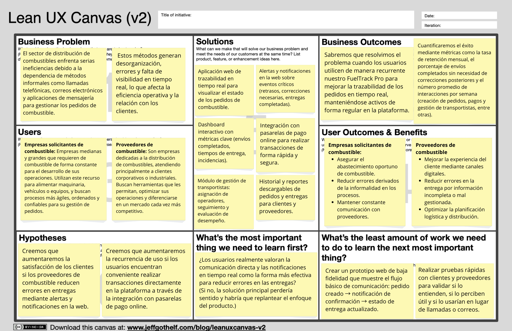

## 1.3 Segmentos objetivo

**A. Empresas solicitantes de combustible**

Empresas medianas y grandes que requieren combustible de forma constante para el desarrollo de sus operaciones (maquinaria pesada, vehículos, equipos), principalmente en los sectores de construcción y minería - los mismos sectores representados en las entrevistas realizadas (Cap. II). Según el Ministerio de la Producción (Produce), del total de 2,346,592 empresas formales registradas en Perú al cierre de 2024, el sector construcción representa el 3.5% (~82,100 empresas) y el sector minería el 0.8% (~18,800 empresas) - universo de mercado potencial para el segmento solicitante. Estas empresas suelen mantener contratos de exclusividad con un proveedor de combustible, lo que les da un flujo constante de pedidos y una relación comercial estable.

**Necesidades:**

Asegurar el abastecimiento oportuno de combustible.

Reducir errores derivados de la informalidad en los procesos.

Mantener comunicación constante con proveedores.

**B. Proveedores de combustible**

Empresas dedicadas a la distribución de combustibles, atendiendo principalmente a clientes corporativos o industriales. Según la Asociación de Grifos y Estaciones de Servicio del Perú (GESP), el país cuenta con aproximadamente 600 estaciones de servicio operativas, de las cuales el 60% son empresas familiares - un segmento con alta necesidad de digitalización y bajo nivel de sistematización actual. (Cifra de referencia sectorial; se recomienda validar con datos actualizados de OSINERGMIN antes de la entrega final.)

**Motivaciones:**

Mejorar la experiencia del cliente mediante canales digitales.

Reducir errores en la entrega por información incompleta o mal gestionada.

Optimizar la planificación logística y distribución.

---

# Capítulo II: Requirements & Analysis

## 2.1 Competidores

En el mercado existen diversas soluciones digitales enfocadas en la gestión de combustible y flotas que compiten de manera directa o indirecta con lo propuesto. Entre ellas destaca Zavgar, una plataforma SaaS que ayuda a las empresas con flotas vehiculares a optimizar costos y controlar el consumo de combustible. Otro competidor importante es FuelCloud, que ofrece una solución integrada de hardware y software para garantizar seguridad y precisión en el despacho de combustible, principalmente en empresas con tanques propios. Finalmente, Wialon se presenta como una plataforma internacional de gestión de flotas que combina monitoreo GPS, análisis operativos y control de combustible, dirigida a compañías logísticas y de transporte.

### 2.1.1 Análisis competitivo

| **Competitive Analysis Landscape**        |                                   |                                                                                                                                                                            |                                                                                                          |                                                                                    |                                                                                               |
|-------------------------------------------|-----------------------------------|----------------------------------------------------------------------------------------------------------------------------------------------------------------------------|----------------------------------------------------------------------------------------------------------|------------------------------------------------------------------------------------|-----------------------------------------------------------------------------------------------|
| **¿Por qué llevar a cabo este análisis?** |                                   | Este análisis se está llevando a cabo porque queremos conocer las ventajas y desventajas de nuestra aplicación frente a la competencia, y cómo nos diferenciamos de ellas. |                                                                                                          |                                                                                    |                                                                                               |
|                                           |                                   | **FuelBridge**                                                                                                                                                             | **Zavgar**                                                                                               | **FuelCloud**                                                                      | **Wialon**                                                                                    |
| **Perfil**                                | **Visión general**                | Plataforma web que digitaliza y estructura el proceso completo de pedido de combustible entre empresas y proveedores.                                                      | SaaS para la gestión de consumo de combustible de flotas, con enfoque en eficiencia, monitoreo y costos. | Solución con hardware/software para el control físico del despacho de combustible. | Plataforma de gestión de flotas con control de combustible, GPS y reportes operativos.        |
| **Perfil**                                | **Ventaja competitiva**           | Especialización en el flujo completo de pedido, despacho y análisis; integración de pagos y logística; UI intuitiva.                                                       | No requiere hardware; ofrece métricas, control de gastos y reportes sobre consumo.                       | Control físico preciso del combustible, monitoreo en tiempo real.                  | Seguimiento en tiempo real, visualización de rutas, integración con sensores de combustible.  |
| **Perfil**                                | **¿Qué valor ofrece al cliente?** | Trazabilidad total, eficiencia operativa, reportes de consumo y validación segura de pedidos.                                                                              | Optimización de costos y control sobre el uso de combustible en flotas.                                  | Seguridad y precisión operativa en el control de combustible.                      | Trazabilidad de flotas, alertas automáticas, análisis de rutas y consumo de combustible.      |
| **Perfil de Marketing**                   | **Mercado objetivo**              | Empresas que solicitan combustible a proveedores.                                                                                                                          | Empresas con flotas vehiculares que desean monitorear y reducir el consumo de combustible.               | Empresas con tanques de combustible propios.                                       | Empresas logísticas, distribuidoras y de transporte de combustible.                           |
| **Perfil de Marketing**                   | **Estrategias de marketing**      | Alianzas con proveedores, demostraciones de ahorro, marketing de contenido enfocado en eficiencia.                                                                         | Enfoque digital, contenido técnico, integración con proveedores de tarjetas de combustible.              | Ferias industriales, distribuidores, venta consultiva entre empresas.              | Alianzas con distribuidores de GPS, marketing técnico, ferias de transporte.                  |
| **Perfil de Producto**                    | **Productos & Servicios**         | Plataforma para gestión completa de pedidos, seguimiento, reportes, validación y alertas.                                                                                  | Plataforma web con módulo de abastecimiento, reportes de consumo, integración GPS y tarjetas.            | Hardware IoT y software para gestión, y control de combustible.                    | Plataforma SaaS + app móvil con monitoreo, alertas, mapas y módulos personalizables.          |
| **Perfil de Producto**                    | **Precios & Costos**              | Modelo SaaS con suscripción escalable según volumen y servicios.                                                                                                           | SaaS con modelos por flota activa o vehículos monitoreados.                                              | Venta e instalación de hardware + licencias de software.                           | Modelo SaaS modular, basado en vehículos activos y funcionalidades activadas.                 |
| **Perfil de Producto**                    | **Canales de distribución**       | Web app responsive, potencial app móvil futura.                                                                                                                            | Web app, marketing digital y comunidad de flotas.                                                        | Plataforma web + hardware instalado en sitio.                                      | Red de partners global, distribuidores locales e integradores de sistemas GPS.                |
| **Análisis SWOT**                         | **Fortalezas**                    | Enfoque especializado, experiencia de usuario optimizada, integraciones clave, análisis avanzado de consumo.                                                               | Implementación ágil, sin hardware, fácil adopción en empresas medianas.                                  | Control físico riguroso, solución probada en industrias exigentes.                 | Plataforma robusta, cobertura internacional, integración con más de 2,400 dispositivos GPS.   |
| **Análisis SWOT**                         | **Debilidades**                   | Nueva en el mercado, menor reconocimiento de marca, necesita consolidar confianza.                                                                                         | No gestiona el flujo completo del pedido, enfoque parcial en flotas.                                     | Alto costo, dependencia de hardware, menor adaptabilidad en mercados emergentes.   | No gestiona pedidos entre proveedor y solicitante, requiere configuración técnica inicial.    |
| **Análisis SWOT**                         | **Oportunidades**                 | Alta informalidad en el sector, digitalización creciente en logística, necesidad de trazabilidad y control.                                                                | Mayor conciencia en eficiencia de flotas y digitalización de costos operativos.                          | Nuevos mercados industriales con enfoque en seguridad y control.                   | Creciente necesidad de control logístico y monitoreo de distribución en países en desarrollo. |
| **Análisis SWOT**                         | **Amenazas**                      | Aparición de soluciones similares, resistencia al cambio en empresas tradicionales, competencia ERP.                                                                       | SaaS especializados con mayor cobertura funcional (ERP, proveedores, logística).                         | SaaS ágiles y sin hardware físico, que ofrecen soluciones más accesibles.          | SaaS más específicos y ligeros, enfocados exclusivamente en la trazabilidad de entregas.      |

### 2.1.2 Estrategias y tácticas frente a competidores

FuelBridge aplicará diversas estrategias para afrontar la competencia y aprovechar las oportunidades que ofrece el sector.

**a. Diferenciación a través de especialización**

Una de las principales estrategias de HaloFuel es la especialización en el flujo completo de pedido de combustible. A diferencia de soluciones como Zavgar, que están orientadas principalmente al control y análisis del consumo de combustible en flotas, nuestra plataforma se enfoca en las interacciones B2B entre empresas solicitantes y proveedores. Esto nos permite ofrecer un control dedicado del pedido, gestión de la logística, y reportes detallados de consumo y entregas, lo cual no está presente en la mayoría de las plataformas competidoras.

- **Táctica**: Desarrollar funcionalidades para la validación automática de pagos, gestión de stock en tiempo real y la optimización del transporte logrando la automatización de procesos que solo eran logrados de forma manual. Esto crea una ventaja frente a competidores como FuelCloud, que se centran más en el control físico del combustible y menos en la administración a nivel operativo.

**b. Innovación en la interfaz de usuario y experiencia**

El sistema de HaloFuel está diseñado para ofrecer una experiencia de usuario optimizada, algo que Wialon, FuelCloud y la propia OSINERGMIN no abordan en sus plataformas. Al ser una solución especializada y dirigida a una tarea específica, podemos dedicar más recursos en crear una interfaz intuitiva y procesos bien definidos brindando comodidad y seguridad a nuestros usuarios.

- **Táctica**: Diseñar una interfaz intuitiva y consistente que permita a los usuarios acceder a reportes de consumo, validar pedidos y coordinar logística con facilidad. Además, ofrecer soporte y formación continua para asegurar que los usuarios aprovechen al máximo todas las funcionalidades del sistema.

**c. Flexibilidad en precios y modelo SaaS escalable**

El modelo de precios de HaloFuel ofrece planes escalables basados en suscripción, lo que hace que sea más accesible para medianas y grandes empresas. Esto es más competitivo frente a Wialon, que puede no ser una opción viable para empresas que solo requieren una solución de pedidos de combustible. También es más asequible que FuelCloud, que requiere una inversión considerable en hardware, instalación y mantenimiento.

- **Táctica:** Ofrecer un modelo de suscripción flexible y precios competitivos, con múltiples niveles de suscripción adaptados a las necesidades de diferentes empresas. Esto permitirá que empresas de menor tamaño puedan acceder a la plataforma sin comprometer su presupuesto, a la vez que se asegura el crecimiento a largo plazo a medida que la empresa crece.

**d. Aprovechamiento de la digitalización en la logística**

El sector de la logística está experimentando una transformación digital acelerada. HaloFuel se aprovechará de esta tendencia buscando la integración de la plataforma con otras soluciones logísticas (como los sistemas de gestión de vehículos o flotas). De esta forma podemos ofrecer una solución más completa y eficiente.

- **Táctica**: Colaborar con empresas de gestión de flotas para optimizar el proceso de asignación de vehículos, cisternas y choferes. También se considerará la posibilidad de integrar sensores IoT en los camiones de reparto para un control más preciso sobre el combustible transportado y la entrega.

**e. Expansión hacia mercados internacionales**

Si bien HaloFuel está inicialmente orientada a empresas locales, el modelo de negocio y la flexibilidad de la plataforma la hacen ideal para expandirse a mercados internacionales. Competidores como Wialon ya tienen presencia en mercados globales, pero su enfoque en empresas grandes y sus altos costos de implementación pueden ser una barrera para empresas de menor tamaño, limitando su alcance.

- **Táctica**: Iniciar la expansión en mercados emergentes donde la digitalización en la logística es una necesidad creciente. Esto incluirá la localización de la plataforma (idioma, moneda, regulaciones locales) para facilitar la adaptabilidad de los nuevos mercados.

## 2.2 Entrevistas

### 2.2.1 Diseño de entrevistas

- **A. Proveedores de Combustible**

> Preguntas:

1.  ¿Cuál es su cargo dentro de la empresa proveedora?

2.  ¿Qué tipos de clientes atienden principalmente (logística, construcción, minería, agroindustria)?

3.  ¿Qué volumen de operaciones realizan mensualmente?

4.  ¿Cómo gestionan actualmente los pedidos y contratos de sus clientes?

5.  ¿Qué problemas han experimentado con los métodos tradicionales (llamadas, correos, planillas)?

6.  ¿Utilizan algún software especializado para ventas o logística?

7.  ¿Qué características valoraría más en una plataforma digital para gestionar pedidos?

8.  ¿Considera que una solución que centralice cotizaciones, contratos y entregas sería útil para su empresa?

9.  ¿Qué tan importante es para ustedes tener reportes históricos y comparativos de ventas?

10. ¿Qué estrategias usan actualmente para fidelizar clientes, y cómo cree que una plata forma como NombredelaStartup podría apoyarlos?

- **B. Empresas Solicitantes**

> Preguntas:

1.  ¿Cuál es su cargo en la empresa?

2.  ¿Hace cuánto tiempo trabaja en el sector energético/logístico?

3.  ¿Qué volumen de combustible gestionan aproximadamente al mes?

4.  ¿Cómo gestionan actualmente la compra y control de combustible?

5.  ¿Qué herramientas usan (Excel, llamadas, correos, sistemas propios)?

6.  ¿Cuáles son los principales problemas que enfrentan con su sistema actual?

7.  ¿Qué tan importante es para usted contar con trazabilidad en tiempo real?

8.  ¿Qué dispositivos utilizan para gestionar pedidos (PC, móvil, tablet)?

9.  ¿Qué información considera más valiosa al momento de comprar combustible (precio, tiempo de entrega, historial de proveedor, etc.)?

10. ¿Cómo afecta la falta de transparencia en los precios a sus decisiones de compra?

11. ¿Le interesaría recibir notificaciones en tiempo real sobre cambios de precio o estado de sus pedidos?

12. ¿Qué barreras considera que dificultarían implementar una solución digital como PrimerFuel en su empresa?

### 2.2.2 Registro de entrevistas

1\. Segmento 1: Empresas solicitantes de combustible

- **Entrevista 1:**

| **Campo**               | Empresas solicitantes de combustible                                                                                                                                                                                                                                                                                                                                                                                                                                                                                                                                                                                                                                                                                                                                                                                                                                                                                                                                                                                                                                                                                                                                                                                                                                                                                                                                                                                                                                                                                                                                                                                                                                                                                               |
|-------------------------|------------------------------------------------------------------------------------------------------------------------------------------------------------------------------------------------------------------------------------------------------------------------------------------------------------------------------------------------------------------------------------------------------------------------------------------------------------------------------------------------------------------------------------------------------------------------------------------------------------------------------------------------------------------------------------------------------------------------------------------------------------------------------------------------------------------------------------------------------------------------------------------------------------------------------------------------------------------------------------------------------------------------------------------------------------------------------------------------------------------------------------------------------------------------------------------------------------------------------------------------------------------------------------------------------------------------------------------------------------------------------------------------------------------------------------------------------------------------------------------------------------------------------------------------------------------------------------------------------------------------------------------------------------------------------------------------------------------------------------|
| **Nombre entrevistado** | Denis Paul Requejo Sanchez                                                                                                                                                                                                                                                                                                                                                                                                                                                                                                                                                                                                                                                                                                                                                                                                                                                                                                                                                                                                                                                                                                                                                                                                                                                                                                                                                                                                                                                                                                                                                                                                                                                                                                         |
| **Edad**                | 34                                                                                                                                                                                                                                                                                                                                                                                                                                                                                                                                                                                                                                                                                                                                                                                                                                                                                                                                                                                                                                                                                                                                                                                                                                                                                                                                                                                                                                                                                                                                                                                                                                                                                                                                 |
| **Departamento**        | Lima                                                                                                                                                                                                                                                                                                                                                                                                                                                                                                                                                                                                                                                                                                                                                                                                                                                                                                                                                                                                                                                                                                                                                                                                                                                                                                                                                                                                                                                                                                                                                                                                                                                                                                                               |
| **Inicio del video**    | 0:00                                                                                                                                                                                                                                                                                                                                                                                                                                                                                                                                                                                                                                                                                                                                                                                                                                                                                                                                                                                                                                                                                                                                                                                                                                                                                                                                                                                                                                                                                                                                                                                                                                                                                                                               |
| **Fin del video**       | 05:35                                                                                                                                                                                                                                                                                                                                                                                                                                                                                                                                                                                                                                                                                                                                                                                                                                                                                                                                                                                                                                                                                                                                                                                                                                                                                                                                                                                                                                                                                                                                                                                                                                                                                                                              |
| **Link del video**      | [https://upcedupe-my.sharepoint.com/:v:/g/personal/u20241c630_upc_edu_pe/IQD9W1DrB9WQS4N8_M5GJPorAXnVh-sF_SPbza6v5m4C4_A?nav=eyJyZWZlcnJhbEluZm8iOnsicmVmZXJyYWxBcHAiOiJPbmVEcml2ZUZvckJ1c2luZXNzIiwicmVmZXJyYWxBcHBQbGF0Zm9ybSI6IldlYiIsInJlZmVycmFsTW9kZSI6InZpZXciLCJyZWZlcnJhbFZpZXciOiJNeUZpbGVzTGlua0NvcHkifX0&e=YbIC1j](https://upcedupe-my.sharepoint.com/:v:/g/personal/u20241c630_upc_edu_pe/IQD9W1DrB9WQS4N8_M5GJPorAXnVh-sF_SPbza6v5m4C4_A?nav=eyJyZWZlcnJhbEluZm8iOnsicmVmZXJyYWxBcHAiOiJPbmVEcml2ZUZvckJ1c2luZXNzIiwicmVmZXJyYWxBcHBQbGF0Zm9ybSI6IldlYiIsInJlZmVycmFsTW9kZSI6InZpZXciLCJyZWZlcnJhbFZpZXciOiJNeUZpbGVzTGlua0NvcHkifX0&e=YbIC1j)                                                                                                                                                                                                                                                                                                                                                                                                                                                                                                                                                                                                                                                                                                                                                                                                                                                                                                                                                                                                                                                                |
| **Foto entrevista**     |                                                                                                                                                                                                                                                                                                                                                                                                                                                                                                                                                                                                                                                                                                                                                                                                                                                                                                                                                                                                                                                                                                                                                                                                                                                                                                                                                                                                                                                                                                                                                                                                                                                     |
| **Resumen**             | El entrevistado se desempeña como jefe de operaciones logísticas, con aproximadamente 8 años de experiencia en el sector, enfocado en la coordinación del abastecimiento y distribución de combustible, gestionando un volumen mensual que oscila entre 40,000 y 60,000 galones según la demanda. Actualmente, la gestión de compra y control se realiza mediante un enfoque tradicional basado en correos, llamadas y registros en hojas de Excel, complementado con el uso de WhatsApp para coordinaciones rápidas, sin contar con un sistema integrado. Entre los principales problemas identificados destacan el desorden en la información, la duplicidad de datos y la presencia de errores en los pedidos, lo que evidencia limitaciones en la eficiencia operativa. La trazabilidad en tiempo real es considerada altamente importante, ya que permitiría mejorar el control de los procesos y facilitar una respuesta oportuna ante incidencias. En cuanto a herramientas, se utilizan principalmente computadoras en oficina y dispositivos móviles en campo, reflejando una operación híbrida. Los factores más relevantes en la toma de decisiones son el precio, el tiempo de entrega y el historial de cumplimiento del proveedor. Asimismo, la falta de transparencia en los precios genera desconfianza y dificulta la comparación entre opciones. El entrevistado muestra una actitud positiva hacia el uso de notificaciones en tiempo real, destacando su utilidad para mejorar la planificación y la toma de decisiones. Finalmente, identifica como principales barreras para la adopción de una solución digital la resistencia al cambio por parte del personal y el tiempo requerido para su capacitación. |

- **Entrevista 2:**

| **Campo**               | Empresas solicitantes de combustible                                                                                                                                                                                                                                                                                                                                                                                                                                                                                                                                                                                                                                                                                                                                                                                                                                                                                                                            |
|-------------------------|-----------------------------------------------------------------------------------------------------------------------------------------------------------------------------------------------------------------------------------------------------------------------------------------------------------------------------------------------------------------------------------------------------------------------------------------------------------------------------------------------------------------------------------------------------------------------------------------------------------------------------------------------------------------------------------------------------------------------------------------------------------------------------------------------------------------------------------------------------------------------------------------------------------------------------------------------------------------|
| **Nombre entrevistado** | Vannya                                                                                                                                                                                                                                                                                                                                                                                                                                                                                                                                                                                                                                                                                                                                                                                                                                                                                                                                                          |
| **Edad**                | 30                                                                                                                                                                                                                                                                                                                                                                                                                                                                                                                                                                                                                                                                                                                                                                                                                                                                                                                                                              |
| **Departamento**        | Lima                                                                                                                                                                                                                                                                                                                                                                                                                                                                                                                                                                                                                                                                                                                                                                                                                                                                                                                                                            |
| **Inicio del video**    | 00:00                                                                                                                                                                                                                                                                                                                                                                                                                                                                                                                                                                                                                                                                                                                                                                                                                                                                                                                                                           |
| **Fin del video**       | 04:49                                                                                                                                                                                                                                                                                                                                                                                                                                                                                                                                                                                                                                                                                                                                                                                                                                                                                                                                                           |
| **Link del video**      | [https://upcedupe-my.sharepoint.com/:v:/g/personal/u202319027_upc_edu_pe/IQB5qTrYM78QSZVuiMmVg17EAefxCme6U4gWAVQFQBExCeY?nav=eyJyZWZlcnJhbEluZm8iOnsicmVmZXJyYWxBcHAiOiJPbmVEcml2ZUZvckJ1c2luZXNzIiwicmVmZXJyYWxBcHBQbGF0Zm9ybSI6IldlYiIsInJlZmVycmFsTW9kZSI6InZpZXciLCJyZWZlcnJhbFZpZXciOiJNeUZpbGVzTGlua0NvcHkifX0&e=OZHSPU](https://upcedupe-my.sharepoint.com/:v:/g/personal/u202319027_upc_edu_pe/IQB5qTrYM78QSZVuiMmVg17EAefxCme6U4gWAVQFQBExCeY?nav=eyJyZWZlcnJhbEluZm8iOnsicmVmZXJyYWxBcHAiOiJPbmVEcml2ZUZvckJ1c2luZXNzIiwicmVmZXJyYWxBcHBQbGF0Zm9ybSI6IldlYiIsInJlZmVycmFsTW9kZSI6InZpZXciLCJyZWZlcnJhbFZpZXciOiJNeUZpbGVzTGlua0NvcHkifX0&e=OZHSPU)                                                                                                                                                                                                                                                                                             |
| **Foto entrevista**     |                                                                                                                                                                                                                                                                                                                                                                                                                                                                                                                                                                                                                                                                                                                                                                                                                                                                                  |
| **Resumen**             | La entrevistada, Vannya Herrera, jefa comercial de una empresa proveedora de combustible en Lima, indicó que atienden principalmente a empresas de transporte, construcción, minería y agroindustria, gestionando alrededor de 80 a 100 pedidos mensuales. Actualmente, las cotizaciones y pedidos se coordinan mediante correo, teléfono y WhatsApp, complementados con un sistema básico y archivos de Excel, lo que genera pérdida de tiempo y dificultad para centralizar información. Considera importante contar con una plataforma que integre pedidos, cotizaciones, contratos, clientes, precios y entregas, además de alertas y reportes históricos de ventas. Asimismo, señaló que una solución digital permitiría reducir la carga administrativa, mejorar el seguimiento de pedidos y brindar una atención más rápida y transparente, contribuyendo también a la fidelización de clientes mediante mejores condiciones comerciales y comunicación. |

- **Entrevista 3:** Empresas solicitantes de combustible

| **Campo**               | Empresas solicitantes de combustible                                                                                                                                                                                                                                                                                                                                                                                                                                                                                                                                                                                                                                                                                                                                                                                                                                                                                                                                                                                                                                                                                                                                                                                                                                                                                                                                                                                                                                                                                                                                                                                                                                                                                                                          |
|-------------------------|---------------------------------------------------------------------------------------------------------------------------------------------------------------------------------------------------------------------------------------------------------------------------------------------------------------------------------------------------------------------------------------------------------------------------------------------------------------------------------------------------------------------------------------------------------------------------------------------------------------------------------------------------------------------------------------------------------------------------------------------------------------------------------------------------------------------------------------------------------------------------------------------------------------------------------------------------------------------------------------------------------------------------------------------------------------------------------------------------------------------------------------------------------------------------------------------------------------------------------------------------------------------------------------------------------------------------------------------------------------------------------------------------------------------------------------------------------------------------------------------------------------------------------------------------------------------------------------------------------------------------------------------------------------------------------------------------------------------------------------------------------------|
| **Nombre entrevistado** | Renato Guillermo Calvo Yalan                                                                                                                                                                                                                                                                                                                                                                                                                                                                                                                                                                                                                                                                                                                                                                                                                                                                                                                                                                                                                                                                                                                                                                                                                                                                                                                                                                                                                                                                                                                                                                                                                                                                                                                                  |
| **Edad**                | 22                                                                                                                                                                                                                                                                                                                                                                                                                                                                                                                                                                                                                                                                                                                                                                                                                                                                                                                                                                                                                                                                                                                                                                                                                                                                                                                                                                                                                                                                                                                                                                                                                                                                                                                                                            |
| **Departamento**        | Lima                                                                                                                                                                                                                                                                                                                                                                                                                                                                                                                                                                                                                                                                                                                                                                                                                                                                                                                                                                                                                                                                                                                                                                                                                                                                                                                                                                                                                                                                                                                                                                                                                                                                                                                                                          |
| **Inicio del video**    | 00:00                                                                                                                                                                                                                                                                                                                                                                                                                                                                                                                                                                                                                                                                                                                                                                                                                                                                                                                                                                                                                                                                                                                                                                                                                                                                                                                                                                                                                                                                                                                                                                                                                                                                                                                                                         |
| **Fin del video**       | 07:17                                                                                                                                                                                                                                                                                                                                                                                                                                                                                                                                                                                                                                                                                                                                                                                                                                                                                                                                                                                                                                                                                                                                                                                                                                                                                                                                                                                                                                                                                                                                                                                                                                                                                                                                                         |
| **Link del video**      | [https://upcedupe-my.sharepoint.com/:v:/g/personal/u20241c630_upc_edu_pe/IQDS2Yop64CbRLtW82ISOuc4AU56u40anOCvBotRFMydvE4?nav=eyJyZWZlcnJhbEluZm8iOnsicmVmZXJyYWxBcHAiOiJTdHJlYW1XZWJBcHAiLCJyZWZlcnJhbFZpZXciOiJTaGFyZURpYWxvZy1MaW5rIiwicmVmZXJyYWxBcHBQbGF0Zm9ybSI6IldlYiIsInJlZmVycmFsTW9kZSI6InZpZXcifX0%3D&e=Jgu6ZG](https://upcedupe-my.sharepoint.com/:v:/g/personal/u20241c630_upc_edu_pe/IQDS2Yop64CbRLtW82ISOuc4AU56u40anOCvBotRFMydvE4?nav=eyJyZWZlcnJhbEluZm8iOnsicmVmZXJyYWxBcHAiOiJTdHJlYW1XZWJBcHAiLCJyZWZlcnJhbFZpZXciOiJTaGFyZURpYWxvZy1MaW5rIiwicmVmZXJyYWxBcHBQbGF0Zm9ybSI6IldlYiIsInJlZmVycmFsTW9kZSI6InZpZXcifX0%3D&e=Jgu6ZG)                                                                                                                                                                                                                                                                                                                                                                                                                                                                                                                                                                                                                                                                                                                                                                                                                                                                                                                                                                                                                                                                                                     |
| **Foto entrevista**     |                                                                                                                                                                                                                                                                                                                                                                                                                                                                                                                                                                                                                                                                                                                                                                                                                                                                                                                                                                                                                                                                                                                                                                                                                                                                                                                                                                                                                                                                                                                                                                                                                                                                                 |
| **Resumen**             | El entrevistado se desempeña como asistente de logística en una empresa de transporte de carga mediana, con más de dos años de experiencia en el sector, y gestiona un volumen aproximado de 8,000 a 12,000 unidades de combustible mensuales, dependiendo de la demanda operativa. Su labor principal consiste en coordinar pedidos y realizar el seguimiento de entregas, utilizando actualmente un sistema basado en contratos directos con proveedores, gestionado mediante llamadas, WhatsApp y registros en Excel, sin el uso de un sistema integrado. Entre los principales problemas identificados destacan la desorganización de la información, errores en los pedidos, falta de claridad en los datos, inconsistencias en los precios y una considerable pérdida de tiempo en la verificación y validación manual de la información. La trazabilidad en tiempo real es considerada muy importante, ya que permitiría un mayor control sobre los pedidos y el suministro. El uso de dispositivos se centra principalmente en teléfonos móviles para la comunicación y gestión operativa. En cuanto a los factores de decisión, el precio y el tiempo de entrega son los más relevantes, seguidos por la confianza en el proveedor. La falta de transparencia en los precios genera desconfianza y dificulta la comparación entre opciones, afectando negativamente la toma de decisiones. El entrevistado muestra interés en recibir notificaciones en tiempo real, especialmente sobre cambios de precios, para poder reaccionar oportunamente. Finalmente, identifica como principales barreras para la adopción de una solución digital la resistencia al cambio del personal y el tiempo requerido para adaptarse a una nueva forma de trabajo. |

2\. Segmento 2: Proveedores de combustible

- Entrevista 1:

| **Campo**               | Proveedores de combustible                                                                                                                                                                                                                                                                                                                                                                                                                                                                                                                                                                                                                                                                                                                                                                                                                                                                                                                                                                                                                                                                                                                                                                                                                                                                                                                                                                                                                                                                                                                                                                                                                                                                                                                                                                                                                                               |
|-------------------------|--------------------------------------------------------------------------------------------------------------------------------------------------------------------------------------------------------------------------------------------------------------------------------------------------------------------------------------------------------------------------------------------------------------------------------------------------------------------------------------------------------------------------------------------------------------------------------------------------------------------------------------------------------------------------------------------------------------------------------------------------------------------------------------------------------------------------------------------------------------------------------------------------------------------------------------------------------------------------------------------------------------------------------------------------------------------------------------------------------------------------------------------------------------------------------------------------------------------------------------------------------------------------------------------------------------------------------------------------------------------------------------------------------------------------------------------------------------------------------------------------------------------------------------------------------------------------------------------------------------------------------------------------------------------------------------------------------------------------------------------------------------------------------------------------------------------------------------------------------------------------|
| **Nombre entrevistado** | Franceso                                                                                                                                                                                                                                                                                                                                                                                                                                                                                                                                                                                                                                                                                                                                                                                                                                                                                                                                                                                                                                                                                                                                                                                                                                                                                                                                                                                                                                                                                                                                                                                                                                                                                                                                                                                                                                                                 |
| **Edad**                | 20                                                                                                                                                                                                                                                                                                                                                                                                                                                                                                                                                                                                                                                                                                                                                                                                                                                                                                                                                                                                                                                                                                                                                                                                                                                                                                                                                                                                                                                                                                                                                                                                                                                                                                                                                                                                                                                                       |
| **Departamento**        | Lima                                                                                                                                                                                                                                                                                                                                                                                                                                                                                                                                                                                                                                                                                                                                                                                                                                                                                                                                                                                                                                                                                                                                                                                                                                                                                                                                                                                                                                                                                                                                                                                                                                                                                                                                                                                                                                                                     |
| **Inicio del video**    | 0:30                                                                                                                                                                                                                                                                                                                                                                                                                                                                                                                                                                                                                                                                                                                                                                                                                                                                                                                                                                                                                                                                                                                                                                                                                                                                                                                                                                                                                                                                                                                                                                                                                                                                                                                                                                                                                                                                     |
| **Fin del video**       | 5:48                                                                                                                                                                                                                                                                                                                                                                                                                                                                                                                                                                                                                                                                                                                                                                                                                                                                                                                                                                                                                                                                                                                                                                                                                                                                                                                                                                                                                                                                                                                                                                                                                                                                                                                                                                                                                                                                     |
| **Link del video**      | [https://upcedupe-my.sharepoint.com/:v:/g/personal/u202312566_upc_edu_pe/IQDwdZAlffeBR7rWRt\_\_6knyAcukG4A2urcNXp4_k4lFWFw?nav=eyJyZWZlcnJhbEluZm8iOnsicmVmZXJyYWxBcHAiOiJPbmVEcml2ZUZvckJ1c2luZXNzIiwicmVmZXJyYWxBcHBQbGF0Zm9ybSI6IldlYiIsInJlZmVycmFsTW9kZSI6InZpZXciLCJyZWZlcnJhbFZpZXciOiJNeUZpbGVzTGlua0NvcHkifX0&e=wOSc4W](https://upcedupe-my.sharepoint.com/:v:/g/personal/u202312566_upc_edu_pe/IQDwdZAlffeBR7rWRt__6knyAcukG4A2urcNXp4_k4lFWFw?nav=eyJyZWZlcnJhbEluZm8iOnsicmVmZXJyYWxBcHAiOiJPbmVEcml2ZUZvckJ1c2luZXNzIiwicmVmZXJyYWxBcHBQbGF0Zm9ybSI6IldlYiIsInJlZmVycmFsTW9kZSI6InZpZXciLCJyZWZlcnJhbFZpZXciOiJNeUZpbGVzTGlua0NvcHkifX0&e=wOSc4W)                                                                                                                                                                                                                                                                                                                                                                                                                                                                                                                                                                                                                                                                                                                                                                                                                                                                                                                                                                                                                                                                                                                                                                                                    |
| **Foto entrevista**     |                                                                                                                                                                                                                                                                                                                                                                                                                                                                                                                                                                                                                                                                                                                                                                                                                                                                                                                                                                                                                                                                                                                                                                                                                                                                                                                                                                                                                                                                                                                                                                                                                                                                                                                                                                                            |
| **Resumen**             | El entrevistado se desempeña como asistente comercial en una empresa distribuidora de combustibles B2B, con aproximadamente un año de experiencia, encargándose de la gestión de clientes, cotizaciones y seguimiento de pedidos, atendiendo principalmente a empresas de transporte y logística, y en menor medida del sector construcción. La empresa maneja un volumen mensual de entre 10,000 y 18,000 galones, dependiendo de la demanda. Actualmente, los pedidos se gestionan mediante WhatsApp y correo electrónico, registrándose posteriormente en hojas de Excel, mientras que los contratos se almacenan en documentos separados, sin integración entre estos elementos. Entre los principales problemas identificados destacan la presencia de errores debido a información incompleta o mal registrada, la pérdida de tiempo en la búsqueda y validación de datos, y la falta de claridad sobre el estado de los pedidos. No cuentan con un sistema especializado, utilizando únicamente herramientas básicas como Excel y canales de comunicación tradicionales. El entrevistado valora especialmente que una solución digital sea sencilla, centralice la información, reduzca errores y permita visualizar el estado de las entregas en tiempo real. Asimismo, considera que integrar cotizaciones, contratos y pedidos en una sola plataforma sería altamente beneficioso para mejorar el control y la organización. Destaca también la importancia de contar con reportes históricos y comparativos para analizar el comportamiento de los clientes y optimizar la planificación de ventas. Finalmente, señala que la fidelización de clientes se basa en la rapidez de atención y el cumplimiento, y que una plataforma digital podría contribuir a mejorar la transparencia, profesionalizar el servicio y fortalecer la relación con los clientes. |

- Entrevista 2:

| **Campo**               | Proveedores de combustible                                                                                                                                                                                                                                                                                                                                                                                                                                                                                                                                                                                                                                                                                                                                                                                                                                                                                                                                                                                                                                                                                                                                                                                                                                                                                                                                                                                                                                                                                                                                               |
|-------------------------|--------------------------------------------------------------------------------------------------------------------------------------------------------------------------------------------------------------------------------------------------------------------------------------------------------------------------------------------------------------------------------------------------------------------------------------------------------------------------------------------------------------------------------------------------------------------------------------------------------------------------------------------------------------------------------------------------------------------------------------------------------------------------------------------------------------------------------------------------------------------------------------------------------------------------------------------------------------------------------------------------------------------------------------------------------------------------------------------------------------------------------------------------------------------------------------------------------------------------------------------------------------------------------------------------------------------------------------------------------------------------------------------------------------------------------------------------------------------------------------------------------------------------------------------------------------------------|
| **Nombre entrevistado** | Jorge                                                                                                                                                                                                                                                                                                                                                                                                                                                                                                                                                                                                                                                                                                                                                                                                                                                                                                                                                                                                                                                                                                                                                                                                                                                                                                                                                                                                                                                                                                                                                                    |
| **Edad**                | 50 años                                                                                                                                                                                                                                                                                                                                                                                                                                                                                                                                                                                                                                                                                                                                                                                                                                                                                                                                                                                                                                                                                                                                                                                                                                                                                                                                                                                                                                                                                                                                                                  |
| **Departamento**        | Lima                                                                                                                                                                                                                                                                                                                                                                                                                                                                                                                                                                                                                                                                                                                                                                                                                                                                                                                                                                                                                                                                                                                                                                                                                                                                                                                                                                                                                                                                                                                                                                     |
| **Inicio del video**    | 0:15                                                                                                                                                                                                                                                                                                                                                                                                                                                                                                                                                                                                                                                                                                                                                                                                                                                                                                                                                                                                                                                                                                                                                                                                                                                                                                                                                                                                                                                                                                                                                                     |
| **Fin del video**       | 5:42                                                                                                                                                                                                                                                                                                                                                                                                                                                                                                                                                                                                                                                                                                                                                                                                                                                                                                                                                                                                                                                                                                                                                                                                                                                                                                                                                                                                                                                                                                                                                                     |
| **Link del video**      | [upc-pre-202620-1acc0238-16723-FuelBridge-Entrevista-Segmento-Proveedores.mp4](https://upcedupe-my.sharepoint.com/:v:/g/personal/u201916755_upc_edu_pe/IQBD0lTGl-XwQ4qKCnmH6TofAeaUe0s7D1l69jdzKcbxme4?nav=eyJyZWZlcnJhbEluZm8iOnsicmVmZXJyYWxBcHAiOiJPbmVEcml2ZUZvckJ1c2luZXNzIiwicmVmZXJyYWxBcHBQbGF0Zm9ybSI6IldlYiIsInJlZmVycmFsTW9kZSI6InZpZXciLCJyZWZlcnJhbFZpZXciOiJNeUZpbGVzTGlua0NvcHkifX0&e=oLBWzO)                                                                                                                                                                                                                                                                                                                                                                                                                                                                                                                                                                                                                                                                                                                                                                                                                                                                                                                                                                                                                                                                                                                                                        |
| **Foto entrevista**     |                                                                                                                                                                                                                                                                                                                                                                                                                                                                                                                                                                                                                                                                                                                                                                                                                                                                                                                                                                                                                                                                                                                                                                                                                                                                                                                                                                                                                                                                                             |
| **Resumen**             | El entrevistado se desempeña como Jefe de Logística en una empresa de transporte de carga, con aproximadamente ocho años de experiencia en el sector, encargándose de coordinar la flota y el abastecimiento de combustible para una operación que consume entre 15,000 y 19,000 galones de diésel al mes. Actualmente gestiona los pedidos por WhatsApp y llamadas, registrando después la información en Excel, lo que le ha generado errores puntuales y cruces entre pedidos por falta de confirmación clara con los proveedores. Su principal preocupación es no tener visibilidad en tiempo real del estado de sus pedidos, lo que en más de una ocasión ha afectado la programación de sus propios camiones, y reconoce haber pagado de más por no poder comparar precios entre proveedores en el momento de decidir la compra. Al priorizar sus criterios de compra, ubica el tiempo de entrega por encima del precio, y el historial de cumplimiento del proveedor como un factor casi tan relevante como el costo. Se mostró abierto a recibir notificaciones en tiempo real sobre precios y pedidos, pero identificó como principal barrera para adoptar una solución como FuelBridge que sus propios proveedores también deban sumarse a la plataforma, ya que de lo contrario la herramienta perdería utilidad; señaló además la conectividad en algunas zonas de operación y una posible resistencia inicial de su equipo como obstáculos secundarios, aunque considera que esta última se superaría rápido si perciben beneficios claros en el día a día. |

## 2.3 Needfinding

### 2.3.1 User Personas

- Segmento 1: Empresas solicitantes de combustible

  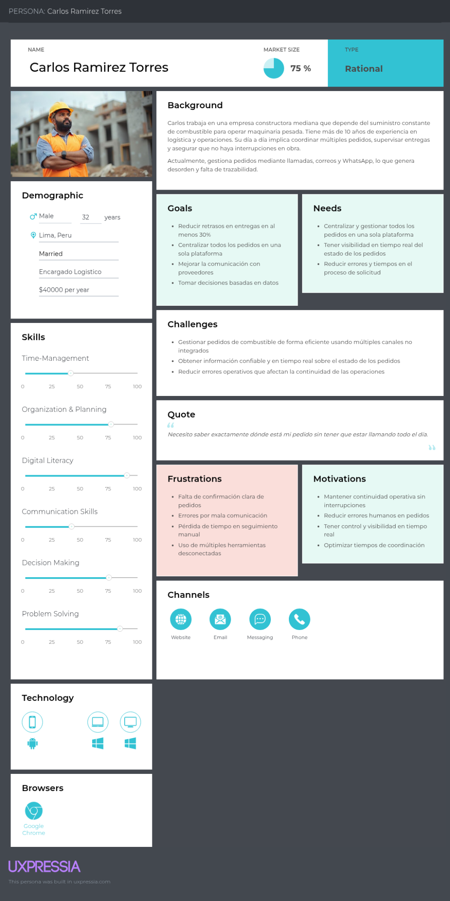

- Segmento 2: Proveedores de Combustible

  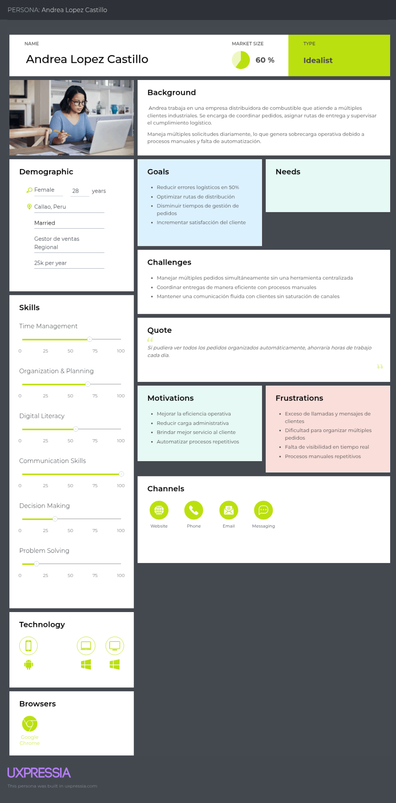

### 2.3.2 User Task Matrix

El User Task Matrix presenta las tareas que realizan los User Persona para cumplir sus objetivos en su día a día, independientemente de si usan nuestro software o no. Se evalúa la frecuencia y la importancia de cada tarea para identificar dónde aportar valor.

  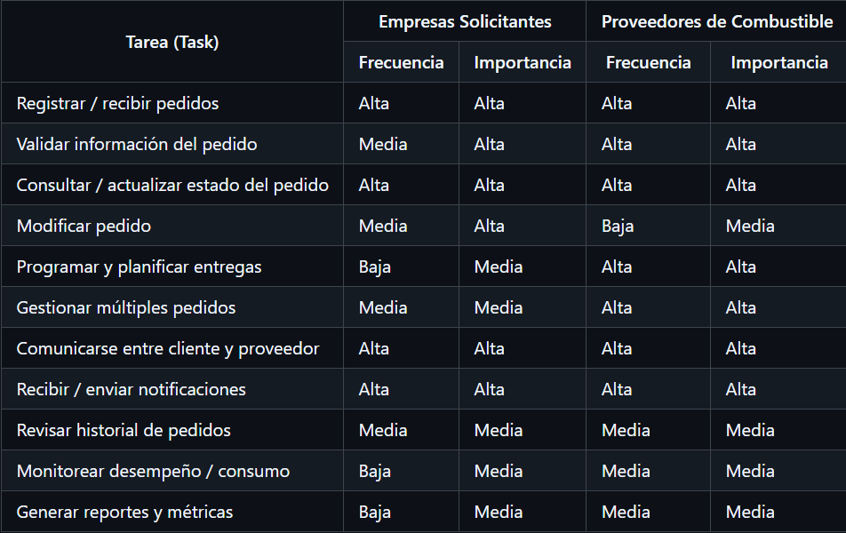

### 2.3.3 Empathy Maps

Para la elaboración de los Empathy Maps, el equipo partió del conocimiento y observaciones recolectadas durante el análisis de los User Persona. Se colocó al centro de cada mapa al usuario correspondiente (Carlos y Andrea) y se respondieron las preguntas claves sobre su entorno, emociones, comportamientos y necesidades.

- Segmento 1: Empresas solicitantes de combustible

  

- Segmento 2: Proveedores de Combustible

  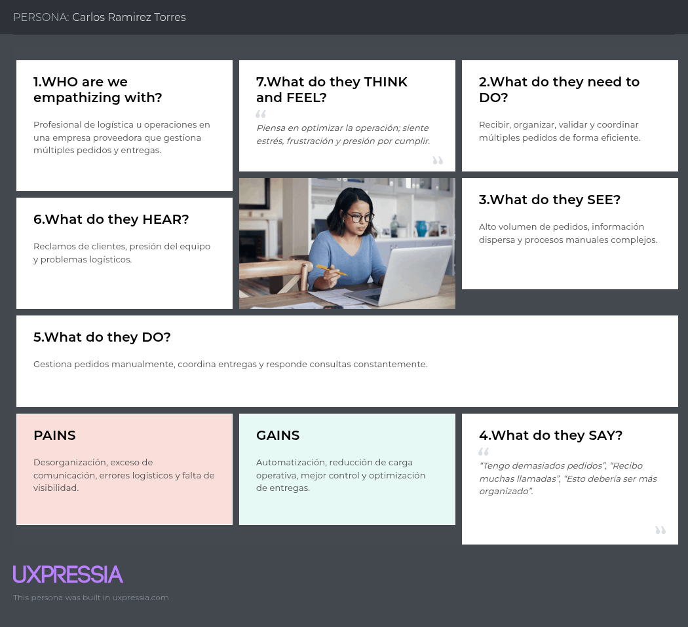

### 2.3.4 As-is Scenario Mapping

  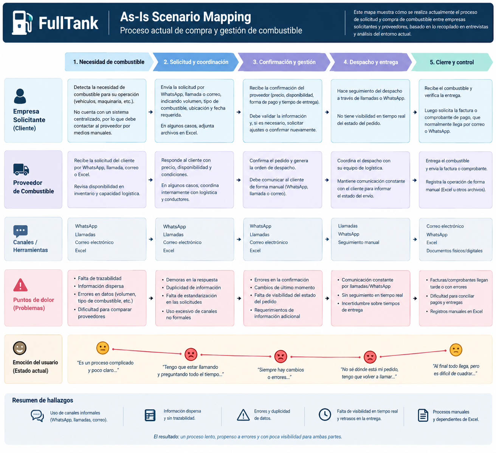

---

# Capítulo III: Requirements Specification

## 3.1 To-Be Scenario Mapping

  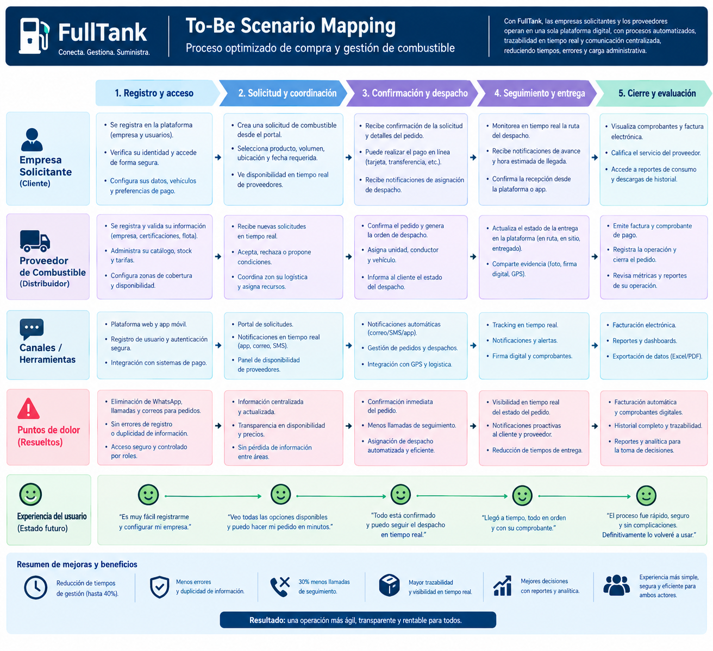

## 3.2 User Stories

<table>
<colgroup>
<col style="width: 12%" />
<col style="width: 15%" />
<col style="width: 20%" />
<col style="width: 39%" />
<col style="width: 13%" />
</colgroup>
<thead>
<tr class="header">
<th>
<strong>Epic / User</strong>

<strong>Story ID</strong>
</th>
<th><strong>Título</strong></th>
<th><strong>Descripción</strong></th>
<th><strong>Criterios de aceptación</strong></th>
<th><strong>Relacionado con (Epic ID)</strong></th>
</tr>
<tr class="odd">
<th>US-01</th>
<th>Ver sección Home</th>
<th>Como visitante (proveedor), quiero ver una sección de inicio que resuma el valor de FuelBridge para comprender rápidamente el objetivo del sistema.</th>
<th>
Escenario 1: Visualización de resumen del sistema

Dado que el visitante (proveedor) accede al sitio web,

Cuando se encuentra en la sección Home,

Entonces puede ver un resumen claro del sistema.

Escenario 2: Acceso a call to action desde Home

Dado que el visitante (proveedor) revisa la sección Home,

Cuando desliza hacia abajo,

Entonces encuentra un botón que lo invita a conocer más sobre FuelBridge.
</th>
<th>EP01</th>
</tr>
<tr class="header">
<th>US-02</th>
<th>Ver sección About Us</th>
<th>Como visitante de ambos segmentos, quiero conocer quiénes están detrás de FuelBridge para confiar en el sistema.</th>
<th>
Escenario 1: Información visible del equipo

Dado que el visitante de ambos segmentos accede a About Us,

Cuando se carga la sección,

Entonces puede leer una descripción del equipo detrás del sistema.

Escenario 2: Ver valores o misión

Dado que el visitante de ambos segmentos revisa la sección completa,

Cuando llega al final del contenido,

Entonces puede conocer los valores o misión de la empresa.
</th>
<th>EP01</th>
</tr>
<tr class="odd">
<th>US-03</th>
<th>Ver sección How it works?</th>
<th>Como visitante de ambos segmentos, quiero entender cómo funciona FuelBridge paso a paso para evaluar si se ajusta a mis necesidades.</th>
<th>
Escenario 1: Comprensión del flujo de pedidos

Dado que el visitante de ambos segmentos accede a How it works?,

Cuando lee la sección,

Entonces entiende el flujo de pedido desde solicitud hasta entrega.

Escenario 2: Interacción clara entre usuarios

Dado que el visitante de ambos segmentos busca claridad,

Cuando revisa la sección,

Entonces puede comprender cómo interactúan solicitante y proveedor.
</th>
<th>EP01</th>
</tr>
<tr class="header">
<th>US-04</th>
<th>Enviar mensaje de contacto</th>
<th>Como visitante de ambos segmentos, quiero enviar un mensaje desde Contact Us para solicitar más información.</th>
<th>
Escenario 1: Envío exitoso de mensaje

Dado que el visitante de ambos segmentos completa el formulario correctamente,

Cuando presiona "Enviar",

Entonces el mensaje es registrado para revisión.

Escenario 2: Validación de campos obligatorios

Dado que el visitante de ambos segmentos deja campos vacíos,

Cuando intenta enviar el formulario,

Entonces el sistema muestra una advertencia.

Escenario 3: Confirmación visual del envío

Dado que el visitante de ambos segmentos envía el formulario exitosamente,

Cuando el mensaje es registrado,

Entonces recibe una confirmación visual o notificación.
</th>
<th>EP01</th>
</tr>
<tr class="odd">
<th>US-05</th>
<th>Registrar nuevo pedido</th>
<th>Como solicitante, quiero registrar un pedido con tipo y cantidad de combustible para que el proveedor lo procese.</th>
<th>
Escenario 1: Registro exitoso del pedido

Dado que el solicitante accede al formulario de pedidos,

Cuando completa los campos requeridos,

Entonces puede enviar un nuevo pedido.

Escenario 2: Validación de campos

Dado que el solicitante deja un campo obligatorio vacío,

Cuando intenta enviar el pedido,

Entonces el sistema muestra un mensaje de error.

Escenario 3: Confirmación del cambio de estado

Dado que el solicitante envió el pedido,

Cuando el proveedor lo aprueba,

Entonces su estado se actualiza automáticamente.
</th>
<th>EP02</th>
</tr>
<tr class="header">
<th>US-06</th>
<th>Consultar estado del pedido</th>
<th>Como solicitante, quiero ver el estado de mis pedidos para saber si están aprobados, en tránsito o entregados.</th>
<th>
Escenario 1: Consulta de estado en el panel

Dado que el solicitante accede a su panel,

Cuando revisa la lista de pedidos,

Entonces ve el estado actualizado.

Escenario 2: Actualización dinámica de estado

Dado que el solicitante está visualizando el panel de pedidos,

Cuando el pedido cambia de estado,

Entonces el cambio se refleja correctamente al recargar el panel.
</th>
<th>EP02</th>
</tr>
<tr class="odd">
<th>US-07</th>
<th>Confirmar recepción de pedido</th>
<th>Como solicitante, quiero confirmar que recibí el pedido para que el proveedor lo cierre.</th>
<th>
Escenario 1: Confirmación exitosa de recepción

Dado que el solicitante recibió el pedido,

Cuando lo confirma en el sistema,

Entonces su estado cambia a "Entregado".

Escenario 2: Prevención de doble confirmación

Dado que el solicitante ya confirmó la entrega,

Cuando intenta volver a confirmar,

Entonces el sistema bloquea la acción y notifica al usuario.
</th>
<th>EP02</th>
</tr>
<tr class="header">
<th>US-08</th>
<th>Registrar información de pago</th>
<th>Como solicitante, quiero ingresar la información de los pagos correspondientes para validar el pedido ante el proveedor.</th>
<th>
Escenario 1: Registro exitoso de depósitos

Dado que el solicitante ingresa la información de depósitos,

Cuando registra el pedido,

Estos quedan vinculados a él.

Escenario 2: Validación del formulario de ingreso de depósitos

Dado que el solicitante intenta ingresar los datos del depósito,

Cuando excede el límite de caracteres,

Entonces el sistema muestra un mensaje de error.

Escenario 3: Validación de depósitos ya registrados

Dado que el solicitante ingresa un depósito con un número de operación repetido,

Cuando intenta seguir con el registro,

Entonces el sistema notifica el error.
</th>
<th>EP02</th>
</tr>
<tr class="odd">
<th>US-09</th>
<th>Ver historial de pedidos</th>
<th>Como solicitante, quiero ver mis pedidos anteriores para tener control sobre mi consumo.</th>
<th>
Escenario 1: Visualización del historial

Dado que el solicitante accede al historial,

Cuando se listan los pedidos,

Entonces puede ver fecha, tipo y estado de cada uno.

Escenario 2: Historial vacío

Dado que el solicitante aún no ha realizado pedidos,

Cuando accede al historial,

Entonces se muestra un mensaje informativo.

Escenario 3: Acceso a detalles desde historial

Dado que el solicitante ve la lista de pedidos anteriores,

Cuando selecciona uno,

Entonces puede revisar sus detalles.
</th>
<th>EP02</th>
</tr>
<tr class="header">
<th>US-10</th>
<th>Ver pedidos pendientes</th>
<th>Como proveedor, quiero ver todos los pedidos pendientes para analizarlos y tomar acción.</th>
<th>
Escenario 1: Listado de pedidos pendientes

Dado que el proveedor accede al panel,

Cuando ve los pedidos pendientes,

Entonces puede revisar sus detalles básicos.

Escenario 2: Filtro por fechas o cliente

Dado que el proveedor tiene muchos pedidos,

Cuando aplica filtros por fecha o empresa,

Entonces puede localizar los pedidos relevantes.
</th>
<th>EP03</th>
</tr>
<tr class="odd">
<th>US-11</th>
<th>Aprobar pedido</th>
<th>Como proveedor, quiero aprobar pedidos según los depósitos hechos a mis cuentas bancarias.</th>
<th>
Escenario 1: Aprobación de pedido con depósitos válidos

Dado que el proveedor tiene el pago completo del pedido,

Cuando intenta aprobarlo,

Entonces el estado cambia a "Aprobado".

Escenario 2: No aprobar el pedido por pago incompleto

Dado que el proveedor no cuenta con los depósitos suficientes para completar el pago del pedido,

Cuando intenta aprobarlo,

Entonces se muestra un mensaje indicando que el pedido no fue pagado por completo.
</th>
<th>EP03</th>
</tr>
<tr class="header">
<th>US-12</th>
<th>Marcar pedido como despachado</th>
<th>Como proveedor, quiero marcar cuándo un pedido sale a entrega para notificar al cliente.</th>
<th>
Escenario 1: Despacho exitoso de un pedido

Dado que el proveedor tiene un pedido aprobado,

Cuando marca el pedido como despachado,

Entonces el estado cambia a "Despachado".

Escenario 2: Restricción de despacho sin aprobación previa

Dado que el proveedor intenta despachar un pedido sin pasar por la liberación correspondiente,

Cuando ejecuta la acción,

Entonces el sistema impide el cambio de estado y muestra un mensaje.
</th>
<th>EP03</th>
</tr>
<tr class="odd">
<th>US-13</th>
<th>Cerrar pedido</th>
<th>Como proveedor, quiero cerrar el pedido cuando el cliente confirme la entrega para finalizar el proceso.</th>
<th>
Escenario 1: Cierre correcto del pedido tras confirmación

Dado que el solicitante ya confirmó la entrega,

Cuando el proveedor cierra el pedido,

Entonces este no puede modificarse más.

Escenario 2: Intento de cierre sin confirmación previa

Dado que el proveedor intenta cerrar el pedido,

Cuando el solicitante aún no ha confirmado la entrega,

Entonces el sistema impide esta acción.
</th>
<th>EP03</th>
</tr>
<tr class="header">
<th>US-14</th>
<th>Generar reporte de ventas</th>
<th>Como proveedor, quiero generar reportes de ventas para tener registro de operaciones realizadas.</th>
<th>
Escenario 1: Generación de reporte con datos disponibles

Dado que el proveedor selecciona un rango de fechas válido,

Cuando solicita el reporte,

Entonces se genera un archivo con los datos de ventas.

Escenario 2: Generación sin datos en el rango

Dado que el proveedor selecciona un rango sin ventas,

Cuando solicita el reporte,

Entonces el sistema informa que no hay resultados.

Escenario 3: Descarga del archivo generado

Dado que el reporte se genera correctamente,

Cuando finaliza el proceso,

Entonces el proveedor puede descargar el archivo.
</th>
<th>EP03</th>
</tr>
<tr class="odd">
<th>US-15</th>
<th>Iniciar sesión</th>
<th>Como usuario registrado, quiero iniciar sesión con correo y contraseña para acceder a mi cuenta.</th>
<th>
Escenario 1: Inicio de sesión exitoso

Dado que el usuario registrado ingresa credenciales válidas,

Cuando presiona iniciar sesión,

Entonces accede a su dashboard.

Escenario 2: Error por credenciales incorrectas

Dado que el usuario registrado ingresa datos incorrectos,

Cuando intenta iniciar sesión,

Entonces el sistema muestra un mensaje de error.

Escenario 3: Validación de campos vacíos

Dado que el usuario deja campos vacíos,

Cuando intenta iniciar sesión,

Entonces el sistema solicita completar los campos.
</th>
<th>EP04</th>
</tr>
<tr class="header">
<th>US-16</th>
<th>Recuperar contraseña</th>
<th>Como usuario registrado, quiero recuperar mi contraseña para volver a acceder si la olvidé.</th>
<th>
Escenario 1: Envío de enlace de recuperación

Dado que el usuario registrado ingresa su correo válido,

Cuando solicita recuperación,

Entonces recibe un enlace al correo.

Escenario 2: Error por correo no registrado

Dado que el usuario ingresa un correo inexistente,

Cuando solicita recuperación,

Entonces se le informa que el correo no está registrado.

Escenario 3: Validación de campo vacío

Dado que el usuario no completa el campo de correo,

Cuando intenta enviar la solicitud,

Entonces el sistema solicita completarlo.
</th>
<th>EP04</th>
</tr>
<tr class="odd">
<th>US-17</th>
<th>Cerrar sesión</th>
<th>Como usuario registrado, quiero poder cerrar sesión para mantener segura mi cuenta.</th>
<th>
Escenario 1: Cierre exitoso de sesión

Dado que el usuario está autenticado,

Cuando selecciona "Cerrar sesión",

Entonces la sesión se finaliza y es redirigido al login.

Escenario 2: Confirmación de cierre de sesión

Dado que el usuario cierra sesión,

Cuando termina la acción,

Entonces el sistema muestra un mensaje de despedida o confirmación.
</th>
<th>EP04</th>
</tr>
<tr class="header">
<th>US-18</th>
<th>Ver resumen de pedidos (Solicitante)</th>
<th>Como solicitante, quiero ver un resumen de mis pedidos para identificar cuántos están en proceso o completados.</th>
<th>
Escenario 1: Visualización de resumen con datos disponibles

Dado que el solicitante tiene pedidos registrados,

Cuando accede a su dashboard,

Entonces visualiza los KPIs por estado: pendientes, aprobados, despachados, finalizados y rechazados.

Escenario 2: Sin pedidos registrados

Dado que el solicitante no tiene pedidos,

Cuando accede al dashboard,

Entonces ve un mensaje informando "No hay pedidos registrados".

Escenario 3: Error al cargar datos del resumen

Dado que el solicitante accede al dashboard,

Cuando ocurre un error de carga,

Entonces el sistema muestra un mensaje e intenta recargar los datos automáticamente.
</th>
<th>EP05</th>
</tr>
<tr class="odd">
<th>US-19</th>
<th>Validar disponibilidad de transporte</th>
<th>Como proveedor, quiero saber qué vehículos están disponibles antes de asignarlos para vincularlos correctamente.</th>
<th>
Escenario 1: Vehículo no disponible por superposición

Dado que el proveedor visualiza el listado de vehículos,

Cuando un vehículo está asignado a otro pedido para la misma fecha y hora estimada,

Entonces el sistema lo muestra como no disponible.

Escenario 2: Vehículo disponible

Dado que el proveedor visualiza un vehículo sin conflictos de agenda,

Cuando se carga el listado de vehículos,

Entonces dicho vehículo se muestra como seleccionable.

Escenario 3: Conflicto en tiempo real

Dado que el proveedor intenta seleccionar un vehículo que fue asignado recientemente por otro usuario,

Cuando realiza la acción,

Entonces el sistema bloquea la selección y muestra un mensaje de actualización.
</th>
<th>EP08</th>
</tr>
<tr class="header">
<th>US-20</th>
<th>Ver perfil de usuario</th>
<th>Como usuario registrado, quiero ver mis datos de perfil para revisar mi información registrada.</th>
<th>
Escenario 1: Visualización exitosa del perfil

Dado que el usuario tiene sesión activa,

Cuando accede a su perfil,

Entonces ve su nombre, correo y rol.

Escenario 2: Error en la carga de datos

Dado que el usuario accede a su perfil y ocurre un error al obtener los datos,

Cuando se carga la vista,

Entonces se muestra un mensaje de error y se sugiere reintentar.

Escenario 3: Restricción de datos de otros usuarios

Dado que el usuario tiene sesión activa,

Cuando intenta ver otro perfil,

Entonces el sistema restringe el acceso y muestra su propia información.
</th>
<th>EP09</th>
</tr>
<tr class="odd">
<th>US-21</th>
<th>Editar datos de perfil</th>
<th>Como usuario registrado, quiero editar mis datos para mantener mi información actualizada.</th>
<th>
Escenario 1: Edición y guardado exitoso

Dado que el usuario modifica uno o más campos del formulario,

Cuando la información ingresada es válida,

Entonces el sistema guarda los cambios correctamente.

Escenario 2: Campo obligatorio vacío

Dado que el usuario deja un campo obligatorio vacío,

Cuando intenta guardar,

Entonces el sistema muestra un mensaje de validación indicando el campo requerido.

Escenario 3: Error del servidor al guardar

Dado que el usuario intenta guardar y ocurre un fallo en el servidor,

Cuando se realiza la acción,

Entonces se muestra un mensaje de error y los datos ingresados permanecen visibles.
</th>
<th>EP09</th>
</tr>
<tr class="header">
<th>US-22</th>
<th>Ver sección de preguntas frecuentes</th>
<th>Como visitante de ambos segmentos, quiero acceder a una sección de preguntas frecuentes para resolver dudas rápidamente.</th>
<th>
Escenario 1: Visualización de preguntas comunes

Dado que el visitante accede a la sección,

Cuando se carga el contenido,

Entonces puede leer las preguntas y respuestas más frecuentes.

Escenario 2: Organización por categorías

Dado que el visitante accede a la sección de preguntas frecuentes con muchas entradas,

Cuando navega por la sección,

Entonces puede visualizarlas clasificadas en categorías.

Escenario 3: Error al cargar FAQs

Dado que el visitante accede a la sección y ocurre un fallo en la carga,

Cuando intenta visualizar las preguntas frecuentes,

Entonces se muestra un mensaje de error o un contenido informativo alternativo.
</th>
<th>EP10</th>
</tr>
<tr class="odd">
<th>US-23</th>
<th>Acceder a información de contacto rápido</th>
<th>Como usuario de ambos segmentos, quiero ver datos de contacto directo (teléfono o correo) para hacer consultas urgentes.</th>
<th>
Escenario 1: Visualización de datos de contacto

Dado que el usuario accede a la sección de soporte,

Cuando se carga la página,

Entonces puede visualizar claramente el correo de soporte y número telefónico.

Escenario 2: Acceso al correo de cliente

Dado que el usuario hace clic en la dirección de correo,

Cuando tiene una app de correo configurada,

Entonces se abre automáticamente su aplicación de correo predeterminada.

Escenario 3: Falla en la configuración de contacto

Dado que el usuario accede a la página y los datos de contacto no están bien configurados,

Cuando se carga la sección de contacto,

Entonces el sistema muestra un mensaje genérico invitando a intentar más tarde.
</th>
<th>EP10</th>
</tr>
<tr class="header">
<th>US-24</th>
<th>Buscar pedido por código</th>
<th>Como usuario de ambos segmentos, quiero buscar un pedido específico por su código para encontrarlo rápidamente.</th>
<th>
Escenario 1: Pedido encontrado

Dado que el usuario escribe un código válido,

Cuando existe un pedido con ese código,

Entonces se muestra el resultado correspondiente.

Escenario 2: Pedido no encontrado

Dado que el usuario digita un código no correspondiente a ningún pedido,

Cuando finaliza la búsqueda,

Entonces el sistema muestra un mensaje de que no hay coincidencias.
</th>
<th>EP11</th>
</tr>
<tr class="odd">
<th>US-25</th>
<th>Filtrar pedidos por estado</th>
<th>Como usuario de ambos segmentos, quiero filtrar mis pedidos por estado (pendiente, aprobado, entregado) para facilitar la revisión.</th>
<th>
Escenario 1: Aplicar filtro correctamente

Dado que el usuario selecciona un estado,

Cuando se aplica el filtro,

Entonces solo se muestran los pedidos con ese estado.

Escenario 2: No hay pedidos en ese estado

Dado que el usuario selecciona un estado que no tiene coincidencias,

Cuando ejecuta el filtro,

Entonces se muestra un mensaje indicando que no hay pedidos para ese estado.
</th>
<th>EP11</th>
</tr>
<tr class="header">
<th>US-26</th>
<th>Recibir notificación de aprobación</th>
<th>Como solicitante, quiero recibir una notificación cuando un pedido sea aprobado o rechazado para estar informado.</th>
<th>
Escenario 1: Visualización de notificación

Dado que el proveedor cambia el estado del pedido,

Cuando el solicitante inicia sesión,

Entonces ve una notificación del evento.

Escenario 2: Pedido actualizado desde otra sesión

Dado que el solicitante aún no ha leído la notificación,

Cuando actualiza la interfaz,

Entonces la notificación se mantiene visible hasta que sea marcada como leída.
</th>
<th>EP12</th>
</tr>
<tr class="odd">
<th>US-27</th>
<th>Notificación de pedido despachado</th>
<th>Como solicitante, quiero recibir una notificación cuando un pedido haya sido despachado para estar informado.</th>
<th>
Escenario 1: Pedido marcado como despachado

Dado que el proveedor marca el pedido como despachado,

Cuando el solicitante consulta su cuenta,

Entonces puede ver la notificación correspondiente.

Escenario 2: Visualización posterior del evento

Dado que el pedido fue despachado anteriormente,

Cuando el solicitante accede en otro momento,

Entonces la notificación sigue disponible hasta ser archivada o leída.
</th>
<th>EP12</th>
</tr>
<tr class="header">
<th>US-28</th>
<th>Ver listado de empresas</th>
<th>Como proveedor, quiero ver una lista de empresas solicitantes para identificar a mis clientes frecuentes.</th>
<th>
Escenario 1: Visualización del listado

Dado que el proveedor accede al módulo de empresas,

Cuando se carga el listado,

Entonces se muestran nombre, pedidos activos y total histórico por empresa.

Escenario 2: Lista vacía o sin datos

Dado que el proveedor accede al módulo y no hay empresas registradas,

Cuando se carga la vista,

Entonces se muestra un mensaje indicando que no hay empresas disponibles.
</th>
<th>EP13</th>
</tr>
<tr class="odd">
<th>US-29</th>
<th>Ver detalles de empresa</th>
<th>Como proveedor, quiero ver información detallada de una empresa solicitante para analizar su historial de pedidos.</th>
<th>
Escenario 1: Acceso a detalle de empresa

Dado que el proveedor selecciona una empresa,

Cuando se carga el detalle,

Entonces visualiza pedidos realizados, cantidades solicitadas y fechas.

Escenario 2: Empresa sin historial de pedidos

Dado que el proveedor selecciona una empresa que aún no ha realizado pedidos,

Cuando se accede a su perfil,

Entonces se muestra un mensaje indicando que no hay historial disponible.
</th>
<th>EP13</th>
</tr>
<tr class="header">
<th>US-30</th>
<th>Ver gráfico de consumo (Solicitante)</th>
<th>Como solicitante, quiero ver un gráfico de mi consumo mensual para tener control sobre el uso del combustible.</th>
<th>
Escenario 1: Gráfico con datos disponibles

Dado que el solicitante ha realizado pedidos,

Cuando accede al módulo de reportes,

Entonces se visualiza un gráfico con galones consumidos por mes.

Escenario 2: Sin datos de consumo

Dado que el solicitante no ha hecho pedidos aún,

Cuando accede al gráfico,

Entonces se muestra un mensaje de que no hay datos suficientes.
</th>
<th>EP14</th>
</tr>
<tr class="odd">
<th>US-31</th>
<th>Ver gráfico de ventas (Proveedor)</th>
<th>Como proveedor, quiero ver un gráfico de ventas por mes para monitorear el rendimiento del negocio.</th>
<th>
Escenario 1: Datos disponibles para graficar

Dado que el proveedor ha despachado pedidos,

Cuando accede al módulo de reportes,

Entonces se visualiza un gráfico con las ventas mensuales totales.

Escenario 2: Sin pedidos registrados

Dado que el proveedor no ha realizado ventas aún,

Cuando accede al gráfico,

Entonces se muestra un mensaje de que no hay datos suficientes.
</th>
<th>EP14</th>
</tr>
<tr class="header">
<th>US-32</th>
<th>Descargar reporte PDF</th>
<th>Como usuario de ambos segmentos, quiero descargar un resumen de pedidos o ventas en formato PDF para archivarlo o compartirlo.</th>
<th>
Escenario 1: Generación de PDF con datos

Dado que el usuario hace clic en "Descargar",

Cuando hay datos en el periodo seleccionado,

Entonces se genera un archivo PDF descargable.

Escenario 2: No hay datos en el periodo seleccionado

Dado que el usuario no tiene registros en el periodo seleccionado,

Cuando se solicita la descarga,

Entonces el sistema notifica que no hay contenido para exportar.

Escenario 3: Falla en la generación del PDF

Dado que el usuario intenta descargar el archivo y ocurre un error en el backend al generar el PDF,

Cuando hace clic en el botón de descargar,

Entonces se muestra un mensaje de error sin afectar la sesión.
</th>
<th>EP14</th>
</tr>
<tr class="odd">
<th>US-33</th>
<th>Ver sección Benefits</th>
<th>Como visitante de ambos segmentos, quiero conocer las principales ventajas con las que puedo contar para evaluar la implementación de la plataforma.</th>
<th>
Escenario 1: Visualizar beneficios

Dado que el visitante de ambos segmentos accede a la sección "¿Por qué elegir FuelBridge?",

Cuando visualiza los múltiples beneficios,

Entonces puede identificar nuestra ventajas frente a nuestros competidores.

Escenario 2: Visualizar beneficios

Dado que el visitante de ambos segmentos accede a la sección "¿Por qué elegir FuelBridge?",

Cuando observa la lista de beneficios,

Entonces ve como le podría beneficiar usar FuelBridge.
</th>
<th>EP01</th>
</tr>
<tr class="header">
<th>US-34</th>
<th>Ver sección Lo que Dicen Nuestros Clientes</th>
<th>Como visitante de ambos segmentos, quiero conocer los testimonios de los usuarios de FuelBridge para tener confianza en la plataforma y saber que otras empresas ya la están usando.</th>
<th>
Escenario 1: Ver testimonios de clientes

Dado que el visitante de ambos segmentos está interesado en los comentarios de los clientes,

Cuando accede a la sección,

Entonces puede leer un breve testimonio sobre experiencias usando FuelBridge.

Escenario 2: Visualizar testimonios recientes

Dado que el visitante de ambos segmentos accede a la sección y esta se actualiza regularmente,

Cuando se carga la información,

Entonces visualiza las últimos testimonios que se han unido a FuelBridge.
</th>
<th>EP01</th>
</tr>
<tr class="odd">
<th>US-35</th>
<th>Ver sección Planes y Precios</th>
<th>Como visitante (ambos segmentos), quiero saber que planes se adecuan a mis necesidades para poder iniciar un proceso de registro o solicitud.</th>
<th>
Escenario 1: Ver información sobre ser solicitante de combustible

Dado que el visitante entra a la sección Precios y Planes,

Cuando visualiza los diferentes precios y las features incluidas,

Entonces entiende que existe flexibilidad para adaptar FuelBridge a su empresa.

Escenario 2: Seleccionar un plan

Dado que el visitante está interesado en obtener un plan específico,

Cuando hace clic en el call to action,

Entonces es redirigido a la página de registro.
</th>
<th>EP01</th>
</tr>
<tr class="header">
<th>US-36</th>
<th>Cambiar idioma</th>
<th>Como visitante de ambos segmentos, quiero poder cambiar entre inglés y español para entender la plataforma en mi idioma preferido.</th>
<th>
Escenario 1: Cambiar idioma a español

Dado que el visitante de ambos segmentos está viendo la página en inglés,

Cuando selecciona la opción de español,

Entonces toda la interfaz de la página se muestra en español.

Escenario 2: Cambiar idioma a inglés

Dado que el visitante está viendo la página en español,

Cuando selecciona la opción de inglés,

Entonces toda la interfaz de la página se muestra en inglés.
</th>
<th>EP01</th>
</tr>
<tr class="odd">
<th>US-37</th>
<th>Registrar empresa solicitante</th>
<th>Como visitante (solicitante), quiero registrar mi empresa en la plataforma para comenzar a realizar pedidos de combustible.</th>
<th>
Escenario 1: Registro exitoso de empresa

Dado que el visitante completa todos los campos requeridos del formulario de registro,

Cuando presiona "Registrar empresa",

Entonces se crea la cuenta y es redirigido a su dashboard.

Escenario 2: RUC o correo ya registrado

Dado que el visitante ingresa un RUC o correo que ya existe en el sistema,

Cuando intenta completar el registro,

Entonces el sistema muestra un mensaje indicando que ya existe una cuenta con esos datos.

Escenario 3: Campos obligatorios vacíos

Dado que el visitante deja uno o más campos obligatorios sin completar,

Cuando intenta continuar con el registro,

Entonces el sistema resalta los campos faltantes y solicita completarlos.
</th>
<th>EP04</th>
</tr>
<tr class="header">
<th>US-38</th>
<th>Registrar empresa proveedora</th>
<th>Como visitante (proveedor), quiero registrar mi empresa distribuidora en la plataforma para comenzar a gestionar pedidos de combustible.</th>
<th>
Escenario 1: Registro exitoso de proveedor

Dado que el visitante proveedor completa todos los campos del formulario,

Cuando confirma el registro,

Entonces se crea la cuenta y puede acceder a su panel de gestión.

Escenario 2: Datos de empresa duplicados

Dado que el visitante ingresa un RUC que ya está registrado como proveedor,

Cuando intenta finalizar el registro,

Entonces el sistema notifica que ya existe una empresa con ese RUC.

Escenario 3: Formato inválido en campos

Dado que el visitante ingresa datos con formato incorrecto,

Cuando intenta avanzar en el formulario,

Entonces el sistema muestra un mensaje de validación por campo.
</th>
<th>EP04</th>
</tr>
<tr class="odd">
<th>US-39</th>
<th>Rechazar pedido</th>
<th>Como proveedor, quiero rechazar un pedido cuando no pueda atenderlo para notificar al solicitante oportunamente.</th>
<th>
Escenario 1: Rechazo exitoso con motivo

Dado que el proveedor decide no atender un pedido pendiente,

Cuando selecciona "Rechazar" e ingresa un motivo,

Entonces el estado del pedido cambia a "Rechazado" y el solicitante recibe una notificación.

Escenario 2: Intento de rechazo sin motivo

Dado que el proveedor intenta rechazar un pedido sin ingresar motivo,

Cuando ejecuta la acción,

Entonces el sistema solicita ingresar un motivo obligatorio antes de confirmar.

Escenario 3: Rechazo de pedido ya procesado

Dado que el proveedor intenta rechazar un pedido que ya fue aprobado o despachado,

Cuando ejecuta la acción,

Entonces el sistema impide la acción y muestra el estado actual del pedido.
</th>
<th>EP03</th>
</tr>
<tr class="header">
<th>US-40</th>
<th>Ver detalle de pedido</th>
<th>Como usuario de ambos segmentos, quiero ver el detalle completo de un pedido para revisar toda la información asociada.</th>
<th>
Escenario 1: Visualización completa del detalle

Dado que el usuario selecciona un pedido desde su panel,

Cuando se carga la vista de detalle,

Entonces puede ver tipo de combustible, cantidad, estado, fechas, datos de pago y asignación logística.

Escenario 2: Pedido no encontrado

Dado que el usuario intenta acceder al detalle de un pedido inexistente,

Cuando se carga la vista,

Entonces el sistema muestra un mensaje de error y ofrece regresar al listado.

Escenario 3: Restricción de acceso a pedidos ajenos

Dado que el usuario intenta acceder al detalle de un pedido que no le pertenece,

Cuando carga la URL directamente,

Entonces el sistema restringe el acceso y redirige a su propio panel.
</th>
<th>EP02</th>
</tr>
<tr class="odd">
<th>US-41</th>
<th>Gestionar vehículos de flota</th>
<th>Como proveedor, quiero registrar y administrar los vehículos de mi flota para tenerlos disponibles al momento de asignarlos a pedidos.</th>
<th>
Escenario 1: Registro exitoso de vehículo

Dado que el proveedor accede al módulo de flota y completa los datos del vehículo,

Cuando guarda el registro,

Entonces el vehículo queda disponible para ser asignado a pedidos.

Escenario 2: Placa duplicada

Dado que el proveedor intenta registrar un vehículo con una placa ya existente,

Cuando intenta guardar,

Entonces el sistema muestra un error indicando que la placa ya está registrada.

Escenario 3: Eliminación de vehículo

Dado que el proveedor elimina un vehículo de la flota,

Cuando confirma la acción,

Entonces el vehículo deja de aparecer como opción en la asignación de pedidos.
</th>
<th>EP08</th>
</tr>
<tr class="header">
<th>US-42</th>
<th>Gestionar conductores</th>
<th>Como proveedor, quiero registrar y administrar los conductores de mi empresa para asignarlos correctamente a los despachos.</th>
<th>
Escenario 1: Registro exitoso de conductor

Dado que el proveedor completa los datos del conductor (nombre, DNI, licencia),

Cuando guarda el registro,

Entonces el conductor queda disponible para ser asignado a pedidos.

Escenario 2: DNI duplicado

Dado que el proveedor intenta registrar un conductor con un DNI ya existente,

Cuando intenta guardar,

Entonces el sistema notifica que el conductor ya está registrado.

Escenario 3: Edición de datos de conductor

Dado que el proveedor actualiza los datos de un conductor existente,

Cuando guarda los cambios,

Entonces la información se actualiza correctamente en el sistema.
</th>
<th>EP08</th>
</tr>
<tr class="odd">
<th>US-43</th>
<th>Gestionar inventario de combustibles</th>
<th>Como proveedor, quiero registrar, editar y eliminar los productos de combustible de mi catálogo para que estén disponibles como opciones al crear un pedido.</th>
<th>
Escenario 1: Registro y visualización de productos en el inventario

Dado que el proveedor accede al módulo de inventario y completa los campos requeridos del formulario de producto (nombre, tipo de combustible, precio por litro y unidad),

Cuando guarda el registro,

Entonces el producto aparece listado en el inventario con su información completa y queda disponible para ser referenciado en nuevos pedidos.

Escenario 2: Edición y eliminación de un producto existente

Dado que el proveedor selecciona un producto ya registrado en el inventario,

Cuando actualiza sus datos o confirma su eliminación,

Entonces los cambios se reflejan de inmediato en el listado y el producto editado o eliminado no genera inconsistencias en pedidos en curso.
</th>
<th>EP16</th>
</tr>
<tr class="header">
<th>US-44</th>
<th>Ver Dashboard principal del proveedor</th>
<th>Como proveedor, quiero acceder a un panel principal con KPIs de operación y un gráfico de tendencia de ventas para tener visibilidad en tiempo real del estado de mi negocio.</th>
<th>
Escenario 1: Visualización de KPIs y gráfico de tendencia

Dado que el proveedor accede al dashboard principal,

Cuando se cargan los datos del periodo activo,

Entonces visualiza las tarjetas de KPIs (combustible total vendido, pedidos pendientes) y un gráfico de tendencia con opción de filtrar por vista diaria, semanal o mensual.

Escenario 2: Navegación desde el dashboard hacia otras secciones

Dado que el proveedor revisa el panel principal y desea profundizar en un indicador,

Cuando selecciona el acceso directo a pedidos activos o al módulo de reportes,

Entonces es redirigido a la vista correspondiente sin perder el contexto de sesión.
</th>
<th>EP05</th>
</tr>
<tr class="odd">
<th>US-45</th>
<th>Ver distribución de ventas por sector</th>
<th>Como proveedor, quiero ver la distribución de mis ventas por sector industrial para identificar cuáles son mis clientes más relevantes por rubro.</th>
<th>
Escenario 1: Visualización de distribución con datos disponibles

Dado que el proveedor accede al módulo de reportes de clientes,

Cuando existen ventas registradas en más de un sector industrial,

Entonces el sistema muestra un gráfico de barras con el volumen y porcentaje de participación por sector.

Escenario 2: Sin distribución por sector disponible

Dado que el proveedor aún no tiene ventas registradas o todos sus clientes pertenecen al mismo sector,

Cuando accede a la sección de distribución,

Entonces el sistema muestra un mensaje indicando que no hay datos suficientes para mostrar la distribución.
</th>
<th>EP14</th>
</tr>
<tr class="header">
<th>US-46</th>
<th>Asignar recursos a despacho</th>
<th>Como proveedor, quiero asignar un vehículo y un conductor a un pedido aprobado en una sola operación para agilizar la preparación del despacho.</th>
<th>
Escenario 1: Asignación exitosa de recursos al despacho

Dado que el proveedor selecciona un pedido aprobado y elige un vehículo y conductor disponibles,

Cuando confirma la asignación,

Entonces ambos recursos quedan vinculados al pedido y el despacho queda registrado con estado "Asignado".

Escenario 2: Recursos no disponibles para la fecha del pedido

Dado que el proveedor intenta asignar recursos a un pedido y tanto el vehículo como el conductor seleccionados ya tienen compromisos en esa fecha,

Cuando ejecuta la asignación,

Entonces el sistema muestra cuáles recursos están en conflicto e impide completar la operación.
</th>
<th>EP08</th>
</tr>
<tr class="odd">
<th>TS-01</th>
<th>Endpoint: Login</th>
<th>Como developer, quiero un endpoint para autenticar usuarios.</th>
<th>
Escenario 1: Autenticación exitosa

Dado que el developer incluye credenciales válidas en el request,

Cuando lo envía al endpoint de autenticación,

Entonces recibe un token JWT y un status 200 como respuesta.

Escenario 2: Credenciales inválidas

Dado que el developer incluye credenciales incorrectas en el request,

Cuando se procesa la solicitud,

Entonces se retorna status 401 con un mensaje de error.

Escenario 3: Error interno del servidor

Dado que el developer realiza un request y ocurre un problema en el backend,

Cuando se procesa la autenticación,

Entonces se retorna status 500 con un mensaje genérico de error.
</th>
<th>EP06</th>
</tr>
<tr class="header">
<th>TS-02</th>
<th>Endpoint: Recuperar contraseña</th>
<th>Como developer, quiero un endpoint para que permita enviar correo de recuperación.</th>
<th>
Escenario 1: Solicitud válida

Dado que el developer envía un request con un correo que existe en la base de datos,

Cuando el request llega al endpoint de recuperación,

Entonces el sistema genera un token y envía el correo de recuperación.

Escenario 2: Correo inexistente

Dado que el developer envía un request con un correo no registrado,

Cuando se procesa la solicitud,

Entonces se retorna status 404 y no se envía ningún correo.

Escenario 3: Error en el envío del correo

Dado que el developer ejecuta la acción y ocurre un fallo en el servicio de correo,

Cuando se intenta enviar el mensaje,

Entonces se retorna status 500 y se registra el error en los logs del servidor.
</th>
<th>EP06</th>
</tr>
<tr class="odd">
<th>TS-03</th>
<th>Endpoint: Logout</th>
<th>Como developer, quiero un endpoint para cerrar sesión.</th>
<th>
Escenario 1: Logout exitoso

Dado que el developer envía un token de sesión válido,

Cuando llama al endpoint de logout,

Entonces la sesión se invalida y se retorna status 200.

Escenario 2: Token inválido o expirado

Dado que el developer incluye un token no válido o expirado,

Cuando se llama al endpoint de logout,

Entonces se retorna status 401 y no se realiza ninguna acción.

Escenario 3: Falla del servidor

Dado que el developer realiza un request y ocurre un error interno en el servidor,

Cuando se procesa el logout,

Entonces se retorna status 500 con un mensaje genérico.
</th>
<th>EP06</th>
</tr>
<tr class="header">
<th>TS-04</th>
<th>Endpoint: Crear pedido</th>
<th>Como developer, quiero un endpoint para registrar un nuevo pedido de combustible.</th>
<th>
Escenario 1: Petición con datos completos

Dado que el developer envía una petición con todos los campos requeridos,

Cuando se procesa el POST,

Entonces se retorna status 201 con el ID del nuevo pedido.

Escenario 2: Petición incompleta

Dado que el developer envía una petición con campos obligatorios faltantes,

Cuando se procesa la solicitud,

Entonces se retorna status 400 con un mensaje de validación.
</th>
<th>EP07</th>
</tr>
<tr class="odd">
<th>TS-05</th>
<th>Endpoint: Consultar pedidos por usuario</th>
<th>Como developer, quiero un endpoint para obtener todos los pedidos de un usuario.</th>
<th>
Escenario 1: Usuario con pedidos registrados

Dado que el usuario tiene pedidos en el sistema,

Cuando se llama al endpoint,

Entonces retorna un array con sus pedidos y status 200.

Escenario 2: Usuario sin pedidos

Dado que el usuario no ha realizado pedidos,

Cuando se ejecuta la solicitud,

Entonces retorna un array vacío con status 200.
</th>
<th>EP07</th>
</tr>
<tr class="header">
<th>TS-06</th>
<th>Endpoint: Registro de usuario</th>
<th>Como developer, quiero un endpoint para registrar nuevos usuarios en la plataforma (sign-up).</th>
<th>Ver especificación del endpoint de registro de usuarios.</th>
<th>EP08</th>
</tr>
<tr class="odd">
<th>TS-07</th>
<th>Endpoint: Consultar usuarios</th>
<th>Como developer, quiero endpoints para listar todos los usuarios y consultar uno por su ID.</th>
<th>Ver especificación de consulta de usuarios.</th>
<th>EP08</th>
</tr>
<tr class="header">
<th>TS-08</th>
<th>Endpoint: CRUD de empresas compradoras</th>
<th>Como developer, quiero endpoints para registrar, listar, consultar y actualizar empresas compradoras.</th>
<th>Ver especificación CRUD de buyer companies.</th>
<th>EP08</th>
</tr>
<tr class="odd">
<th>TS-09</th>
<th>Endpoint: CRUD de empresas proveedoras</th>
<th>Como developer, quiero endpoints para registrar, listar, consultar y actualizar empresas proveedoras.</th>
<th>Ver especificación CRUD de provider companies.</th>
<th>EP08</th>
</tr>
<tr class="header">
<th>TS-10</th>
<th>Endpoint: Actualizar perfil de usuario</th>
<th>Como developer, quiero un endpoint para que un usuario autenticado actualice los datos de su propio perfil.</th>
<th>Ver especificación de actualización de perfil.</th>
<th>EP08</th>
</tr>
<tr class="odd">
<th>TS-11</th>
<th>Endpoint: CRUD de productos de combustible</th>
<th>Como developer, quiero endpoints para crear, listar, consultar, actualizar y eliminar productos de combustible.</th>
<th>Ver especificación CRUD de productos.</th>
<th>EP09</th>
</tr>
<tr class="header">
<th>TS-12</th>
<th>Endpoint: Actualizar stock de producto</th>
<th>Como developer, quiero un endpoint para actualizar el stock disponible de un producto de combustible.</th>
<th>Ver especificación de actualización de stock.</th>
<th>EP09</th>
</tr>
<tr class="odd">
<th>TS-13</th>
<th>Endpoint: Consultar pedidos</th>
<th>Como developer, quiero endpoints para listar todos los pedidos y consultarlos por ID, por empresa compradora y por proveedor.</th>
<th>
Escenario 1: Consulta exitosa por ID

Dado que el developer envía un ID de pedido existente,

Cuando se llama al endpoint de consulta,

Entonces se retorna el pedido correspondiente con status 200.

Escenario 2: Consulta por empresa compradora o proveedor

Dado que el developer envía el identificador de una empresa compradora o proveedora,

Cuando se ejecuta la solicitud,

Entonces se retorna un array con los pedidos asociados y status 200.

Escenario 3: Pedido no encontrado

Dado que el developer envía un ID que no corresponde a ningún pedido registrado,

Cuando se procesa la solicitud,

Entonces se retorna status 404 con un mensaje de error.
</th>
<th>EP07</th>
</tr>
<tr class="header">
<th>TS-14</th>
<th>Endpoint: Confirmar / cancelar pedido</th>
<th>Como developer, quiero endpoints para confirmar o cancelar un pedido existente.</th>
<th>
Escenario 1: Confirmación exitosa del pedido

Dado que el developer envía una solicitud de confirmación sobre un pedido válido,

Cuando se procesa el request,

Entonces el estado del pedido cambia a confirmado y se retorna status 200.

Escenario 2: Cancelación exitosa del pedido

Dado que el developer envía una solicitud de cancelación sobre un pedido que aún puede cancelarse,

Cuando se procesa el request,

Entonces el estado del pedido cambia a cancelado y se retorna status 200.

Escenario 3: Intento de acción sobre pedido ya cerrado

Dado que el developer intenta confirmar o cancelar un pedido que ya fue cerrado o cancelado previamente,

Cuando se procesa la solicitud,

Entonces se retorna status 400 con un mensaje indicando que la acción no es válida para el estado actual.
</th>
<th>EP07</th>
</tr>
<tr class="odd">
<th>TS-15</th>
<th>Endpoint: Solicitudes de combustible</th>
<th>Como developer, quiero endpoints para crear, listar, aceptar y rechazar solicitudes de combustible.</th>
<th>Ver especificación de fuel requests.</th>
<th>EP10</th>
</tr>
<tr class="header">
<th>TS-16</th>
<th>Endpoint: Consultar solicitud por ID</th>
<th>Como developer, quiero un endpoint para consultar el detalle de una solicitud de combustible específica.</th>
<th>Ver especificación de consulta de solicitud.</th>
<th>EP10</th>
</tr>
<tr class="odd">
<th>TS-17</th>
<th>Endpoint: Gestión de entregas</th>
<th>Como developer, quiero endpoints para crear, despachar, completar, marcar como fallida y consultar entregas.</th>
<th>Ver especificación de entregas.</th>
<th>EP10</th>
</tr>
<tr class="header">
<th>TS-18</th>
<th>Endpoint: CRUD de conductores</th>
<th>Como developer, quiero endpoints para registrar, consultar, actualizar y eliminar conductores</th>
<th>Ver especificación CRUD de conductores.</th>
<th>EP10</th>
</tr>
<tr class="odd">
<th>TS-19</th>
<th>Endpoint: CRUD de vehículos</th>
<th>Como developer, quiero endpoints para registrar, consultar, actualizar y eliminar vehículos.</th>
<th>Ver especificación CRUD de vehículos.</th>
<th>EP10</th>
</tr>
<tr class="header">
<th>TS-20</th>
<th>Endpoint: Registrar y procesar pagos</th>
<th>Como developer, quiero endpoints para registrar pagos, completarlos y procesar reembolsos.</th>
<th>Ver especificación de pagos.</th>
<th>EP11</th>
</tr>
<tr class="odd">
<th>TS-21</th>
<th>Endpoint: Consultar pagos</th>
<th>Como developer, quiero endpoints para consultar pagos por distintos criterios.</th>
<th>Ver especificación de consultas de pago.</th>
<th>EP11</th>
</tr>
<tr class="header">
<th>TS-22</th>
<th>Endpoint: Calificaciones de proveedores</th>
<th>Como developer, quiero endpoints para crear, listar y actualizar calificaciones de proveedores.</th>
<th>Ver especificación de provider ratings.</th>
<th>EP12</th>
</tr>
<tr class="odd">
<th>TS-23</th>
<th>Endpoint: Gestión de equipos</th>
<th>Como developer, quiero endpoints para registrar, actualizar, listar y consultar equipos.</th>
<th>Ver especificación de equipos.</th>
<th>EP12</th>
</tr>
<tr class="header">
<th>TS-24</th>
<th>Endpoint: Asignar proveedor favorito</th>
<th>Como developer, quiero un endpoint para asignar un proveedor favorito a un equipo.</th>
<th>Ver especificación de proveedor favorito.</th>
<th>EP12</th>
</tr>
<tr class="odd">
<th>TS-25</th>
<th>Endpoint: Eliminar equipo</th>
<th>Como developer, quiero un endpoint para eliminar un equipo registrado.</th>
<th>Ver especificación de eliminación de equipos.</th>
<th>EP12</th>
</tr>
<tr class="header">
<th>TS-26</th>
<th>Endpoint: Sistema de notificaciones</th>
<th>Como developer, quiero endpoints para crear, consultar y marcar notificaciones como leídas.</th>
<th>Ver especificación de notificaciones.</th>
<th>EP13</th>
</tr>
<tr class="odd">
<th>TS-27</th>
<th>Endpoint: Reportes y analítica</th>
<th>Como developer, quiero endpoints para obtener indicadores y estadísticas de la plataforma.</th>
<th>Ver especificación de analítica.</th>
<th>EP14</th>
</tr>
</thead>
<tbody>
</tbody>
</table>

## 3.3 Impact Map

En el Impact Mapping del modelo de negocio digital de FuelBridge, desarrollado por la startup HaloFuel, el equipo elaboró el mapa partiendo de un Business Goal principal que cumple los criterios SMART: “Optimizar la gestión y distribución de combustible, alcanzando 300 empresas solicitantes activas y 100 proveedores registrados en el primer año de operación, reduciendo en un 40% los tiempos de gestión de pedidos”. A partir de esta meta se incorporaron como Actors/Personas a los User Personas previamente definidos: Carlos Ramírez (empresa solicitante) y Andrea López (proveedora de combustible). Para cada uno se identificaron los Impacts esperados, es decir, cómo se busca cambiar su comportamiento para lograr el objetivo: en el caso de Carlos, la digitalización del registro de pedidos, la reducción de la dependencia de canales informales, el seguimiento en tiempo real y una mejor toma de decisiones basada en datos; en el caso de Andrea, la centralización de pedidos, la optimización de la planificación logística, la mejora en la comunicación con clientes y el uso de métricas para el control operativo.

A partir de estos impactos se definieron los Deliverables que la plataforma FuelBridge debe ofrecer para generar dichos cambios en los actores. Entre ellos se incluyen el módulo de registro y gestión de pedidos, el sistema de tracking en tiempo real, el panel de control con métricas operativas, la planificación logística automatizada, el historial de pedidos y el sistema de notificaciones y comunicación integrada. Finalmente, en la columna de User Stories se detallaron historias en formato “Como \[persona\] deseo \[acción\] para \[beneficio\]” (por ejemplo, registro de pedidos, consulta de estado, actualización de entregas, coordinación logística y generación de reportes), lo que permite trazar una línea clara desde los objetivos de negocio hasta las funcionalidades del sistema, asegurando la alineación entre Business Goals, Impacts, Deliverables y el desarrollo de la solución.

  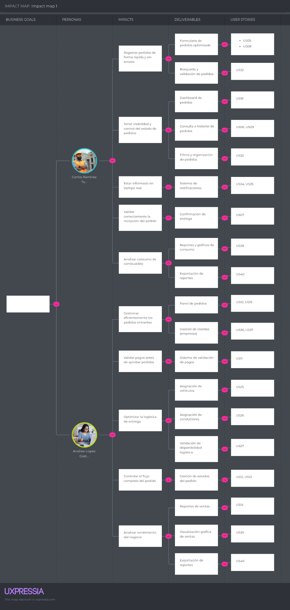

## 3.4 Product Backlog

| **\#Orden** | **ID** | **Título**                                 | **Descripción**                                                                                                                                                                    | **Story Points** |
|-------------|--------|--------------------------------------------|------------------------------------------------------------------------------------------------------------------------------------------------------------------------------------|------------------|
| **01**      | US-05  | Registrar nuevo pedido                     | Como solicitante, quiero registrar un pedido con tipo y cantidad de combustible para que el proveedor lo procese.                                                                  | **5**            |
| **02**      | US-06  | Consultar estado del pedido                | Como solicitante, quiero ver el estado de mis pedidos para saber si están aprobados, en tránsito o entregados.                                                                     | **2**            |
| **03**      | US-08  | Registrar información de pago              | Como solicitante, quiero ingresar la información de los pagos correspondientes para validar el pedido ante el proveedor.                                                           | **3**            |
| **04**      | US-07  | Confirmar recepción de pedido              | Como solicitante, quiero confirmar que recibí el pedido para que el proveedor lo cierre.                                                                                           | **2**            |
| **05**      | US-09  | Ver historial de pedidos                   | Como solicitante, quiero ver mis pedidos anteriores para tener control sobre mi consumo.                                                                                           | **2**            |
| **06**      | US-43  | Ver detalle de pedido                      | Como usuario de ambos segmentos, quiero ver el detalle completo de un pedido para revisar toda la información asociada.                                                            | **2**            |
| **07**      | US-10  | Ver pedidos pendientes                     | Como proveedor, quiero ver todos los pedidos pendientes para analizarlos y tomar acción.                                                                                           | **2**            |
| **08**      | US-11  | Aprobar pedido                             | Como proveedor, quiero aprobar pedidos según los depósitos hechos a mis cuentas bancarias.                                                                                         | **3**            |
| **09**      | US-42  | Rechazar pedido                            | Como proveedor, quiero rechazar un pedido cuando no pueda atenderlo para notificar al solicitante oportunamente.                                                                   | **2**            |
| **10**      | US-12  | Marcar pedido como despachado              | Como proveedor, quiero marcar cuándo un pedido sale a entrega para notificar al cliente.                                                                                           | **2**            |
| **11**      | US-13  | Cerrar pedido                              | Como proveedor, quiero cerrar el pedido cuando el cliente confirme la entrega para finalizar el proceso.                                                                           | **2**            |
| **12**      | US-14  | Generar reporte de ventas                  | Como proveedor, quiero generar reportes de ventas para tener registro de operaciones realizadas.                                                                                   | **3**            |
| **13**      | US-46  | Gestionar inventario de combustibles       | Como proveedor, quiero registrar, editar y eliminar los productos de combustible de mi catálogo para que estén disponibles como opciones al crear un pedido.                       | **3**            |
| **14**      | US-44  | Gestionar vehículos de flota               | Como proveedor, quiero registrar y administrar los vehículos de mi flota para tenerlos disponibles al asignarlos a pedidos.                                                        | **3**            |
| **15**      | US-45  | Gestionar conductores                      | Como proveedor, quiero registrar y administrar los conductores de mi empresa para asignarlos correctamente a los despachos.                                                        | **3**            |
| **16**      | US-49  | Asignar recursos a despacho                | Como proveedor, quiero asignar un vehículo y un conductor a un pedido aprobado en una sola operación para agilizar la preparación del despacho.                                    | **5**            |
| **17**      | US-22  | Validar disponibilidad de transporte       | Como proveedor, quiero saber qué vehículos están disponibles antes de asignarlos para vincularlos correctamente.                                                                   | **5**            |
| **18**      | US-18  | Ver resumen de pedidos (Solicitante)       | Como solicitante, quiero ver un resumen de mis pedidos para identificar cuántos están en proceso o completados.                                                                    | **3**            |
| **19**      | US-47  | Ver Dashboard principal del proveedor      | Como proveedor, quiero acceder a un panel principal con KPIs de operación y un gráfico de tendencia de ventas para tener visibilidad en tiempo real del estado de mi negocio.      | **3**            |
| **20**      | US-29  | Recibir notificación de aprobación         | Como solicitante, quiero recibir una notificación cuando un pedido sea aprobado o rechazado para estar informado.                                                                  | **2**            |
| **21**      | US-30  | Notificación de pedido despachado          | Como solicitante, quiero recibir una notificación cuando un pedido haya sido despachado para estar informado.                                                                      | **2**            |
| **22**      | US-27  | Buscar pedido por código                   | Como usuario de ambos segmentos, quiero buscar un pedido específico por su código para encontrarlo rápidamente.                                                                    | **2**            |
| **23**      | US-28  | Filtrar pedidos por estado                 | Como usuario de ambos segmentos, quiero filtrar mis pedidos por estado para facilitar la revisión.                                                                                 | **2**            |
| **24**      | US-31  | Ver listado de empresas                    | Como proveedor, quiero ver una lista de empresas solicitantes para identificar a mis clientes frecuentes.                                                                          | **2**            |
| **25**      | US-32  | Ver detalles de empresa                    | Como proveedor, quiero ver información detallada de una empresa solicitante para analizar su historial de pedidos.                                                                 | **2**            |
| **26**      | US-33  | Ver gráfico de consumo (Solicitante)       | Como solicitante, quiero ver un gráfico de mi consumo mensual para tener control sobre el uso del combustible.                                                                     | **3**            |
| **27**      | US-34  | Ver gráfico de ventas (Proveedor)          | Como proveedor, quiero ver un gráfico de ventas por mes para monitorear el rendimiento del negocio.                                                                                | **3**            |
| **28**      | US-48  | Ver distribución de ventas por sector      | Como proveedor, quiero ver la distribución de mis ventas por sector industrial para identificar cuáles son mis clientes más relevantes por rubro.                                  | **2**            |
| **29**      | US-35  | Descargar reporte PDF                      | Como usuario de ambos segmentos, quiero descargar un resumen de pedidos o ventas en formato PDF para archivarlo o compartirlo.                                                     | **3**            |
| **30**      | US-01  | Ver sección Home                           | Como visitante (proveedor), quiero ver una sección de inicio que resuma el valor de FuelBridge para comprender rápidamente el objetivo del sistema.                                  | **2**            |
| **31**      | US-02  | Ver sección About Us                       | Como visitante de ambos segmentos, quiero conocer quiénes están detrás de FuelBridge para confiar en el sistema.                                                                     | **1**            |
| **32**      | US-03  | Ver sección How it works?                  | Como visitante de ambos segmentos, quiero entender cómo funciona FuelBridge paso a paso para evaluar si se ajusta a mis necesidades.                                                 | **2**            |
| **33**      | US-36  | Ver sección Benefits                       | Como visitante de ambos segmentos, quiero conocer las principales ventajas para evaluar la implementación de la plataforma.                                                        | **1**            |
| **34**      | US-37  | Ver sección Lo que Dicen Nuestros Clientes | Como visitante de ambos segmentos, quiero conocer los testimonios de usuarios de FuelBridge para tener confianza en la plataforma.                                                   | **2**            |
| **35**      | US-38  | Ver sección Planes y Precios               | Como visitante de ambos segmentos, quiero saber qué planes se adecuan a mis necesidades para poder iniciar un proceso de registro.                                                 | **3**            |
| **36**      | US-39  | Cambiar idioma                             | Como visitante de ambos segmentos, quiero poder cambiar entre inglés y español para entender la plataforma en mi idioma preferido.                                                 | **3**            |
| **37**      | US-04  | Enviar mensaje de contacto                 | Como visitante de ambos segmentos, quiero enviar un mensaje desde Contact Us para solicitar más información.                                                                       | **3**            |
| **38**      | US-23  | Ver perfil de usuario                      | Como usuario registrado, quiero ver mis datos de perfil para revisar mi información registrada.                                                                                    | **1**            |
| **39**      | US-24  | Editar datos de perfil                     | Como usuario registrado, quiero editar mis datos para mantener mi información actualizada.                                                                                         | **2**            |
| **40**      | US-25  | Ver sección de preguntas frecuentes        | Como visitante de ambos segmentos, quiero acceder a una sección de preguntas frecuentes para resolver dudas rápidamente.                                                           | **2**            |
| **41**      | US-26  | Acceder a información de contacto rápido   | Como usuario de ambos segmentos, quiero ver datos de contacto directo (teléfono o correo) para hacer consultas urgentes.                                                           | **1**            |
| **42**      | US-40  | Registrar empresa solicitante              | Como visitante (solicitante), quiero registrar mi empresa en la plataforma para comenzar a realizar pedidos de combustible.                                                        | **3**            |
| **43**      | US-41  | Registrar empresa proveedora               | Como visitante (proveedor), quiero registrar mi empresa distribuidora en la plataforma para comenzar a gestionar pedidos de combustible.                                           | **3**            |
| **44**      | US-15  | Iniciar sesión                             | Como usuario registrado, quiero iniciar sesión con correo y contraseña para acceder a mi cuenta.                                                                                   | **2**            |
| **45**      | US-16  | Recuperar contraseña                       | Como usuario registrado, quiero recuperar mi contraseña para volver a acceder si la olvidé.                                                                                        | **2**            |
| **46**      | US-17  | Cerrar sesión                              | Como usuario registrado, quiero poder cerrar sesión para mantener segura mi cuenta.                                                                                                | **1**            |
| **47**      | TS-01  | Endpoint: Login                            | Como developer, quiero un endpoint para autenticar usuarios.                                                                                                                       | **2**            |
| **48**      | TS-02  | Endpoint: Recuperar contraseña             | Como developer, quiero un endpoint que permita enviar correo de recuperación.                                                                                                      | **2**            |
| **49**      | TS-03  | Endpoint: Logout                           | Como developer, quiero un endpoint para cerrar sesión.                                                                                                                             | **1**            |
| **50**      | TS-04  | Endpoint: Crear pedido                     | Como developer, quiero un endpoint para registrar un nuevo pedido de combustible.                                                                                                  | **3**            |
| **51**      | TS-05  | Endpoint: Consultar pedidos por usuario    | Como developer, quiero un endpoint para obtener todos los pedidos de un usuario.                                                                                                   | **2**            |
| **52**      | TS-06  | Endpoint: Registro de usuario              | Como developer, quiero un endpoint para registrar nuevos usuarios en la plataforma (sign-up).                                                                                      | **3**            |
| **53**      | TS-07  | Endpoint: Consultar usuarios               | Como developer, quiero endpoints para listar todos los usuarios y consultar uno por su ID.                                                                                         | **5**            |
| **54**      | TS-08  | Endpoint: CRUD de empresas compradoras     | Como developer, quiero endpoints para registrar, listar, consultar y actualizar empresas compradoras (buyer companies).                                                            | **5**            |
| **55**      | TS-09  | Endpoint: CRUD de empresas proveedoras     | Como developer, quiero endpoints para registrar, listar, consultar y actualizar empresas proveedoras (provider companies).                                                         | **3**            |
| **56**      | TS-10  | Endpoint: Actualizar perfil de usuario     | Como developer, quiero un endpoint para que un usuario autenticado actualice los datos de su propio perfil.                                                                        | **5**            |
| **57**      | TS-11  | Endpoint: CRUD de productos de combustible | Como developer, quiero endpoints para crear, listar, consultar (por ID y por proveedor), actualizar y eliminar productos de combustible.                                           | **2**            |
| **58**      | TS-12  | Endpoint: Actualizar stock de producto     | Como developer, quiero un endpoint para actualizar el stock disponible de un producto de combustible.                                                                              | **3**            |
| **59**      | TS-13  | Endpoint: Consultar pedidos                | Como developer, quiero endpoints para listar todos los pedidos y consultarlos por ID, por empresa compradora y por proveedor.                                                      | **3**            |
| **60**      | TS-14  | Endpoint: Confirmar / cancelar pedido      | Como developer, quiero endpoints para confirmar o cancelar un pedido existente.                                                                                                    | **5**            |
| **61**      | TS-15  | Endpoint: Solicitudes de combustible       | Como developer, quiero endpoints para crear, listar, aceptar y rechazar solicitudes de combustible (fuel requests).                                                                | **2**            |
| **62**      | TS-16  | Endpoint: Consultar solicitud por ID       | Como developer, quiero un endpoint para consultar el detalle de una solicitud de combustible específica.                                                                           | **5**            |
| **63**      | TS-17  | Endpoint: Gestión de entregas              | Como developer, quiero endpoints para crear, despachar, completar, marcar como fallida y consultar entregas (todas, por ID, por proveedor y por pedido).                           | **5**            |
| **64**      | TS-18  | Endpoint: CRUD de conductores              | Como developer, quiero endpoints para registrar, listar por proveedor, consultar, actualizar y eliminar conductores.                                                               | **5**            |
| **65**      | TS-19  | Endpoint: CRUD de vehículos                | Como developer, quiero endpoints para registrar, listar por proveedor, consultar, actualizar y eliminar vehículos.                                                                 | **3**            |
| **66**      | TS-20  | Endpoint: Registrar y procesar pagos       | Como developer, quiero endpoints para registrar un pago, marcarlo como completado y procesar su reembolso.                                                                         | **3**            |
| **67**      | TS-21  | Endpoint: Consultar pagos                  | Como developer, quiero endpoints para listar todos los pagos y consultarlos por ID, por pedido y por empresa.                                                                      | **3**            |
| **68**      | TS-22  | Endpoint: Calificaciones de proveedores    | Como developer, quiero endpoints para crear, listar y actualizar calificaciones de proveedores.                                                                                    | **5**            |
| **69**      | TS-23  | Endpoint: Gestión de equipos               | Como developer, quiero endpoints para registrar, actualizar, listar y consultar equipos (por ID y por empresa).                                                                    | **2**            |
| **70**      | TS-24  | Endpoint: Asignar proveedor favorito       | Como developer, quiero un endpoint para asignar un proveedor favorito a un equipo.                                                                                                 | **2**            |
| **71**      | TS-25  | Endpoint: Eliminar equipo                  | Como developer, quiero un endpoint para eliminar un equipo registrado.                                                                                                             | **5**            |
| **72**      | TS-26  | Endpoint: Sistema de notificaciones        | Como developer, quiero endpoints para crear notificaciones, marcarlas como leídas y consultarlas por usuario, por empresa compradora, por proveedor y las no leídas de un usuario. | **5**            |
| **73**      | TS-27  | Endpoint: Reportes y analítica             | Como developer, quiero endpoints para obtener el resumen general de la plataforma y la analítica de un proveedor o comprador específico.                                           | **5**            |

  

El tablero Kanban de seguimiento (Trello) se referencia en la sección [4.3.1.7](#4317-analysis-of-current-design-and-review-iteration-goal-kanban-board) del Capítulo IV, junto con el estado de cada tarea por iteración.

---

# Capítulo IV: Product Architecture Design

## 4.1 Design Concepts, ViewPoints & ER Diagrams

### 4.1.1 Principles Statements

El diseño arquitectónico de FuelBridge (desarrollado por HaloFuel) se rige bajo principios fundamentales de ingeniería de software para garantizar escalabilidad, mantenibilidad y una experiencia de usuario óptima. Cada principio se vincula a los Quality Attribute Scenarios definidos en la sección [4.2.3](#423-quality-attribute-scenarios):

| **ID** | **Principio**              | **Descripción**                                                                                                                                                                                 | **Driver relacionado**                 |
|--------|-----------------------------|---------------------------------------------------------------------------------------------------------------------------------------------------------------------------------------------|------------------------------------------|
| P-1    | Domain-Driven Design (DDD)  | El software está estrictamente alineado con los procesos de negocio de compra y distribución de combustible. El sistema se divide en Bounded Contexts claramente definidos (Identity & Access, Ordering, Payment, Inventory, Catalog, Fulfillment, Notification, Reporting & Analytics, Equipment) para aislar la complejidad del dominio. | QA-2 Performance, CONC-3 (Mantenimiento del Código) |
| P-2    | Separation of Concerns (SoC) | El sistema se divide en distintas capas (Presentación, Lógica de Negocio mediante APIs y Acceso a Datos) asegurando que cada componente tenga una responsabilidad única.                      | QA-2 Performance, CONC-3 (Mantenimiento del Código) |
| P-3    | API-First Design            | Todo el acceso a la lógica de negocio y a los datos se expone mediante una API REST centralizada, permitiendo que múltiples interfaces consuman los mismos servicios y facilitando integraciones futuras. | QA-1 Availability & Traceability        |
| P-4    | Diseño centrado en el usuario | Priorización de interfaces limpias, fluidas y de respuesta rápida (Single Page Application) orientadas a resolver problemas prácticos del día a día logístico y asegurar la satisfacción del usuario final. | QA-3 Usability                          |

### 4.1.2 Approaches Statements Architectural Styles & Patterns

Para resolver la problemática de comunicación informal y trazabilidad en el sector energético, se adoptan los siguientes estilos. La decisión final entre estilos candidatos se formaliza en la sección [4.3.1.4](#4314-choose-one-or-more-design-concepts-that-satisfy-the-selected-drivers), donde Monolito Modular es seleccionado sobre Microservicios distribuidos:

| **ID**  | **Estilo**                              | **Descripción**                                                                                                                             | **Driver relacionado**                        |
|---------|-------------------------------------------|-----------------------------------------------------------------------------------------------------------------------------------------------|------------------------------------------------|
| ST-1    | Monolito Modular por Bounded Contexts    | El backend se estructura internamente en 9 Bounded Contexts independientes por dominio (ver ADR-02), facilitando la escalabilidad y el mantenimiento concurrente dentro de una única API desplegable. | QA-2 Performance, CON-1 (Tecnológicas)        |
| ST-2    | Single Page Application (SPA)             | El frontend utiliza un estilo de aplicación de página única para brindar una experiencia fluida sin recargas, crucial para paneles de control en tiempo real. | QA-3 Usability                                  |
| ST-3    | Event-Driven interno (Observer/Pub-Sub)   | Implementado para la orquestación asíncrona entre Bounded Contexts, como el disparo de notificaciones o la generación de reportes PDF cuando un pedido cambia de estado en el sistema. | QA-1 Availability & Traceability, CONC-2 (Desacoplamiento de Servicios Bloqueantes) |

> Nota: en una versión previa de este capítulo, ST-1 se describía como "Microservicios lógicos", lo cual entraba en contradicción con la decisión adoptada en 4.3.1.4 (Monolito Modular, microservicios distribuidos rechazados por Constraint de time-to-market). Se corrige aquí para mantener consistencia entre el estilo declarado y la decisión arquitectónica final.

### 4.1.3 Context Diagram

  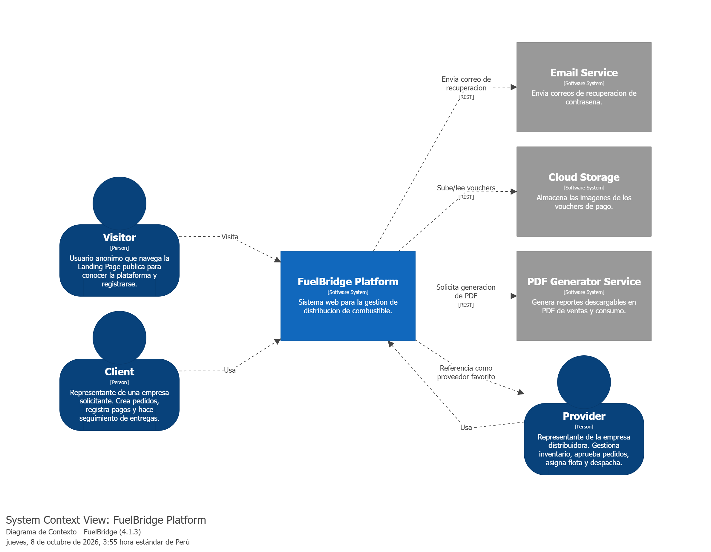

El Diagrama de Contexto de FuelBridge define los límites del sistema y sus interacciones principales con los usuarios y sistemas externos:

**Sistema Central**

FuelBridge Platform: Sistema web para la gestión de distribución de combustible.

**Actores (Personas)**

- Visitor: Usuario anónimo que navega por la Landing Page pública para conocer las características de la plataforma y registrarse.

- Client (Requester): Representante de una empresa que necesita combustible. Interactúa para crear pedidos, registrar pagos y hacer seguimiento del estado de entrega.

- Provider: Representante de la empresa distribuidora de combustible. Gestiona el inventario, aprueba/rechaza pedidos, asigna la flota logística y despacha las entregas.

**Sistemas Externos**

- Email Service: Sistema de software utilizado para enviar correos de recuperación de contraseñas a los usuarios registrados mediante REST API.

- Cloud Storage: Servicio en la nube encargado de almacenar las imágenes de los vouchers de pago subidos por los clientes.

- PDF Generator Service: Herramienta externa consumida vía REST API para generar reportes descargables en PDF sobre ventas y resúmenes de consumo.

### 4.1.4 Approach Driven ViewPoints Diagrams

  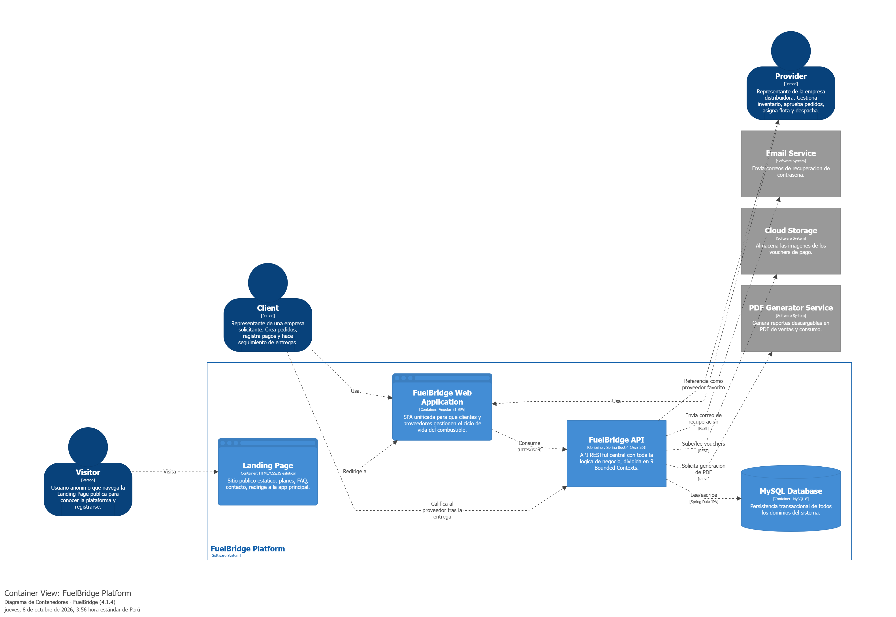

El Diagrama de Contenedores detalla la arquitectura de alto nivel y las piezas de software desplegables:

- Landing Page: Sitio web estático que presenta las características de la plataforma, planes de precios, preguntas frecuentes y formulario de contacto, redirigiendo al usuario a la aplicación principal.

- FuelBridge Web Application: Una Single Page Application (SPA) ejecutada en el navegador del usuario, que sirve como la interfaz gráfica unificada para que clientes y proveedores gestionen el ciclo de vida del combustible.

- FuelBridge API: Desarrollada en Spring Boot (Java 26), es la API RESTful central que contiene toda la lógica de negocio, procesa las peticiones del frontend y orquesta los diferentes Bounded Contexts.

- MySQL Database: Base de datos relacional centralizada que almacena la información de dominio (usuarios, clientes, proveedores, pedidos, pagos, flota, despachos, etc.), accedida desde la API mediante Spring Data JPA / Hibernate.

  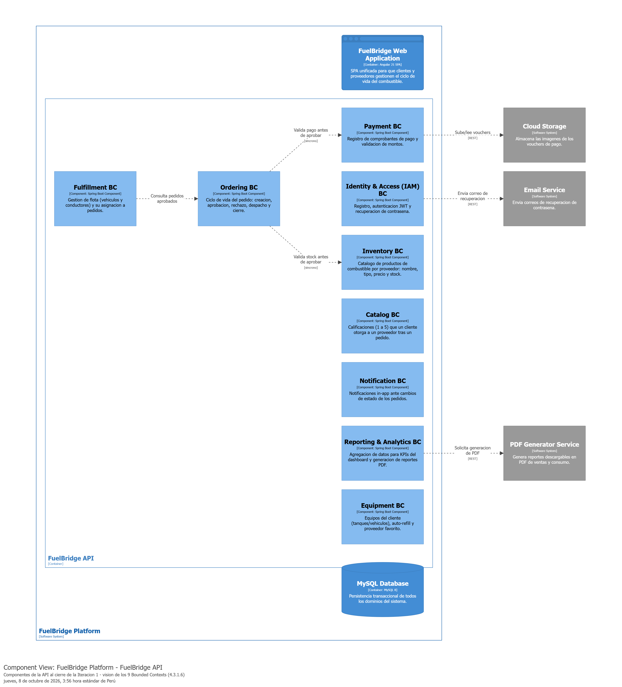

  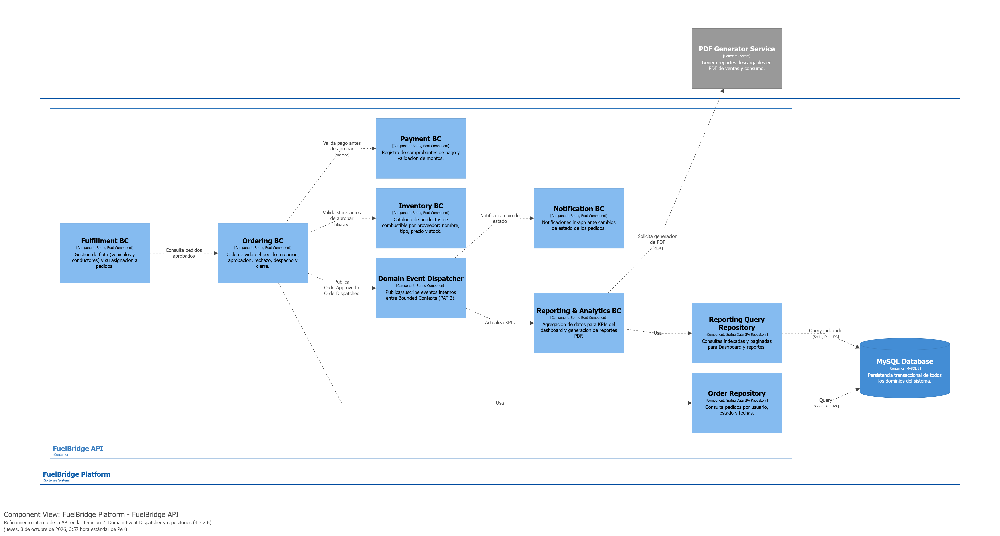

A nivel de componentes, la FuelBridge API se descompone en los siguientes Bounded Contexts (BC) para mantener alta cohesión:

- Identity & Access BC: Gestiona registro, autenticación, JWT y recuperación de contraseñas.

- Ordering BC: Orquesta el ciclo de vida del pedido (creación, aprobación, rechazo, despacho y cierre).

- Inventory BC: Administra el catálogo de productos de combustible de cada proveedor (nombre, tipo, precio por unidad, capacidad y stock disponible).

- Catalog BC: Gestiona las calificaciones (1 a 5 estrellas) que un Client otorga a un Provider tras completar un pedido, dando visibilidad de reputación dentro del marketplace.

- Payment BC: Registra comprobantes de pago y valida los montos.

- Fulfillment BC: Administra la flota (vehículos y conductores) y su asignación a pedidos.

- Notification BC: Crea notificaciones in-app ante cambios de estado de los pedidos.

- Reporting & Analytics BC: Agrega datos para generar gráficos y solicitar PDFs de ventas.

- Equipment BC: Administra los equipos del Client (tanques, vehículos propios), su nivel de combustible, umbral de auto-refill y proveedor favorito asociado.

**Domain Class Diagram (Ordering BC)**

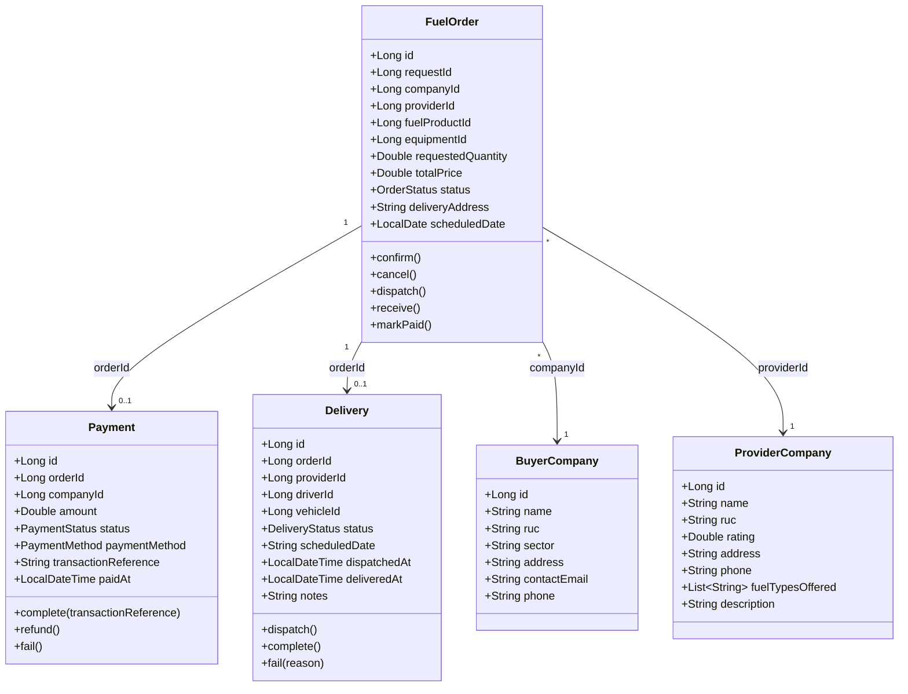
```mermaid
classDiagram
    class FuelOrder {
        +Long id
        +Long requestId
        +Long companyId
        +Long providerId
        +Long fuelProductId
        +Long equipmentId
        +Double requestedQuantity
        +Double totalPrice
        +OrderStatus status
        +String deliveryAddress
        +LocalDate scheduledDate
        +confirm()
        +cancel()
        +dispatch()
        +receive()
        +markPaid()
    }
    class Payment {
        +Long id
        +Long orderId
        +Long companyId
        +Double amount
        +PaymentStatus status
        +PaymentMethod paymentMethod
        +String transactionReference
        +LocalDateTime paidAt
        +complete(transactionReference)
        +refund()
        +fail()
    }
    class Delivery {
        +Long id
        +Long orderId
        +Long providerId
        +Long driverId
        +Long vehicleId
        +DeliveryStatus status
        +String scheduledDate
        +LocalDateTime dispatchedAt
        +LocalDateTime deliveredAt
        +String notes
        +dispatch()
        +complete()
        +fail(reason)
    }
    class BuyerCompany {
        +Long id
        +String name
        +String ruc
        +String sector
        +String address
        +String contactEmail
        +String phone
    }
    class ProviderCompany {
        +Long id
        +String name
        +String ruc
        +Double rating
        +String address
        +String phone
        +List~String~ fuelTypesOffered
        +String description
    }
    FuelOrder "1" --> "0..1" Payment : orderId
    FuelOrder "1" --> "0..1" Delivery : orderId
    FuelOrder "*" --> "1" BuyerCompany : companyId
    FuelOrder "*" --> "1" ProviderCompany : providerId
```

**Nota de implementación:** a diferencia de una versión anterior de este diagrama, el agregado `FuelOrder` no tiene una clase `OrderDetail` asociada — es un agregado plano con un único `fuelProductId` y `requestedQuantity` por pedido (un pedido = un producto, no una lista de líneas). `BuyerCompany` y `ProviderCompany` son las clases reales de Identity & Access BC (antes referidas genéricamente como "Client" y "Provider"); no exponen métodos de cambio de estado propios más allá del constructor. Las clases `Client` y `Provider` de la versión anterior no existen en el código.

**State Diagram – Ciclo de vida del pedido (Order)**

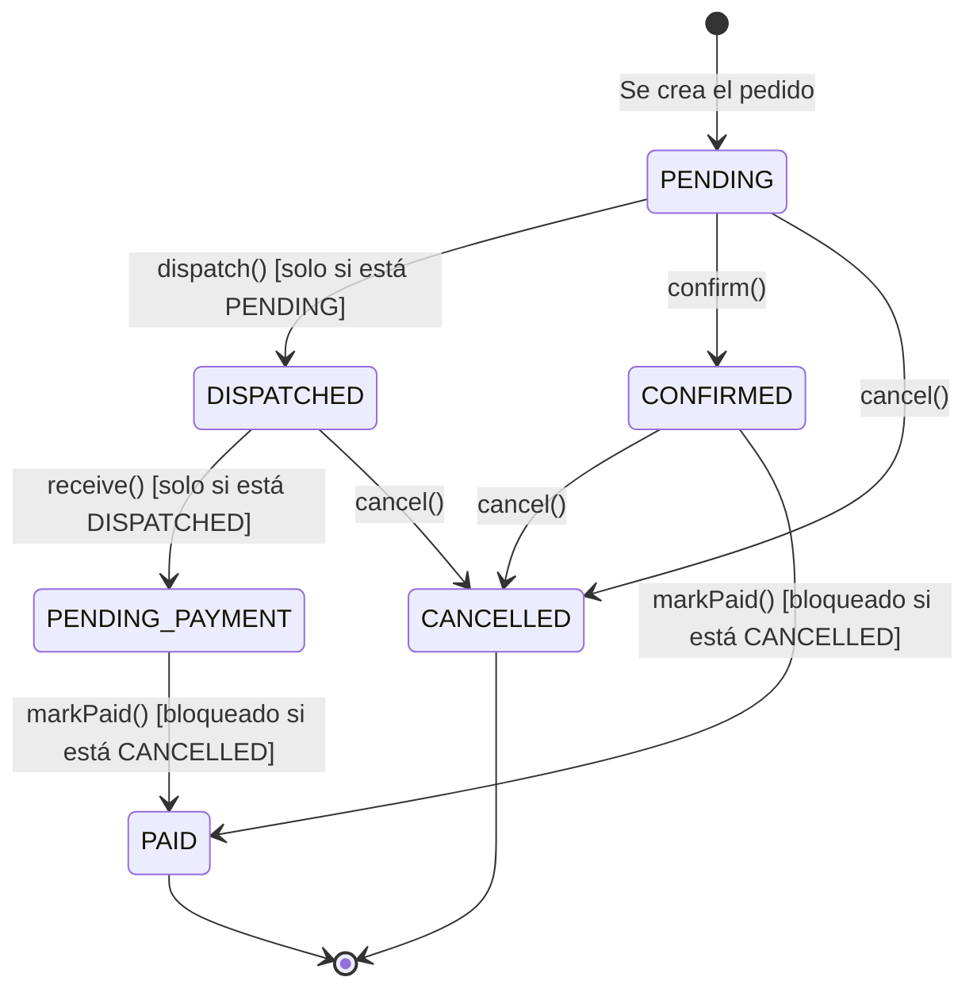
```mermaid
stateDiagram-v2
    [*] --> PENDING : Se crea el pedido
 
    PENDING --> DISPATCHED : dispatch() [solo si está PENDING]
    PENDING --> CONFIRMED : confirm()
    PENDING --> CANCELLED : cancel()
 
    DISPATCHED --> PENDING_PAYMENT : receive() [solo si está DISPATCHED]
    DISPATCHED --> CANCELLED : cancel()
 
    CONFIRMED --> CANCELLED : cancel()
    CONFIRMED --> PAID : markPaid() [bloqueado si está CANCELLED]
 
    PENDING_PAYMENT --> PAID : markPaid() [bloqueado si está CANCELLED]
 
    PAID --> [*]
    CANCELLED --> [*]
```
 
**Nota de implementación:** `dispatch()` y `receive()` sí validan el estado previo del pedido (lanzan `IllegalStateException` si se invocan fuera de orden). `confirm()`, `cancel()` y `markPaid()` no tienen esa validación en el código actual — pueden invocarse desde cualquier estado (markPaid() solo bloquea si el pedido ya está `CANCELLED`). Los estados `IN_PROGRESS` y `DELIVERED`, declarados en `OrderStatus`, no están conectados a ningún método del agregado todavía.

**Activity Diagram – Aprobación y despacho de un pedido**

```mermaid
flowchart TD
    A[Cliente envía FuelRequest] --> B{Producto pertenece al proveedor indicado?}
    B -- No --> B1[Sistema rechaza la solicitud]
    B -- Sí --> C[Request queda en estado PENDING]
    C --> D{Proveedor decide}
    D -- Rechazar --> E{Incluyó un motivo?}
    E -- No --> E1[Sistema exige un motivo obligatorio]
    E -- Sí --> F[Request pasa a REJECTED]
    D -- Aceptar --> G{El producto todavía existe?}
    G -- No --> G1[Sistema rechaza la aceptación]
    G -- Sí --> H[Se crea FuelOrder en PENDING, vinculado al Request]
    H --> I[Request pasa a APPROVED]
    I --> J{Acción posterior sobre el FuelOrder}
    J -- confirm&#40;&#41; --> K[Order pasa a CONFIRMED]
    J -- cancel&#40;&#41; --> L[Order pasa a CANCELLED]
    J -- "dispatch&#40;&#41; si está PENDING" --> M[Order pasa a DISPATCHED]
    M --> N{receive&#40;&#41;}
    N -- "si está DISPATCHED" --> O[Order pasa a PENDING_PAYMENT]
    O --> P{"markPaid&#40;&#41; si no está CANCELLED"}
    P --> Q[Order pasa a PAID]
```

**Nota de implementación:** este diagrama refleja el flujo real tal como está en `FuelRequestService` y `FuelOrderCommandServiceImpl`. No hay validación automática de stock ni de pago antes de la aceptación del proveedor (`accept()` solo valida que el producto todavía exista), y `confirm()`, `cancel()`, `dispatch()`, `receive()` y `markPaid()` son operaciones independientes invocadas por separado vía API, no un pipeline orquestado automáticamente.
 
`confirm()`, `cancel()` y `dispatch()` publican un evento de dominio (`FuelOrderConfirmedEvent`, `FuelOrderCancelledEvent`, `FuelOrderDispatchedEvent`) a través del mecanismo de Spring Data (`AbstractAggregateRoot` + `ApplicationEventPublisher`, publicado manualmente en `FuelOrderRepositoryImpl.save()` dado que el agregado se mapea a una entidad de persistencia aparte). Un listener en Notification BC (`FuelOrderNotificationEventHandler`) escucha esos tres eventos y crea una notificación real para el usuario dueño de la empresa compradora. `receive()` y `markPaid()` todavía no publican eventos ni generan notificaciones.

### 4.1.5 Relational/Non Relational Database Diagram

  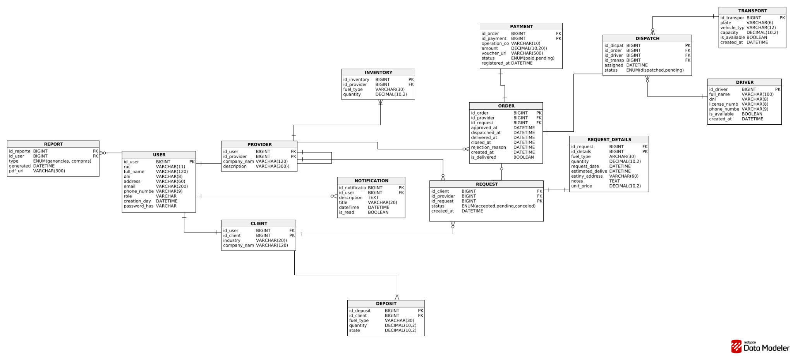

El modelo de datos relacional de la plataforma está normalizado para garantizar la integridad referencial y soportar las transacciones de los diferentes Bounded Contexts. Cada grupo de tablas pertenece y es administrado por un único BC (Database per Bounded Context dentro del esquema compartido MySQL, ver ADR-04):

| **Bounded Context**       | **Tablas**                                | **Responsabilidad del esquema**                                                                                                     |
|----------------------------|--------------------------------------------|----------------------------------------------------------------------------------------------------------------------------------------|
| Identity & Access BC       | USER, CLIENT, PROVIDER                      | La tabla central USER almacena credenciales y roles. De esta se derivan lógicamente los perfiles especializados CLIENT (empresa solicitante) y PROVIDER (distribuidor), que incluyen datos comerciales específicos. |
| Ordering BC                 | REQUEST, REQUEST_DETAILS, ORDER             | La interacción comercial inicia en la tabla REQUEST y se detalla en REQUEST_DETAILS. Una vez aceptada, se consolida en la tabla transaccional ORDER, que centraliza estados y tiempos (aprobado, despachado, entregado). |
| Payment BC                  | PAYMENT, DEPOSIT                            | Los pagos se registran en la tabla PAYMENT (asociada a una orden), además de considerar depósitos pre-aprobados en DEPOSIT.             |
| Inventory BC                | FUEL_PRODUCT                                | Controla el catálogo y el stock de combustible de cada proveedor: nombre, tipo, precio por unidad, capacidad y disponibilidad.         |
| Catalog BC                  | PROVIDER_RATING                             | Almacena las calificaciones (1 a 5) que un cliente otorga a un proveedor tras un pedido completado.                                    |
| Fulfillment BC              | DISPATCH, TRANSPORT, DRIVER                 | La tabla DISPATCH actúa como el núcleo operativo, vinculando un pedido aprobado (ORDER) con los recursos físicos de la tabla TRANSPORT (vehículos, placas, capacidad) y DRIVER (conductores y licencias). |
| Notification BC             | NOTIFICATION                                | Permite el historial de alertas por usuario.                                                                                           |
| Reporting & Analytics BC    | REPORT                                      | Consolida la metadata de los archivos generados en el sistema.                                                                         |
| Equipment BC                 | EQUIPMENT                                   | Almacena los equipos (tanques/vehículos) del cliente: capacidad, nivel actual, umbral y configuración de auto-refill, y proveedor favorito. |

Las referencias entre esquemas de distintos BC (por ejemplo, DISPATCH → ORDER, o PAYMENT → ORDER) se mantienen como foreign keys dentro de la misma base MySQL, consistente con la decisión ADR-04 de no separar la base de datos por BC durante el MVP.

### 4.1.6 Design Patterns

| **ID**  | **Patrón**                   | **Aplicación**                                                                                                                       | **Driver relacionado**                           |
|---------|-------------------------------|-----------------------------------------------------------------------------------------------------------------------------------------|----------------------------------------------------|
| PAT-1   | Repository Pattern            | Aplicado en el acceso a datos para abstraer las consultas a MySQL vía Spring Data JPA, permitiendo modificaciones en el motor de persistencia sin alterar los controladores de la API. | QA-2 Performance, CONC-3 (Mantenimiento del Código) |
| PAT-2   | Observer (Publish-Subscribe)  | Empleado internamente (Domain Event Dispatcher) para que el Notification BC y Reporting & Analytics BC reaccionen asíncronamente a los eventos del Ordering BC (ej. cuando se aprueba o despacha una orden). | QA-1 Availability & Traceability, CONC-2 (Desacoplamiento de Servicios Bloqueantes) |
| PAT-3   | MVC / MVVM                    | Patrones aplicados en el diseño de la SPA en el frontend para separar la lógica de presentación de la lógica de consumo de servicios REST. | QA-3 Usability                                      |
| PAT-4   | Unit of Work                  | Agrupa las operaciones de escritura de un mismo caso de uso (ej. aprobar pedido + registrar despacho) en una única transacción de Spring (@Transactional), evitando estados inconsistentes entre tablas de distintos BC. | CONC-1 (Gestión Segura del Estado)                  |

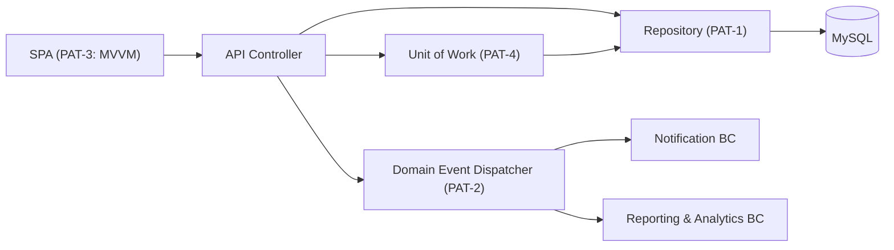
```mermaid
flowchart LR
    Controller["API Controller"] --> Repo["Repository (PAT-1)"]
    Controller --> UoW["Unit of Work (PAT-4)"]
    UoW --> Repo
    Repo --> DB[(MySQL)]
    Controller --> Dispatcher["Domain Event Dispatcher (PAT-2)"]
    Dispatcher --> Notif["Notification BC"]
    Dispatcher --> Report["Reporting & Analytics BC"]
    SPA["SPA (PAT-3: MVVM)"] --> Controller
```

### 4.1.7 Tactics

| **ID**  | **Atributo de calidad**        | **Categoría táctica (Bass et al.)** | **Táctica aplicada**                                                                                                                 | **QA relacionado** |
|---------|----------------------------------|----------------------------------------|------------------------------------------------------------------------------------------------------------------------------------------|-----------------------|
| TAC-1   | Disponibilidad (Availability)   | Detect Faults → Recover from Faults    | Uso de redundancia en la persistencia de datos (Cloud Storage para archivos) y excepciones controladas (circuit-breaker simple) en la comunicación con servicios de terceros (como el PDF Generator) para evitar fallos en cascada. | QA-1                 |
| TAC-2   | Seguridad (Security)            | Resist Attacks                         | Autenticación estricta mediante JSON Web Tokens (JWT) gestionada por el Identity & Access BC, además de obligar al uso de HTTPS para todo el tráfico entre la SPA, la Landing Page y la API. | Constraint: Integración de Terceros |
| TAC-3   | Modificabilidad (Modifiability) | Increase Cohesion / Reduce Coupling    | La alta cohesión lograda al separar la API en 9 Bounded Contexts distintos permite modificar, por ejemplo, la lógica de inventario (Inventory BC) sin impactar la lógica de despachos (Fulfillment BC). | CONC-3 (Mantenimiento del Código) |
| TAC-4   | Desempeño (Performance)         | Manage Resources / Resource Pooling    | Índices en las columnas de búsqueda frecuente de ORDER (estado, fecha, cliente) y paginación en los endpoints de Dashboard para acotar el volumen de datos procesado por consulta. | QA-2                 |

## 4.2 Architectural Drivers

### 4.2.1 Design Purpose

El propósito arquitectónico de FuelBridge es proporcionar una plataforma B2B centralizada y altamente confiable que digitalice el flujo completo de pedido, pago y despacho de combustible. Se busca reemplazar los canales informales (WhatsApp, llamadas, hojas de Excel) para reducir errores operativos, brindar trazabilidad en tiempo real y optimizar los tiempos de gestión logística para empresas de los sectores de minería y construcción.

### 4.2.2 Primary Functionality (Primary User Stories)

La arquitectura debe dar soporte prioritario a las historias de usuario y endpoints core identificados con mayor valor de negocio en el Product Backlog. Cada una exige una decisión estructural específica, no solo funcional:

- US-05 / TS-04: Registrar un nuevo pedido de combustible (Solicitante) y su creación en la base de datos. Exige que el Ordering BC exponga un endpoint transaccional que valide stock (Catalog BC) antes de confirmar el REQUEST, lo cual condiciona la comunicación entre BCs definida en 4.3.1.3.

- US-11 / TS-14: Aprobar pedidos condicionados a la validación de los pagos correspondientes (Proveedor). Requiere una dependencia síncrona entre Ordering BC y Payment BC antes de permitir la transición de estado Pending → Approved (ver diagrama de estados en 4.1.4).

- US-46 / TS-17: Asignar recursos físicos (vehículo y conductor) al despacho en una sola operación. Obliga a que Fulfillment BC consulte disponibilidad de TRANSPORT y DRIVER de forma atómica, lo que motiva el patrón Unit of Work (PAT-4, ver 4.1.6).

- US-47: Despliegue de un Dashboard principal para el proveedor con KPIs y métricas en tiempo real. Es el origen directo del driver QA-2 (Performance) y de la decisión de indexar y optimizar las consultas de Reporting & Analytics BC (ver ADD-06 y ADR-07).

### 4.2.3 Quality Attribute Scenarios

Basado en los requerimientos del sector B2B, se definen tres Quality Attribute Scenarios siguiendo el formato de 6 partes (Bass, Clements & Kazman). Los IDs QA-1, QA-2 y QA-3 asignados aquí son los mismos referenciados en los Architectural Design Backlogs de la sección 4.3:

**QA-1 - Disponibilidad y Trazabilidad (Availability & Traceability)**

| **Parte**              | **Descripción**                                                                                   |
|-------------------------|-----------------------------------------------------------------------------------------------------|
| Fuente del estímulo     | Provider (desde la Web Application)                                                                 |
| Estímulo                | Actualiza el estado de una orden a "Despachado"                                                     |
| Entorno                 | Sistema en operación normal, carga nominal                                                          |
| Artefacto                 | Notification BC y Ordering BC                                                                       |
| Respuesta                | El cambio de estado se publica como evento de dominio (Observer/Pub-Sub) y genera una notificación in-app para el Client correspondiente |
| Medida de respuesta      | El 100% de los eventos de cambio de estado generan una notificación visible para el cliente en menos de 5 segundos, sin pérdida de eventos |

**QA-2 - Desempeño (Performance)**

| **Parte**              | **Descripción**                                                                                   |
|-------------------------|-----------------------------------------------------------------------------------------------------|
| Fuente del estímulo     | Provider (desde el Dashboard) o Client (desde el historial de pedidos)                              |
| Estímulo                | Solicita la carga del Dashboard principal o del historial de pedidos                                |
| Entorno                 | Operación normal, hasta 50 usuarios concurrentes consultando reportes                               |
| Artefacto                 | Reporting & Analytics BC y la base de datos MySQL                                                   |
| Respuesta                | El sistema consulta ORDER y tablas relacionadas usando índices por estado y fecha (ver ADR-07) y devuelve el resultado paginado |
| Medida de respuesta      | El 95% de las consultas del Dashboard y del historial responden en menos de 2 segundos bajo carga de 50 usuarios concurrentes (pendiente de validar con pruebas de carga, ver 4.3.2.7) |

**QA-3 - Usabilidad (Usability)**

| **Parte**              | **Descripción**                                                                                   |
|-------------------------|-----------------------------------------------------------------------------------------------------|
| Fuente del estímulo     | Client o Provider, usuarios que transicionan desde herramientas manuales (WhatsApp, Excel)          |
| Estímulo                | Registra un nuevo pedido (US-05) o asigna flota a un despacho (US-46)                               |
| Entorno                 | Primer uso o uso recurrente de la SPA, sin entrenamiento previo formal                              |
| Artefacto                 | FuelBridge Web Application (SPA)                                                                     |
| Respuesta                | La interfaz valida el formulario en el cliente y muestra confirmación visual inmediata del resultado de la acción |
| Medida de respuesta      | El sistema brinda feedback visual en menos de 300 ms tras la acción del usuario, y un usuario nuevo completa el registro de un pedido en menos de 2 minutos sin asistencia |

### 4.2.4 Constraints

| **ID**   | **Restricción**            | **Descripción**                                                                                                                 |
|----------|------------------------------|-------------------------------------------------------------------------------------------------------------------------------------|
| CON-1    | Tecnológicas                 | El backend se restringe al uso del entorno Spring Boot (Java) para la exposición de la REST API y MySQL para la persistencia transaccional. |
| CON-2    | Integración de Terceros      | El sistema tiene dependencias externas estrictas para el envío de correos, almacenamiento de vouchers (Cloud Storage) y generación de reportes (PDF Generator), por lo que las interfaces de red deben manejar latencias. |
| CON-3    | Plazos (Time-to-market)      | El proyecto cuenta con un límite de tiempo estructurado en 4 Sprints, obligando a un desarrollo ágil y priorización del MVP.          |

### 4.2.5 Architectural Concerns

| **ID**    | **Concern**                              | **Descripción**                                                                                                                             |
|-----------|---------------------------------------------|--------------------------------------------------------------------------------------------------------------------------------------------------|
| CONC-1    | Gestión Segura del Estado                    | Coordinar el flujo transaccional entre el pedido, el pago y la liberación de inventario (Ordering BC, Payment BC y Catalog BC) garantizando que un despacho no ocurra si el pago y el stock no están debidamente verificados. |
| CONC-2    | Desacoplamiento de Servicios Bloqueantes     | Extraer tareas pesadas o de latencia variable (generación de PDFs o envío masivo de correos) fuera del hilo principal de ejecución HTTP para no afectar la experiencia del usuario. |
| CONC-3    | Mantenimiento del Código                     | Asegurar convenciones claras de nombrado, estructuración por dominios y un pipeline de CI/CD que soporte integraciones continuas conforme avance el equipo durante los Sprints establecidos. |
| CONC-4    | Separación de Responsabilidades              | Mantener la Landing Page (contenedor estático de presentación) completamente desacoplada de la lógica transaccional de la Web Application y la API, evitando que cambios de marketing/contenido requieran un despliegue de la plataforma transaccional. |

## 4.3 ADD Iterations

### 4.3.1 Iteration 1: Estructura Global del Sistema

#### 4.3.1.1 Architectural Design Backlog 1

| **ID** | **Decisión de Diseño**                                                                   | **Driver Relacionado**                                       | **Prioridad** | **Estado**   |
|--------|------------------------------------------------------------------------------------------|--------------------------------------------------------------|---------------|--------------|
| ADD-01 | Definir los contenedores principales del sistema y sus responsabilidades                 | QA-1 (Availability & Traceability), QA-3 (Usability)         | Alta          | Por resolver |
| ADD-02 | Establecer el estilo arquitectónico base (SPA + API REST + BCs)                          | QA-2 (Performance), CON-1 (Tecnológicas)                   | Alta          | Por resolver |
| ADD-03 | Definir la estrategia de comunicación entre contenedores (sincrónica o. asincrónica)     | QA-1 (Availability & Traceability), CONC-2 (Desacoplamiento de Servicios Bloqueantes) | Alta          | Por resolver |
| ADD-04 | Establecer la separación en Bounded Contexts dentro de la API                            | QA-2 (Performance), CONC-1 (Gestión Segura del Estado)       | Media         | Por resolver |
| ADD-05 | Definir la Landing Page como contenedor estático separado de la FuelBridge Web Application | QA-3 (Usability), CONC-4 (Separación de Responsabilidades)   | Media         | Por resolver |

#### 4.3.1.2 Establish Iteration Goal by Selecting Drivers

El objetivo de esta primera iteración es establecer la estructura global del sistema desde cero, definiendo los contenedores principales que lo componen y las relaciones entre ellos.

Drivers trabajados en Iteración 1: QA-1 Availability & Traceability, QA-3 Usability y CON-1 (Tecnológicas: Spring Boot + MySQL).

**QA-1 Availability & Traceability:** Es el driver de mayor impacto para el negocio. Los clientes del sector B2B (minería y construcción) dependen de la visibilidad del estado de sus pedidos en tiempo real. Una arquitectura que no garantice la entrega confiable de eventos de cambio de estado compromete el valor principal de la plataforma. Por ello, la estructura global debe contemplar desde el inicio un mecanismo asincrónico que desacople la notificación del flujo principal del pedido.

**QA-3 Usability:** Los usuarios de FuelBridge provienen de entornos manuales (Excel, WhatsApp). La arquitectura debe soportar una interfaz de usuario fluida y sin interrupciones, lo que justifica la elección de una SPA como contenedor de frontend separado de la API, permitiendo actualizaciones parciales de la vista sin recargas completas.

**CON-1 (Tecnológicas):** El equipo está restringido al uso de Spring Boot (Java) para el backend y MySQL para la persistencia. Esta restricción condiciona directamente las decisiones de contenedores y patrones de acceso a datos.

Los drivers QA-2 (Performance) y los Concerns de gestión del estado quedan registrados en el backlog pero se abordan en la Iteración 2, donde se profundizará en los componentes internos de la API.

#### 4.3.1.3 Choose One or More Elements of the System to Refine

El elemento refinado en esta iteración es el sistema FuelBridge en su totalidad, abordado como una unidad que se descompone por primera vez en sus contenedores desplegables. Se identifican como puntos de decisión:

- La separación entre el frontend y el backend como contenedores independientes.

- La estructura interna de la API y su división en Bounded Contexts.

- Las integraciones con sistemas externos (Email Service, Cloud Storage, PDF Generator Service) y el tipo de comunicación que cada una requiere.

#### 4.3.1.4 Choose One or More Design Concepts That Satisfy the Selected Drivers

| **Concepto evaluado**                           | **Decisión** | **Razón**                                                                                                                   |
|-------------------------------------------------|--------------|-----------------------------------------------------------------------------------------------------------------------------|
| Monolito MVC server-side                        | Rechazado    | Las recargas completas de página son incompatibles con la experiencia requerida en paneles de control en tiempo real (QA-3) |
| SPA + REST API desacoplada                      | Seleccionado | Permite actualizaciones parciales de la vista y desacopla el ciclo de despliegue del frontend del backend                   |
| Microservicios distribuidos                     | Rechazado    | Complejidad operativa incompatible con el plazo de 4 Sprints (Constraint: Time-to-market)                                   |
| Monolito Modular (API única con BCs internos)   | Seleccionado | Compatible con Spring Boot y MySQL; permite cohesión por dominio sin overhead de infraestructura distribuida             |
| Observer/Pub-Sub interno para eventos entre BCs | Seleccionado | Desacopla el Notification BC del flujo transaccional del Ordering BC sin requerir un message broker externo en esta etapa   |

Decisión adoptada: arquitectura de Monolito Modular con SPA desacoplada. La API centralizada en Spring Boot se divide internamente en 9 Bounded Contexts que comparten una base de datos MySQL. La comunicación entre BCs que requiere desacoplamiento se implementa mediante Observer/Pub-Sub interno.

#### 4.3.1.5 Instantiate Architectural Elements, Allocate Responsibilities, and Define Interfaces

**Contenedores del sistema:**

| **Elemento**             | **Tipo**                 | **Responsabilidad**                                                                                                 | **Interfaz**                                                                                  |
|--------------------------|--------------------------|---------------------------------------------------------------------------------------------------------------------|-----------------------------------------------------------------------------------------------|
| Landing Page             | Static Web               | Presentación pública de la plataforma y redirección al Web Application                                              | Ninguna, redirección via URL                                                                  |
| FuelBridge Web Application | SPA (Vue/React)          | Interfaz unificada para clientes y proveedores en la gestión del ciclo de vida del combustible                      | Consume: FuelBridge API (REST/HTTPS)                                                            |
| FuelBridge API             | Spring Boot (Java)       | Lógica de negocio completa dividida en 9 BCs; procesamiento de pedidos, pagos, inventario, despachos, notificaciones y reportes | Expone: REST API (HTTPS/JSON). Consume: MySQL DB, Email Service, Cloud Storage, PDF Generator |
| MySQL Database           | Base de datos relacional | Persistencia transaccional de todos los dominios del sistema                                                        | Consumida por FuelBridge API via Spring Data JPA                                                |
| Email Service            | Sistema externo          | Envío de correos de recuperación de contraseña                                                                      | Consumido por Identity & Access BC via REST API                                               |
| Cloud Storage            | Sistema externo          | Almacenamiento de vouchers de pago                                                                                  | Consumido por Payment BC via REST API                                                         |
| PDF Generator Service    | Sistema externo          | Generación de reportes en PDF                                                                                       | Consumido por Reporting & Analytics BC via REST API                                           |

**Bounded Contexts de la FuelBridge API:**

| **Bounded Context**      | **Responsabilidad**                                                        |
|--------------------------|----------------------------------------------------------------------------|
| Identity & Access BC     | Registro, autenticación JWT y recuperación de contraseña                   |
| Ordering BC              | Ciclo de vida del pedido: creación, aprobación, rechazo, despacho y cierre |
| Payment BC               | Registro de comprobantes de pago y validación de montos                    |
| Inventory BC             | Gestión del catálogo de productos de combustible: stock y precios          |
| Catalog BC               | Calificaciones (1-5) de proveedores otorgadas por clientes                 |
| Fulfillment BC           | Gestión de flota (vehículos y conductores) y asignación a despachos        |
| Notification BC          | Generación de notificaciones in-app ante cambios de estado de pedidos      |
| Reporting & Analytics BC | Agregación de datos para KPIs del dashboard y generación de reportes PDF   |
| Equipment BC             | Equipos del cliente (tanques/vehículos), auto-refill y proveedor favorito  |

#### 4.3.1.6 Sketch Views (C4 & UML) and Record Design Decisions

**C4 Context Diagram**

  

**Diagrama de Secuencia UML**

  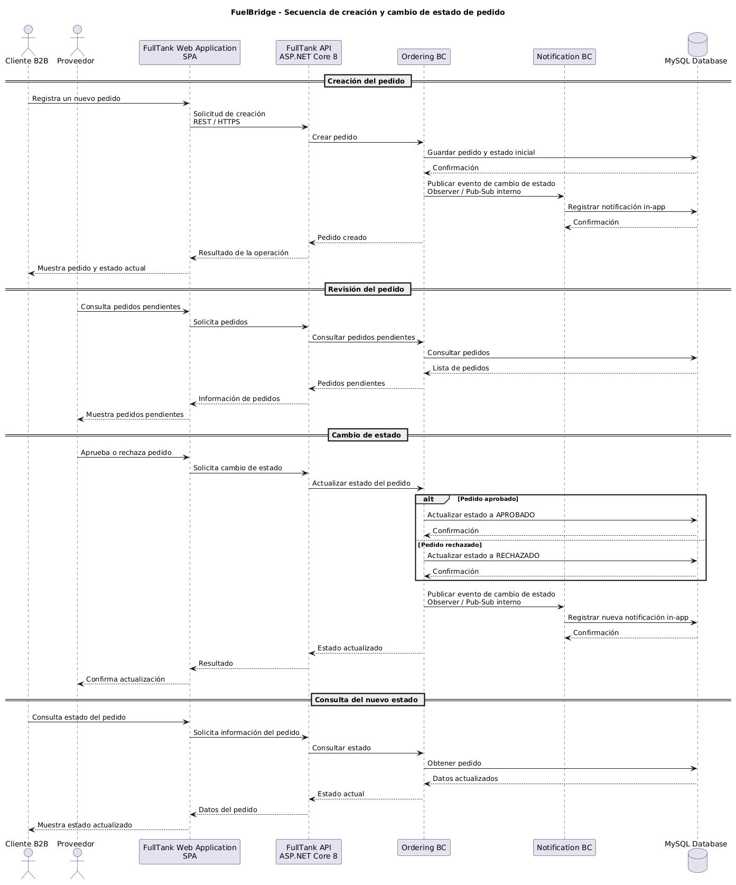

**Diagrama de Componentes - Estructura del Monolito**

**Component Diagram – FuelBridge API**

  

El diagrama de componentes representa la estructura interna del Monolito Modular implementado en FuelBridge API. La lógica de negocio se divide en nueve Bounded Contexts con responsabilidades independientes: Identity & Access, Ordering, Payment, Inventory, Catalog, Fulfillment, Notification, Reporting & Analytics y Equipment. Todos los componentes se ejecutan dentro de una única API Spring Boot y comparten una base de datos MySQL. Las integraciones externas se mantienen asociadas al contexto responsable: Identity & Access consume Email Service, Payment utiliza Cloud Storage y Reporting & Analytics utiliza PDF Generator Service. Asimismo, Ordering BC se comunica con Notification BC mediante Observer/Pub-Sub interno para reducir el acoplamiento del flujo de notificaciones.

**C4 Component Diagram – FuelBridge Web Application**

  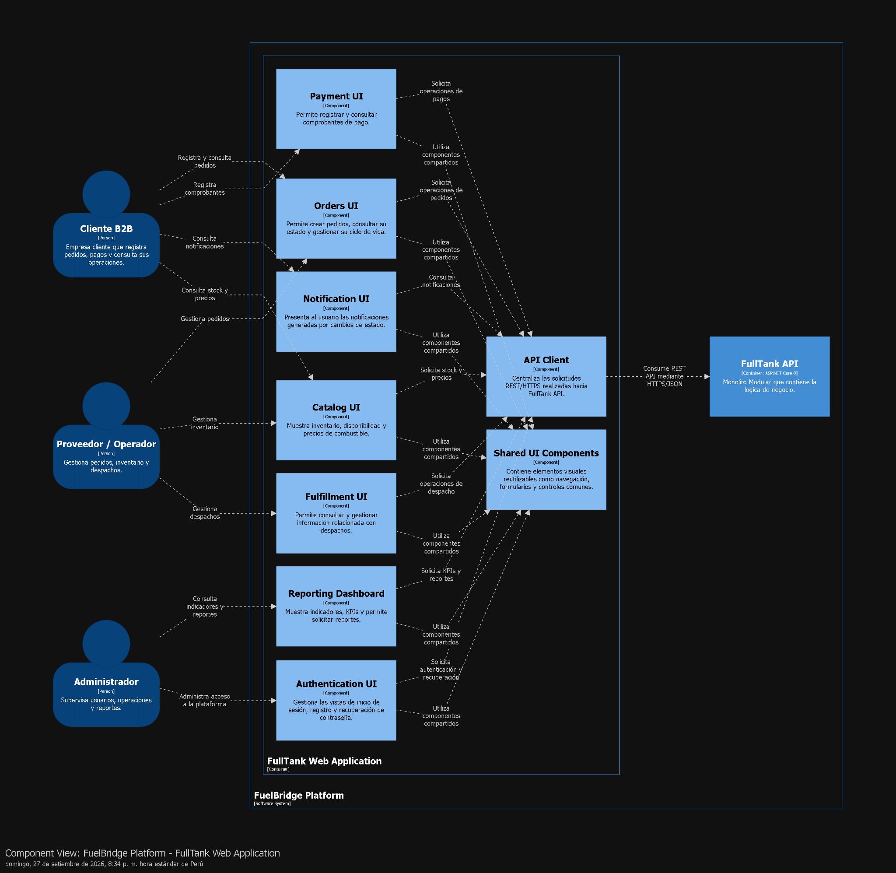

El diagrama de componentes de FuelBridge Web Application representa la organización interna de la SPA utilizada por clientes, proveedores y administradores. La interfaz se divide en componentes asociados a las principales funcionalidades del sistema, como autenticación, pedidos, catálogo, pagos, despachos, notificaciones y reportes. Todas las operaciones hacia el backend se centralizan mediante API Client, que consume FuelBridge API utilizando REST sobre HTTPS. Shared UI Components reúne elementos reutilizables de interfaz para evitar duplicación y mantener consistencia visual.

**C4 Component Diagram – Landing Page**

  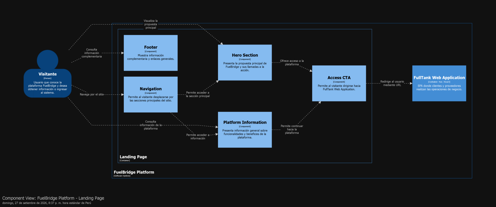

El diagrama de componentes de la Landing Page representa la estructura del sitio público de FuelBridge. Al tratarse de una aplicación web estática, sus componentes se limitan a responsabilidades de presentación y navegación. Navigation permite acceder a las distintas secciones, Hero Section comunica la propuesta principal, Platform Information presenta las características de la solución y Access CTA redirige hacia FuelBridge Web Application. Esta separación mantiene la Landing Page independiente de la lógica transaccional del sistema.

| **ID** | **Decisión**                                                  | **Alternativa descartada**        | **Driver**    | **Componente**             | **Justificación**                                                                        | **Consecuencia**                                                                |
|--------|---------------------------------------------------------------|-----------------------------------|-----------------|-------------------------------|------------------------------------------------------------------------------------------|---------------------------------------------------------------------------------|
| ADR-01 | SPA desacoplada del backend                                   | Monolito MVC server-side          | QA-3            | FuelBridge Web Application     | Soporte de actualizaciones parciales de vista sin recargas para paneles en tiempo real   | El frontend requiere pipeline de despliegue independiente                       |
| ADR-02 | Monolito Modular como estilo del backend                      | Microservicios distribuidos       | CON-3, QA-2     | FuelBridge API                 | Viable dentro del plazo de 4 Sprints; modificabilidad por dominio sin overhead operativo | Riesgo de acoplamiento si los BCs no mantienen límites claros en el código      |
| ADR-03 | Observer/Pub-Sub interno para eventos Ordering → Notification | Message broker externo (RabbitMQ) | QA-1            | Domain Event Dispatcher        | Satisface QA-1 sin infraestructura adicional en el MVP                                   | Si el volumen de eventos crece, se requerirá migrar a un message broker externo |
| ADR-04 | Base de datos MySQL compartida entre todos los BCs            | Base de datos por BC              | CON-1, CON-3    | MySQL Database                 | Compatible con CON-1 (Tecnológicas) y CON-3 (Time-to-market)                             | Cambios en tablas compartidas requieren coordinación entre BCs                  |

#### 4.3.1.7 Analysis of Current Design and Review Iteration Goal (Kanban Board)

El tablero Kanban de la Iteración 1 se gestiona en Trello: **[Tablero FuelBridge - Iteración 1](https://trello.com/invite/b/69e2fd01ee5b055b2d967a45/ATTI05a9ebca4c1da02108fc92fa76bfa07e412172F6/fulltank)**. Al cierre de esta iteración, las tareas del backlog ADD-01 a ADD-05 quedan distribuidas así:

  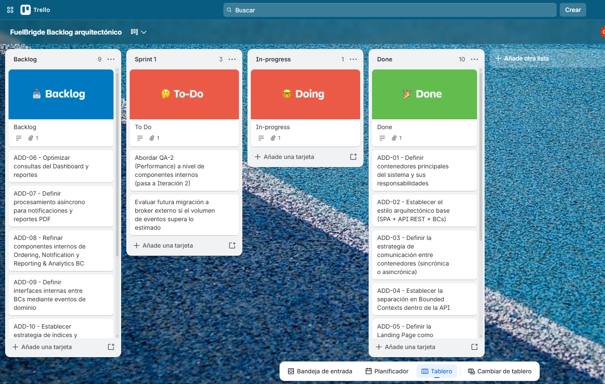

| **To Do** | **In Progress** | **Done** |
|-----------|------------------|----------|
| Abordar QA-2 (Performance) a nivel de componentes internos (pasa a Iteración 2) | - | Definir contenedores principales del sistema (ADD-01) |
| | | Establecer estilo arquitectónico base (ADD-02) |
| | | Definir estrategia de comunicación entre contenedores (ADD-03) |
| | | Separar API en Bounded Contexts y asignar responsabilidades (ADD-04) |
| | | Definir la Landing Page como contenedor separado (ADD-05) |
| | | Elaborar C4 Level 1 Context Diagram |
| | | Elaborar C4 Level 2 Container Diagram |
| | | Elaborar C4 Level 3 Component Diagram (FuelBridge API) |
| | | Registrar decisiones de diseño (ADR-01 al ADR-04) |

**Trazabilidad driver → decisión → componente (Iteración 1)**

| **Driver** | **Backlog** | **ADR** | **Componente**             |
|------------|-------------|---------|--------------------------------|
| QA-1, QA-3 | ADD-01      | -       | Todos los contenedores          |
| CON-1      | ADD-02      | ADR-02  | FuelBridge API                  |
| CONC-2     | ADD-03      | ADR-03  | Domain Event Dispatcher         |
| QA-2, CONC-1 | ADD-04    | ADR-02  | FuelBridge API (9 BCs)          |
| QA-3, CONC-4 | ADD-05    | ADR-01  | Landing Page                    |

Los drivers QA-1 y QA-3 quedan satisfechos a nivel estructural. QA-2 se traslada a la Iteración 2 donde se abordará la estructura interna del Ordering BC y el Reporting & Analytics BC.

### 4.3.2 Iteration 2: Performance y Procesamiento Asíncrono de Pedidos, Notificaciones y Reportes

#### 4.3.2.1 Architectural Design Backlog 2

| **Decisión de diseño**                                                                  | **Driver relacionado**                                      | **ID** | **Prioridad** | **Estado**   |
|-----------------------------------------------------------------------------------------|-------------------------------------------------------------|--------|---------------|--------------|
| Optimizar consultas del Dashboard y reportes                                            | QA-2 Performance                                            | ADD-06 | Alta          | Por resolver |
| Definir procesamiento asíncrono para notificaciones y reportes PDF                      | QA-1 Availability & Traceability / CONC-2 (Desacoplamiento de Servicios Bloqueantes) | ADD-07 | Alta          | Por resolver |
| Refinar componentes internos de Ordering BC, Notification BC y Reporting & Analytics BC | QA-2 Performance / Modificabilidad                          | ADD-08 | Alta          | Por resolver |
| Definir interfaces internas entre BCs mediante eventos de dominio                       | CONC-1 (Gestión Segura del Estado)                          | ADD-09 | Media         | Por resolver |
| Establecer estrategia de índices y consultas para MySQL                                 | QA-2 Performance                                            | ADD-10 | Media         | Por resolver |

#### 4.3.2.2 Establish Iteration Goal by Selecting Drivers

El objetivo de esta segunda iteración es refinar los componentes internos de la FuelBridge/FuelBridge API, priorizando el desempeño del Dashboard, el procesamiento de reportes y el desacoplamiento de notificaciones generadas por cambios de estado de pedidos. Los drivers seleccionados son QA-2 Performance, porque el Dashboard y el historial requieren consultar múltiples registros sin bloquear la operación; QA-1 Availability & Traceability, porque cada cambio de estado del pedido debe generar notificaciones sin pérdida de eventos; y el concern de Desacoplamiento de Servicios Bloqueantes, porque la generación de PDFs y envío de correos no deben ejecutarse dentro del flujo principal HTTP. Estos drivers ya estaban identificados en la sección 4.2 y quedaron pendientes al cierre de la Iteración 1.

#### 4.3.2.3 Choose One or More Elements of the System to Refine

En esta iteración se refina el contenedor FuelBridge/FuelBridge API, específicamente los Bounded Contexts internos que soportan el flujo transaccional y analítico:

- Ordering BC: ciclo de vida del pedido.

- Notification BC: generación de notificaciones por cambios de estado.

- Reporting & Analytics BC: KPIs, dashboard y reportes PDF.

- Payment BC: validación de pagos antes de aprobación.

- Catalog BC: verificación de stock antes del despacho.

Estos elementos se seleccionan porque concentran los puntos de mayor riesgo: pedidos, pagos, stock, notificaciones y reportes.

#### 4.3.2.4 Choose One or More Design Concepts That Satisfy the Selected Drivers

| **Concepto evaluado**                      | **Decisión** | **Razón**                                                                                         |
|--------------------------------------------|--------------|---------------------------------------------------------------------------------------------------|
| Procesamiento síncrono completo            | Rechazado    | Puede bloquear la API al generar PDFs o enviar notificaciones.                                    |
| Observer/Pub-Sub interno                   | Seleccionado | Permite que Notification BC y Reporting BC reaccionen a eventos sin acoplarse al flujo principal. |
| Repository Pattern                         | Seleccionado | Abstrae acceso a MySQL y mejora mantenibilidad.                                                   |
| Índices en MySQL para consultas frecuentes | Seleccionado | Reduce tiempos de búsqueda en Dashboard e historial                                               |
| Message broker externo                     | Postergado   | Útil a futuro, pero aumenta complejidad para el MVP de 4 sprints.                                 |

Decisión adoptada: mantener el Monolito Modular con eventos internos mediante Observer/Pub-Sub, aplicar Repository Pattern para acceso a datos e incorporar optimización de consultas mediante índices en MySQL. Esta decisión mantiene bajo el costo operativo y mejora performance sin introducir infraestructura distribuida.

#### 4.3.2.5 Instantiate Architectural Elements, Allocate Responsibilities, and Define Interfaces

| **Elemento**             | **Tipo**               | **Responsabilidad**                                   | **Interfaz**                                      |
|--------------------------|------------------------|-------------------------------------------------------|---------------------------------------------------|
| Ordering BC              | Componente API         | Crear, aprobar, rechazar, despachar y cerrar pedidos  | Expone endpoints REST. Publica eventos internos.  |
| Payment BC               | Componente API         | Registrar vouchers y validar montos de pago.          | Consume Cloud Storage. Expone validación interna. |
| Catalog BC               | Componente API         | Gestionar stock, precios e inventario de combustible. | Consulta/actualiza MySQL mediante repositorios.   |
| Fulfillment BC           | Componente API         | Asignar vehículos y conductores al despacho.          | Consume pedidos aprobados desde Ordering BC.      |
| Notification BC          | Componente API         | Generar notificaciones in-app ante cambios de estado. | Consume eventos internos de Ordering BC           |
| Reporting & Analytics BC | Componente API         | Calcular KPIs, métricas y solicitar PDFs.             | Consulta MySQL y consume PDF Generator Service.   |
| Domain Event Dispatcher  | Componente interno     | Publicar eventos internos entre BCs (PAT-2).           | Interfaz publish/subscribe interna.               |
| Order Repository         | Componente de datos    | Consultar pedidos por usuario, estado y fechas.       | Spring Data JPA hacia MySQL (PAT-1).              |
| Reporting Query Repository | Componente de consulta | Optimizar consultas para Dashboard y reportes.        | SQL/Spring Data JPA con índices (ADR-07).         |

#### 4.3.2.6 Sketch Views (C4 & UML) and Record Design Decisions

**C4 Component Diagram – FuelBridge API refinado (Iteración 2)**

El diagrama de componentes de esta iteración muestra la estructura interna de la API, refinando los Bounded Contexts más críticos: Ordering, Payment, Catalog, Fulfillment, Notification y Reporting & Analytics. Ordering BC actúa como núcleo del ciclo de pedido y publica eventos internos (vía Domain Event Dispatcher) cuando un pedido cambia de estado. Notification BC consume esos eventos para generar alertas in-app, mientras Reporting & Analytics BC consulta MySQL a través de Reporting Query Repository para mostrar KPIs y solicitar reportes PDF al servicio externo. Esta vista evidencia bajo acoplamiento, alta cohesión y procesamiento asíncrono interno.

| **ID** | **Decisión**                                         | **Alternativa descartada**                | **Driver** | **Componente**              | **Justificación**                                  | **Consecuencia**                                         |
|--------|--------------------------------------------------------|---------------------------------------------|-------------|--------------------------------|------------------------------------------------------|--------------------------------------------------------------|
| ADR-05 | Usar Observer/Pub-Sub interno para eventos de pedido | Llamadas directas entre BCs               | QA-1        | Domain Event Dispatcher        | Reduce acoplamiento entre Ordering y Notification. | Si crece el volumen, podría requerirse broker externo.   |
| ADR-06 | Aplicar Repository Pattern con Spring Data JPA       | Consultas SQL directas en controladores   | CONC-3      | Order Repository                | Centraliza acceso a datos y mejora mantenibilidad. | Requiere disciplina para no duplicar lógica de consulta. |
| ADR-07 | Optimizar Dashboard con consultas indexadas          | Consultas sin estrategia de índices       | QA-2        | Reporting Query Repository     | Mejora performance en reportes e historial.        | Se deben mantener índices según evolución del modelo.    |
| ADR-08 | Mantener generación de PDF fuera del flujo principal | Generar PDF dentro del endpoint principal | CONC-2      | Reporting & Analytics BC       | Evita bloqueo de la API ante latencia externa.     | Requiere manejo de estados o errores de generación.      |

#### 4.3.2.7 Analysis of Current Design and Review Iteration Goal (Kanban Board)

El tablero Kanban de la Iteración 2 se gestiona en el mismo tablero Trello referenciado en [4.3.1.7]

(#4317-analysis-of-current-design-and-review-iteration-goal-kanban-board). Al cierre de esta iteración, las tareas del backlog ADD-06 a ADD-10 quedan distribuidas así:

  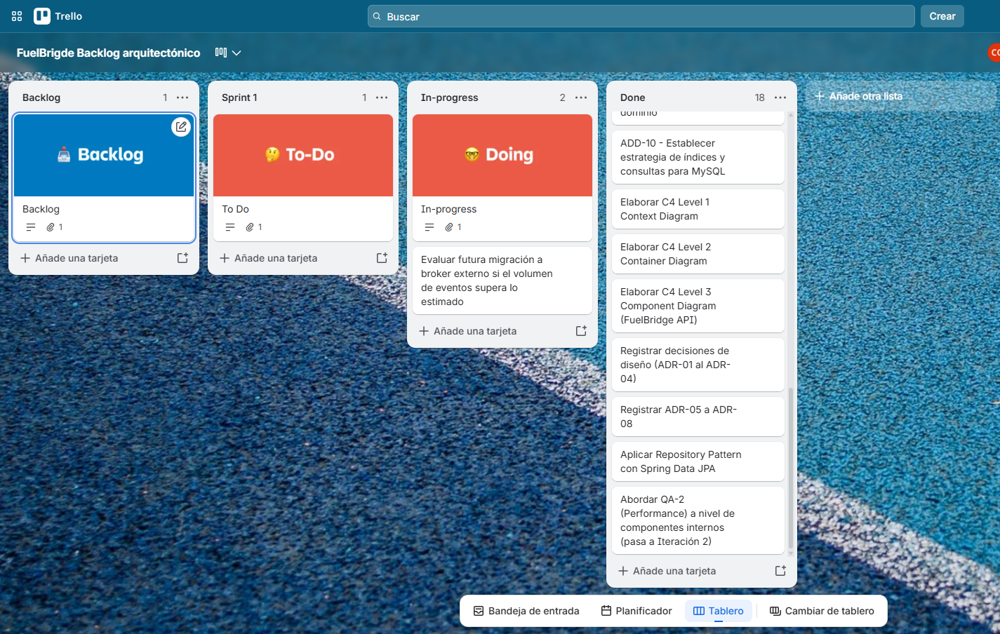

| **To Do** | **In Progress** | **Done** |
|-----------|------------------|----------|
| - | Evaluar futura migración a broker externo si el volumen de eventos supera lo estimado | Refinar componentes internos de FuelBridge API (ADD-08) |
| | | Definir comunicación interna entre Ordering BC y Notification BC (ADD-09) |
| | | Definir estrategia de consultas para Dashboard y reportes (ADD-06) |
| | | Registrar ADR-05 a ADR-08 |
| | | Aplicar Repository Pattern con Spring Data JPA |
| | | Validar performance real con pruebas de carga contra la medida de QA-2 (95% < 2s, ver 4.2.3) |

QA-2 (Performance) queda **cubierto y validado**: se ejecutó una prueba de carga real contra `GET /api/v1/analytics/platform` desplegado en Railway, con 200 peticiones en tandas de 50 concurrentes. Resultado: mínimo 331.7 ms, máximo 988.9 ms, percentil 95 en 705.6 ms, muy por debajo del umbral de 2000 ms definido en 4.2.3.

  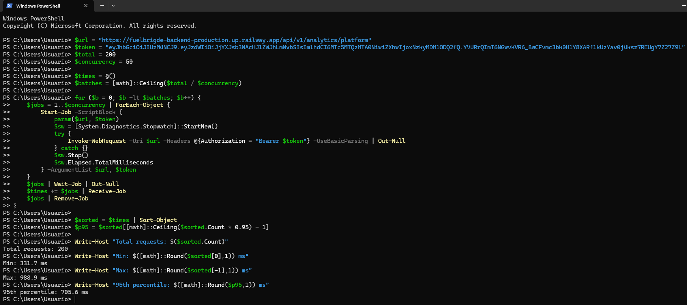

**Trazabilidad driver → decisión → componente (Iteración 2)**

| **Driver** | **Backlog** | **ADR** | **Componente**              |
|------------|-------------|---------|---------------------------------|
| QA-2       | ADD-06      | ADR-07  | Reporting Query Repository      |
| QA-1, CONC-2 | ADD-07    | ADR-08  | Reporting & Analytics BC        |
| CONC-3     | ADD-08      | ADR-06  | Order Repository                 |
| CONC-1     | ADD-09      | ADR-05  | Domain Event Dispatcher         |
| QA-2       | ADD-10      | ADR-07  | MySQL Database                  |

### 4.3.2.8 C4 Y DIAGRAMA UML

**C4 Component Diagram – FuelBridge API refinado**

  

El diagrama muestra el refinamiento interno de la FuelBridge API durante la segunda iteración. Se representan los Bounded Contexts principales relacionados con pedidos, pagos, stock, despachos, notificaciones y reportes, además del Domain Event Dispatcher y los repositorios. La estructura busca reducir el acoplamiento entre componentes y mejorar el acceso a datos y el rendimiento de las consultas.

**UML Sequence Diagram – Aprobación y despacho de pedido**

  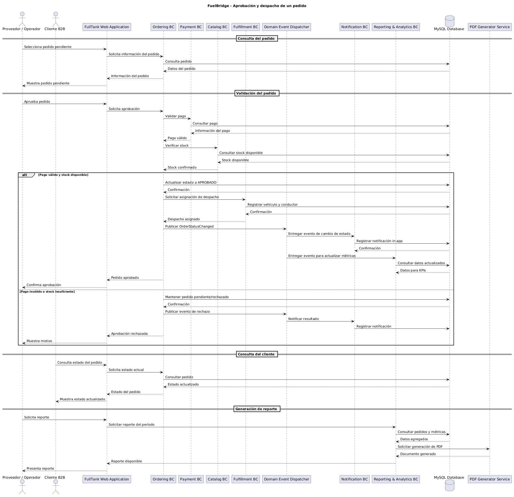

El diagrama de secuencia representa el flujo de aprobación de un pedido, incluyendo la validación del pago y stock, la asignación del despacho y la actualización del estado. Luego, el sistema publica eventos internos para generar notificaciones y actualizar la información de reportes, mostrando la interacción entre los principales componentes de la API.

---

# Capítulo V: Product Implementation, Validation & Deployment

## 5.1 Testing Suites & General Patterns

### 5.1.1 Backend Application Core Testing Suite
 
Se escribieron pruebas unitarias sobre los agregados centrales de Ordering BC y Payment BC, usando JUnit 5 y AssertJ, sin levantar el contexto de Spring para que los tests corran rápido y sin depender de infraestructura externa.
 
**FuelOrder (Ordering BC)** — 9 escenarios cubiertos:
 
- Un pedido nuevo nace en estado `PENDING`.
- `confirm()` mueve el pedido a `CONFIRMED`.
- `cancel()` mueve el pedido a `CANCELLED`.
- `dispatch()` mueve un pedido `PENDING` a `DISPATCHED`.
- `dispatch()` lanza `IllegalStateException` si el pedido no está en `PENDING`.
- `receive()` mueve un pedido `DISPATCHED` a `PENDING_PAYMENT`.
- `receive()` lanza `IllegalStateException` si el pedido nunca fue despachado.
- `markPaid()` marca el pedido como `PAID` cuando no está cancelado.
- `markPaid()` lanza `IllegalStateException` si el pedido ya está `CANCELLED`.
 
**Payment (Payment BC)** — 4 escenarios cubiertos:
 
- El constructor copia los datos del comando y el pago nace en estado `PENDING`.
- `complete()` marca el pago como `COMPLETED`, registra la referencia de transacción y guarda el momento exacto del pago.
- `refund()` marca el pago como `REFUNDED`.
- `fail()` marca el pago como `FAILED`.
 
A diferencia de `FuelOrder`, `Payment` no restringe transiciones de estado, por lo que no se escribieron tests de excepción para él.
 
También se corrigió el test `contextLoads()` que viene por defecto en Spring Boot, que reventaba porque intentaba conectarse a MySQL real en un entorno local sin base de datos disponible. La solución fue agregar un perfil de test (`application-test.properties`) con H2 en memoria y activarlo con `@ActiveProfiles("test")`, sin tocar los perfiles de desarrollo ni producción.
 
---

### 5.1.2 Pattern Based Backend Application(s)
 
El backend aplica cuatro patrones de diseño de forma consistente en los 9 Bounded Contexts, cada uno respondiendo a un driver concreto del Capítulo IV.
 
- **Patrón Repository:** separa la lógica de negocio del mecanismo de persistencia, de modo que el dominio no depende de anotaciones JPA ni de detalles del motor de base de datos. Cada Bounded Context define una interfaz de repositorio de dominio (ej. `FuelOrderRepository`) implementada en infraestructura (`FuelOrderRepositoryImpl`), que traduce entre el agregado y su entidad JPA a través de un assembler dedicado. Responde a CONC-3 (Mantenimiento del Código): se puede cambiar la lógica de negocio sin tocar el mapeo, y viceversa.
 

  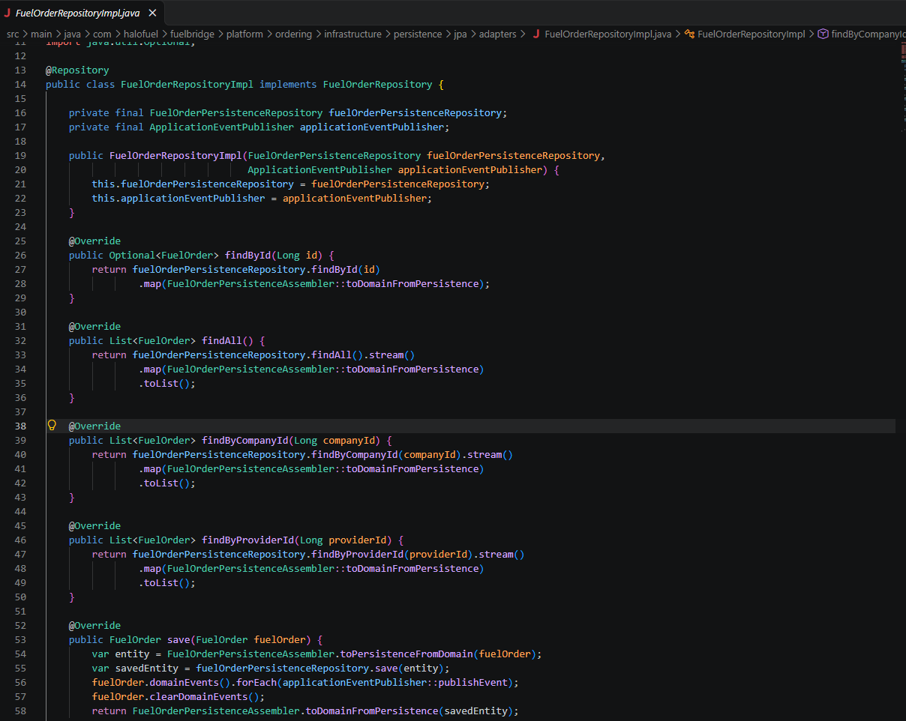

 
- **Patrón DTO (Data Transfer Object):** evita exponer los agregados de dominio directamente en la API. Se implementó como clases `Resource` (37 en el proyecto, ej. `CreateFuelOrderResource`, `FuelOrderResource`), que permiten cambiar el modelo interno de un Bounded Context sin romper el contrato que ya consume el frontend. Responde a QA-3 (Usability): la SPA necesita contratos estables para no romperse con cada cambio interno del backend.
 

  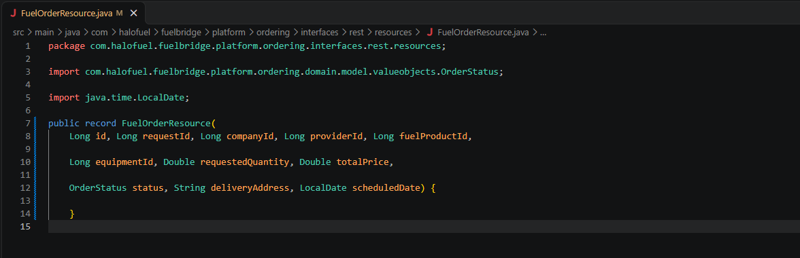

 
- **Patrón CQRS (aplicación parcial a nivel de capa de aplicación):** cada Bounded Context define una interfaz `XxxCommandService` para escritura y una `XxxQueryService` para lectura por separado (10 de cada una en el proyecto), en lugar de mezclar ambas responsabilidades en un solo servicio. Esto es la base de la optimización descrita en ADR-07 (QA-2 Performance): se puede optimizar las consultas del dashboard sin tocar la lógica transaccional. No hay separación física de bases de datos de lectura/escritura, así que es CQRS parcial, no completo.
 

  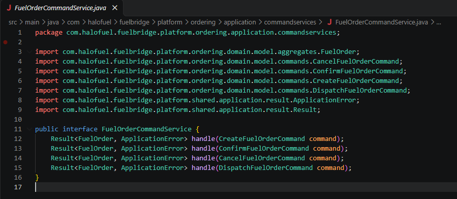
  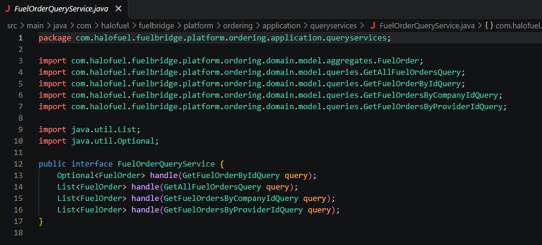

 
- **Patrón Observer (Publish-Subscribe):** `FuelOrder` registra eventos de dominio (`FuelOrderConfirmedEvent`, `FuelOrderCancelledEvent`, `FuelOrderDispatchedEvent`) al cambiar de estado. `FuelOrderRepositoryImpl` los publica al guardar el agregado usando `ApplicationEventPublisher`, y `FuelOrderNotificationEventHandler` (en Notification BC) los escucha para crear notificaciones reales al usuario, sin que Ordering BC sepa que Notification BC existe. Es la implementación concreta de ADR-03 y satisface QA-1 (Availability & Traceability).
 

  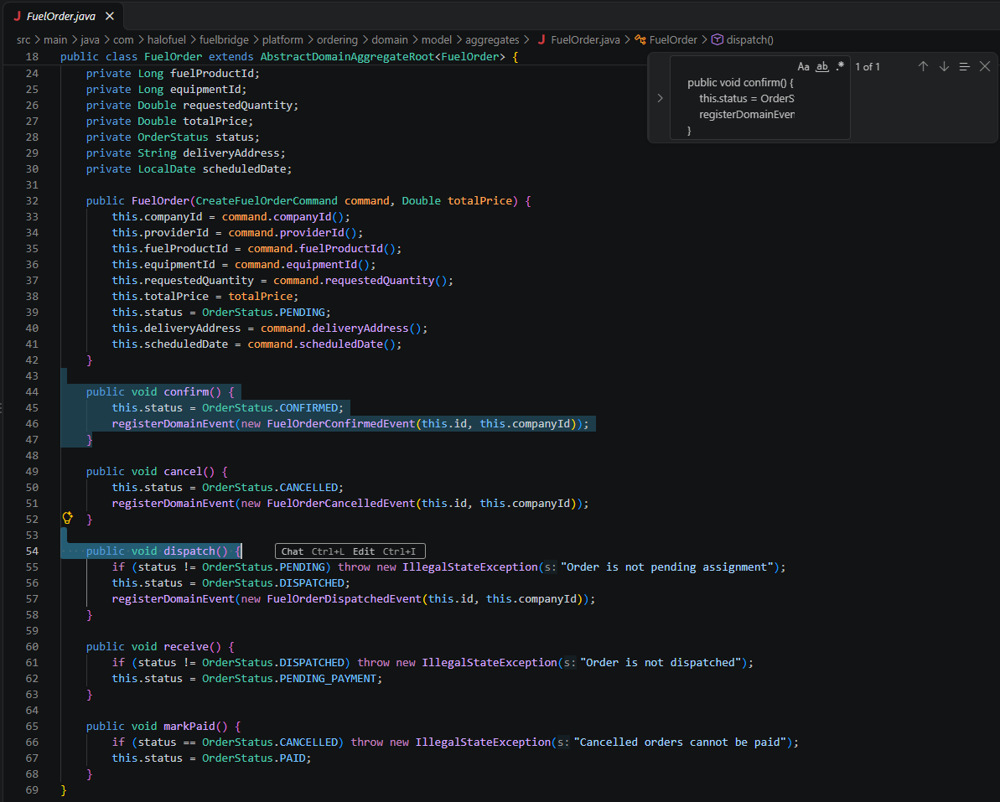
  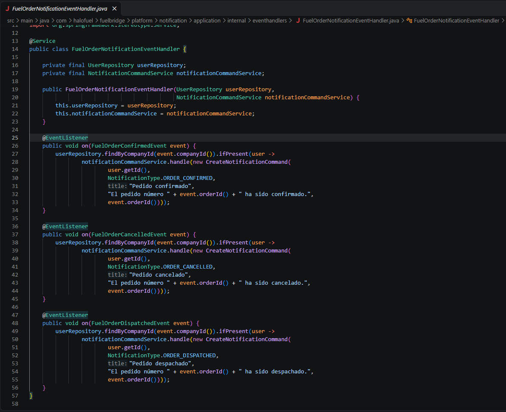

 
---

### 5.1.3 Pattern Based Custom Software Library

### 5.1.4 Framework Pattern Driven Refactoring Report

## 5.2 Software Configuration Management

### 5.2.1 Software Development Environment Configuration

En esta sección se especifican los productos de software utilizados por el equipo de HaloFuel para colaborar en el ciclo de vida de FuelBridge, organizados por tipo de actividad.

#### Project Management

| Producto | Tipo | Propósito | URL |
|---|---|---|---|
| Trello | SaaS | Gestión del Sprint Backlog y tablero Kanban | https://trello.com |
| GitHub | SaaS | Repositorio central y coordinación del equipo | https://github.com |

#### Requirements Management

| Producto | Tipo | Propósito | URL |
|---|---|---|---|
| GitHub Issues | SaaS | Registro y seguimiento de requerimientos e incidencias | https://github.com |

#### Product UX/UI Design

| Producto | Tipo | Propósito | URL |
|---|---|---|---|
| Figma | SaaS | Diseño de wireframes y prototipos de la interfaz | https://figma.com |

#### Software Development Landing Page

La landing page de FuelBridge es un sitio estático desarrollado con tecnologías web nativas, sin framework ni herramienta de build.

| Producto | Tipo | Propósito | URL |
|---|---|---|---|
| HTML5 / CSS3 / JavaScript | — | Lenguajes base del sitio estático | — |
| Google Fonts (Inter) | SaaS | Tipografía del sitio | https://fonts.google.com |
| Visual Studio Code | Local | Editor de código | https://code.visualstudio.com/download |

#### Software Development — Frontend (Angular SPA)

| Producto | Versión | Tipo | Propósito | URL |
|---|---|---|---|---|
| Node.js + npm | npm 11.12.1 | Local | Entorno de ejecución y gestor de paquetes | https://nodejs.org/en/download |
| Angular CLI | 21.2.7 | Local (npm) | Toolchain oficial para generación, build y serve | https://angular.dev/tools/cli |
| Angular | 21.2.9 | Local (npm) | Framework principal de la SPA | https://angular.dev |
| Angular Material + CDK | 21.2.7 | Local (npm) | Biblioteca de componentes de UI | https://material.angular.io |
| RxJS | 7.8.0 | Local (npm) | Programación reactiva y manejo de estado | https://rxjs.dev |
| @ngx-translate/core | 17.0.0 | Local (npm) | Internacionalización (i18n) | https://github.com/ngx-translate/core |
| Chart.js + ng2-charts | 4.5.1 | Local (npm) | Visualización de datos en Reporting | https://www.chartjs.org |
| Firebase | 12.13.0 | Local (npm) | Servicios de autenticación y base de datos en tiempo real | https://firebase.google.com |
| TypeScript | 5.9.3 | Local (npm) | Lenguaje tipado base de Angular | https://www.typescriptlang.org |
| JSON Server | 0.17.4 | Local (npm) | Mock de API REST para desarrollo local | https://github.com/typicode/json-server |
| Visual Studio Code | — | Local | Editor principal para desarrollo frontend | https://code.visualstudio.com/download |

#### Software Development — Backend (Spring Boot API)

| Producto | Versión | Tipo | Propósito | URL |
|---|---|---|---|---|
| Java JDK | 26 | Local | Lenguaje principal del backend | https://www.oracle.com/java/technologies/downloads/ |
| Spring Boot | 4.0.6 | Local (Maven) | Framework base para la API REST | https://spring.io/projects/spring-boot |
| Maven | — | Local | Build tool y gestión de dependencias | https://maven.apache.org/download.cgi |
| IntelliJ IDEA | — | Local | IDE principal para desarrollo Java | https://www.jetbrains.com/idea/download/ |
| Lombok | — | Local (Maven) | Reducción de boilerplate en entidades y DTOs | https://projectlombok.org/ |
| Spring Security | — | Local (Maven) | Autenticación y autorización de la API | https://spring.io/projects/spring-security |
| jjwt | 0.12.6 | Local (Maven) | Generación y validación de tokens JWT | https://github.com/jwtk/jjwt |
| springdoc-openapi | 3.0.3 | Local (Maven) | Generación automática de documentación OpenAPI / Swagger UI | https://springdoc.org |
| MySQL Workbench | — | Local | Administración y consulta de la base de datos | https://dev.mysql.com/downloads/workbench/ |

#### Software Testing

| Producto | Versión | Tipo | Propósito | URL |
|---|---|---|---|---|
| JUnit 5 | — | Local (Maven) | Pruebas unitarias del dominio backend | https://junit.org/junit5/ |
| H2 Database | — | Local (Maven) | Base de datos en memoria para el perfil de test | https://www.h2database.com/html/download.html |
| Karma + Jasmine | 6.4.0 / 5.9.0 | Local (npm) | Pruebas unitarias del frontend Angular | https://karma-runner.github.io |
| Postman | — | Local | Pruebas manuales de endpoints REST | https://www.postman.com/downloads/ |

#### Software Deployment

| Producto | Tipo | Propósito | URL |
|---|---|---|---|
| Railway | SaaS | Despliegue del backend (Spring Boot + MySQL) | https://railway.app |
| Vercel | SaaS | Despliegue del frontend Angular y la Landing Page | https://vercel.com |

#### Software Documentation

| Producto | Versión | Tipo | Propósito | URL |
|---|---|---|---|---|
| springdoc-openapi | 3.0.3 | Local (Maven) | Generación automática de la especificación OpenAPI y Swagger UI | https://springdoc.org |
| GitHub | — | SaaS | Documentación del repositorio vía README | https://github.com/HaloFuel |

#### Source Code Management

| Producto | Tipo | Propósito | URL |
|---|---|---|---|
| Git | Local | Control de versiones distribuido | https://git-scm.com/downloads |
| GitHub | SaaS | Repositorio remoto y colaboración (org: HaloFuel) | https://github.com/HaloFuel |

---

### 5.2.2 Source Code Management

### 5.2.3 Source Code Style Guide & Conventions

Para garantizar la consistencia, legibilidad y mantenibilidad del código fuente de FuelBridge, la startup HaloFuel establece una guía de estilos y convenciones de programación aplicable al desarrollo del backend y frontend de la plataforma.

Estas convenciones toman como referencia Google Java Style Guide, Google TypeScript Style Guide y Angular Style Guide, además de los principios de Domain-Driven Design (DDD). Su propósito es facilitar la colaboración entre los desarrolladores, mantener una organización uniforme y reducir la complejidad durante la implementación y mantenimiento del software.

**Convenciones de Nombres**

**Clases e Interfaces:** Se utiliza la nomenclatura PascalCase,
donde cada palabra comienza con mayúscula. Los nombres deben
expresar claramente la responsabilidad de la clase o interfaz,
evitando abreviaturas innecesarias.

En FuelBridge se emplean clases como `FuelOrdersController` e
interfaces como `FuelOrderCommandService` y
`FuelOrderQueryService`, pertenecientes al Bounded Context Ordering.

  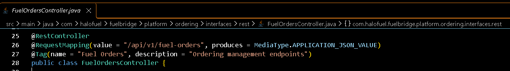

*Figura 1. Aplicación de la convención PascalCase en clases e interfaces del backend de FuelBridge.*

**Métodos y Variables:** Se utiliza camelCase, comenzando con minúscula y escribiendo las palabras siguientes con mayúscula inicial. Los métodos deben describir claramente las operaciones que ejecutan.

Por ejemplo, el controlador `FuelOrdersController` utiliza métodos como `createFuelOrder()`, `confirmOrder()`, `cancelOrder()` y `getOrdersByCompany()` para representar las operaciones relacionadas con la gestión de pedidos de combustible.

  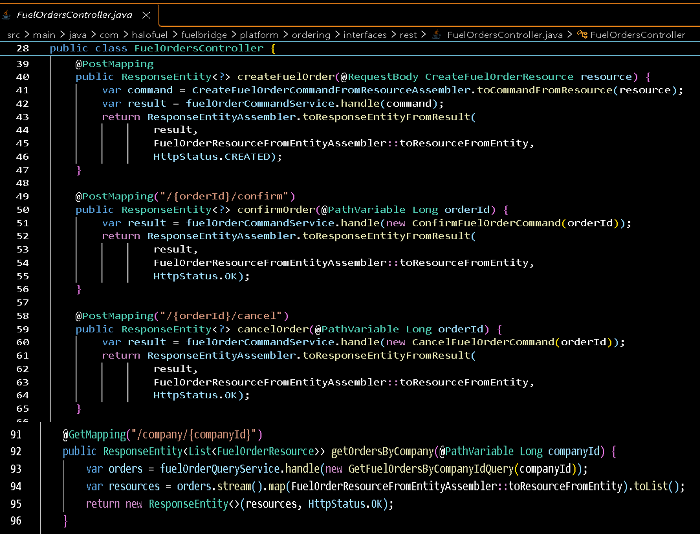

*Figura 2. Convención camelCase en métodos del controlador FuelOrdersController de FuelBridge.*

**Constantes:** Las constantes se escriben utilizando UPPER_SNAKE_CASE, separando las palabras mediante guiones bajos. Esta convención permite identificarlas y diferenciarlas de las variables convencionales.

Un ejemplo presente en el backend es la constante `MESSAGES_BASENAME`, declarada dentro de `GlobalExceptionHandler`.

**Enumeraciones (Enums):** Las enumeraciones utilizan PascalCase para sus nombres y UPPER_SNAKE_CASE para los valores definidos.

Por ejemplo, `OrderStatus` contiene valores como `PENDING`, `CONFIRMED`, `DISPATCHED`, `PENDING_PAYMENT`, `PAID` y `CANCELLED`, entre otros.

  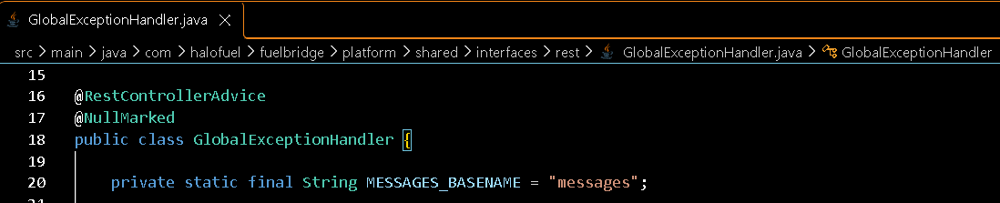

  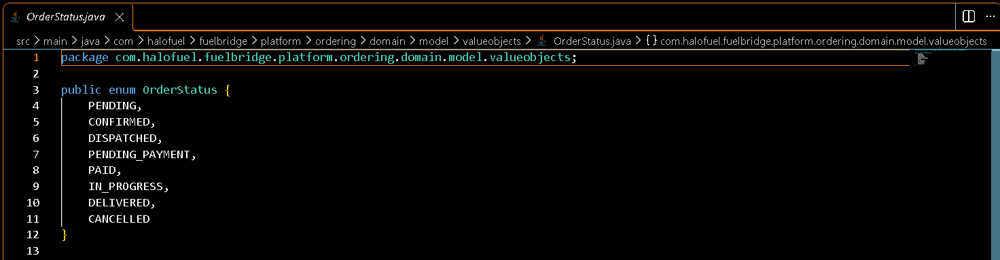

*Figura 3. Aplicación de las convenciones UPPER_SNAKE_CASE y PascalCase en constantes y enumeraciones del backend de FuelBridge.*

**Diseño del Código**

**Indentación:** Se utilizan espacios en lugar de tabulaciones para mantener una presentación consistente del código fuente. En los archivos Java se sigue una indentación habitual de cuatro espacios por nivel, mientras que el frontend utiliza dos espacios, según la configuración del archivo `.editorconfig`.

**Llaves:** Se emplea el estilo de llaves en la misma línea de apertura de las clases, métodos y estructuras de control. La llave de cierre se coloca en una línea independiente, manteniendo la organización visual del código.

**Longitud de Línea:** Se busca evitar líneas demasiado extensas para facilitar su lectura. En el frontend se utiliza Prettier con una longitud objetivo de 100 caracteres, configurada mediante la propiedad `printWidth`.

**Formato de TypeScript:** El archivo `.prettierrc` establece el uso de comillas simples y un formato específico para las plantillas HTML de Angular.

  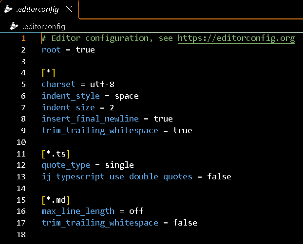
  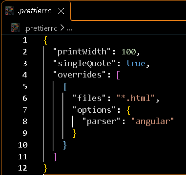

*Figura 4. Configuración de indentación, longitud de línea y formato de código mediante EditorConfig y Prettier en el frontend de FuelBridge.*

**Comentarios y Documentación**

**Comentarios en Línea:** Se recomienda utilizar comentarios breves que expliquen decisiones de negocio, restricciones o comportamientos complejos que no puedan entenderse fácilmente mediante la lectura del código.

Los comentarios deben utilizarse con moderación, evitando repetir información evidente de los nombres de clases, métodos o variables.

**Comentarios de Documentación:** Para las clases y métodos cuya funcionalidad requiera una explicación adicional, se utilizan bloques de documentación. En Java se emplea el formato Javadoc y en TypeScript pueden utilizarse comentarios JSDoc.

En FuelBridge se encuentran ejemplos de documentación mediante etiquetas como `@summary`, `@remarks` y `@author` en las clases del proyecto.

Estas descripciones permiten explicar las responsabilidades de los componentes y facilitan su comprensión por otros integrantes del equipo.

  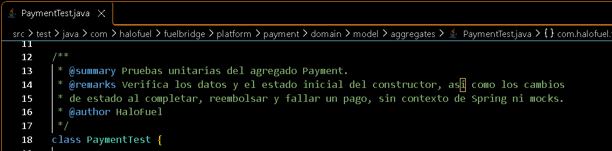
  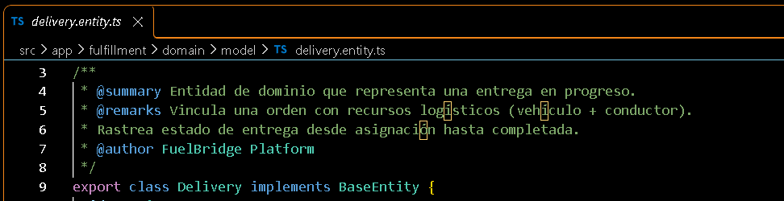

*Figura 5. Documentación de clases mediante comentarios estructurados en Java y TypeScript del proyecto FuelBridge.*

**Comentarios TODO:** Se establece el uso de comentarios `TODO` cuando sea necesario identificar tareas pendientes, mejoras futuras o secciones que requieran revisión. Estos comentarios deben acompañarse de una descripción clara para facilitar su seguimiento.

**Estructura de Archivos**

**Organización por Bounded Contexts:** El backend de FuelBridge utiliza una estructura modular basada en Domain-Driven Design (DDD), agrupando el código fuente según las responsabilidades del negocio.

Se identifican los siguientes contextos: IAM, Ordering, Inventory, Catalog, Payment, Fulfillment, Notification, Reporting y Equipment.

Dentro de cada contexto se organizan las siguientes capas:

| Capa | Responsabilidad |
|---|---|
| Domain | Entidades, agregados, objetos de valor y reglas de negocio |
| Application | Servicios de aplicación, comandos y consultas |
| Infrastructure | Persistencia, configuraciones y adaptadores técnicos |
| Interfaces | Controladores REST, recursos y transformadores |

Esta estructura favorece la separación de responsabilidades y facilita la evolución de los módulos sin mezclar directamente la lógica del negocio con los detalles técnicos.

  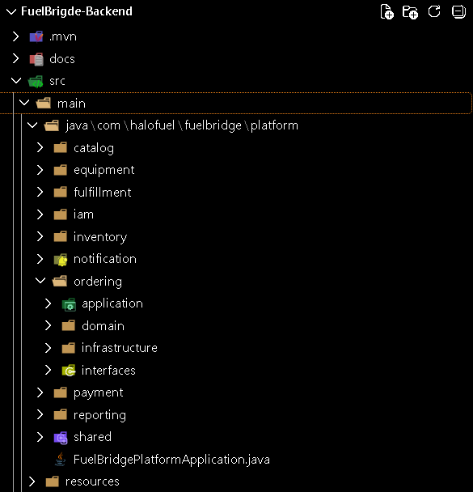

*Figura 6. Organización modular del backend de FuelBridge mediante Bounded Contexts y capas DDD.*

**Organización del Frontend:** El frontend Angular utiliza una organización similar, separando las funcionalidades por contextos y distribuyendo sus componentes en capas de presentación, aplicación, dominio e infraestructura.

Los archivos TypeScript emplean nombres descriptivos en kebab-case, como `fulfillment.store.ts`, `delivery.entity.ts` y `order-list.ts`.

  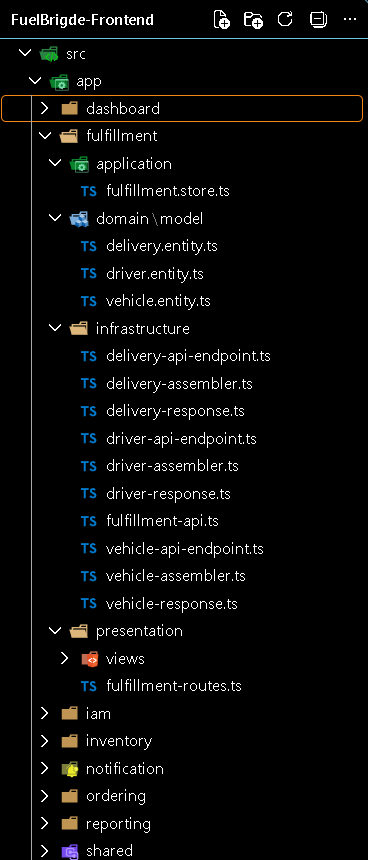

*Figura 7. Organización modular del frontend de FuelBridge mediante Bounded Contexts y capas DDD.*

**Manejo de Errores**

**Manejo de Excepciones:** El backend centraliza el tratamiento de excepciones mediante la clase `GlobalExceptionHandler`, utilizando la anotación `@RestControllerAdvice` de Spring Boot.

Esta implementación contempla el tratamiento de errores de validación, argumentos incorrectos y excepciones inesperadas, permitiendo convertirlos en respuestas HTTP.

**Respuestas de Error:** El proyecto incorpora la estructura `ErrorResource`, que permite representar los errores mediante atributos como `code`, `message` y `details`.

Se recomienda utilizar mensajes descriptivos, mantener respuestas consistentes y evitar exponer información sensible o detalles internos del servidor.

  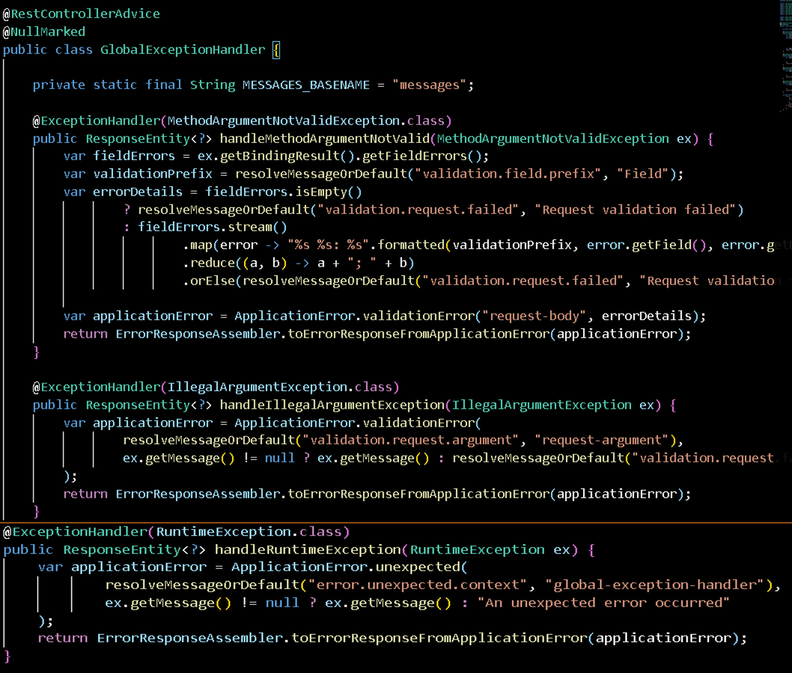
  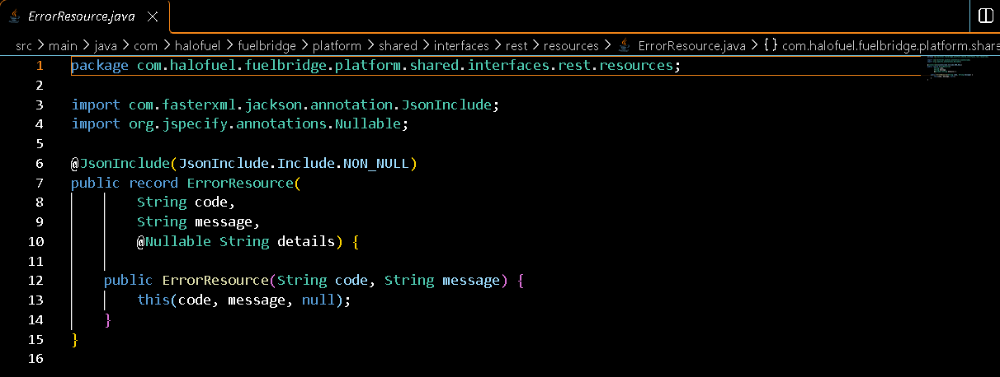

*Figura 8. Implementación del manejo centralizado de excepciones y estructura de respuestas de error en el backend de FuelBridge.*

**Integración con Control de Versiones**

**Políticas de Check-in:** Los cambios realizados en el código fuente deben registrarse mediante commits descriptivos y relacionados con las funcionalidades implementadas.

El proyecto utiliza Git y GitHub para almacenar el código y mantener el historial de modificaciones.

**Convenciones de Commits:** Se adopta la especificación Conventional Commits, utilizando prefijos como `feat:`, `fix:`, `test:`, `docs:` y `refactor:` para identificar el propósito de cada modificación.

**Revisión de Código:** Como buena práctica de colaboración, se establece la revisión de los cambios antes de incorporarlos a las ramas principales del proyecto, verificando que respeten la arquitectura y las convenciones de desarrollo.

**Prácticas de Programación**

**Separación de Responsabilidades:** Cada componente debe concentrarse en funciones relacionadas con su propósito, manteniendo alta cohesión y reduciendo el acoplamiento innecesario.

**Reutilización de Código:** Se promueve la reutilización de componentes y servicios compartidos cuando una funcionalidad resulta necesaria para varios módulos.

**Uso de Patrones:** Se aplican patrones de diseño cuando permiten resolver problemas concretos de la arquitectura, evitando introducir complejidad innecesaria.

**Código Mantenible:** Se prioriza la claridad, el uso de nombres descriptivos y la organización modular antes que optimizaciones prematuras.

Estas prácticas buscan mantener un código coherente con los principios arquitectónicos del proyecto y facilitar su evolución durante los siguientes sprints.

### 5.2.4 Software Deployment Configuration

La configuración de despliegue de **FuelBridge**, desarrollada por la startup **HaloFuel**, se basa en una infraestructura cloud que permite alojar y ejecutar los diferentes componentes de la plataforma. Para ello, se utilizan servicios de alojamiento web, ejecución de aplicaciones backend y almacenamiento de datos.

La solución emplea **Vercel** para el despliegue del frontend desarrollado con Angular, mientras que **Railway** aloja la API REST implementada con Spring Boot y la base de datos MySQL. Esta distribución permite administrar los componentes de manera separada y mantener la comunicación entre ellos mediante interfaces REST.

#### Vercel para el Frontend

**Hosting:** Vercel es una plataforma cloud que permite desplegar aplicaciones web y distribuir archivos estáticos mediante su infraestructura de entrega de contenido. En FuelBridge, se utiliza para alojar el frontend desarrollado con Angular 21 y TypeScript.

La plataforma permite publicar la aplicación web y acceder a ella desde un navegador mediante HTTPS. Asimismo, facilita la distribución de los archivos HTML, CSS y JavaScript generados durante la compilación de Angular.

**Integración con GitHub:** El proyecto se encuentra conectado con su repositorio de GitHub, utilizando la rama `main` como fuente del despliegue de producción. Esto permite actualizar el frontend mediante nuevos despliegues asociados a los cambios del código fuente.

**Configuración del despliegue:** Para generar la versión de producción se utiliza el comando `npm run build`, que ejecuta el proceso de compilación de Angular. El frontend consume la API REST publicada en Railway mediante las rutas configuradas en los archivos de entorno del proyecto.

**URL del frontend:** https://fuel-brigde-frontend.vercel.app

  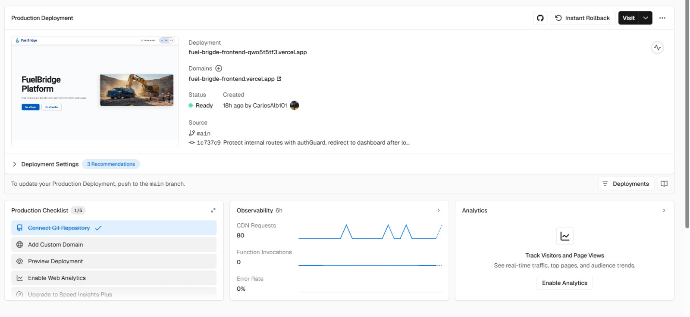

*Figura 1. Despliegue de producción del frontend de FuelBridge en Vercel, mostrando el estado Ready, el dominio público y la integración con GitHub.*

#### Railway para el Backend

**Hosting:** Railway es una plataforma cloud que permite desplegar aplicaciones backend y administrar servicios de infraestructura. En FuelBridge, se utiliza para ejecutar la API REST desarrollada con Java 26 y Spring Boot 4.

El backend implementa una arquitectura de monolito modular, organizada mediante Bounded Contexts siguiendo los principios de Domain-Driven Design (DDD). Entre sus principales módulos se encuentran IAM, Ordering, Inventory, Catalog, Payment, Fulfillment, Notification, Reporting y Equipment.

**Contenedorización:** El backend utiliza Docker para facilitar su construcción y ejecución. Su archivo `Dockerfile` implementa una construcción en múltiples etapas, utilizando una imagen con JDK 26 para compilar el proyecto mediante Maven y otra con JRE 26 para ejecutar la aplicación.

Este procedimiento permite empaquetar la aplicación en un archivo JAR y ejecutarla dentro del entorno de Railway. La construcción Docker actual omite la ejecución de pruebas mediante `-DskipTests`, por lo que estas deben validarse independientemente.

**Configuración de Variables de Entorno:** Railway permite establecer variables para configurar la conexión con MySQL, el puerto de ejecución, la autenticación JWT y los orígenes autorizados para consumir la API.

Las principales variables contempladas por la aplicación son:

| Variable | Descripción |
|---|---|
| `PORT` | Puerto asignado al servicio backend |
| `MYSQLHOST` | Dirección del servidor MySQL |
| `MYSQLPORT` | Puerto de conexión con MySQL |
| `MYSQLDATABASE` | Nombre de la base de datos |
| `MYSQLUSER` | Usuario de acceso a MySQL |
| `MYSQLPASSWORD` | Contraseña de acceso a MySQL |
| `AUTHORIZATION_JWT_SECRET` | Clave utilizada para la firma de tokens JWT |
| `CORS_ALLOWED_ORIGINS` | Orígenes permitidos para acceder a la API |

Estas configuraciones permiten adaptar la aplicación al entorno de despliegue sin necesidad de modificar directamente su código fuente. Los valores sensibles deben mantenerse protegidos y no incluirse en el repositorio.

**Documentación de API:** El backend incorpora Swagger/OpenAPI para documentar y consultar los endpoints REST correspondientes a los diferentes módulos de FuelBridge.

**URL del backend:** https://fuelbrigde-backend-production.up.railway.app

#### Railway MySQL para la Base de Datos

**Base de Datos:** FuelBridge utiliza MySQL como sistema de gestión de bases de datos relacionales para almacenar la información relacionada con usuarios, empresas, solicitudes, pedidos de combustible, inventarios, pagos, vehículos y entregas.

La base de datos se encuentra desplegada como un servicio independiente dentro del proyecto de Railway y se comunica con el backend mediante el controlador JDBC de MySQL y Spring Data JPA/Hibernate.

**Persistencia:** La instancia utiliza almacenamiento persistente mediante un volumen denominado `mysql-volume`, lo que permite conservar los datos independientemente del ciclo de vida del contenedor de la base de datos.

**Configuración:** El servicio MySQL utiliza una imagen Docker de MySQL 9. La conexión con el backend se administra mediante las variables de entorno correspondientes a la dirección, puerto, nombre de la base de datos y credenciales de acceso.

**Estado del Despliegue:** En la evidencia obtenida desde Railway se observan los servicios FuelBridge-Backend y MySQL en estado `Online`. Asimismo, el despliegue de MySQL presenta el estado `ACTIVE` y el mensaje `Deployment successful`.

  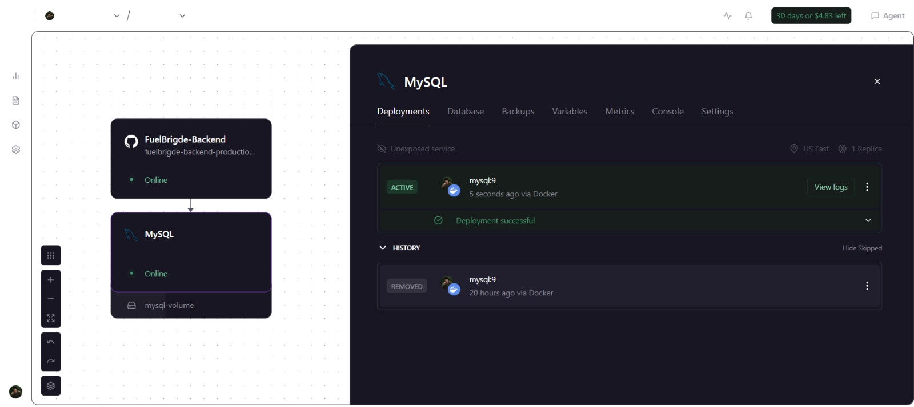

*Figura 2. Infraestructura cloud de FuelBridge en Railway, mostrando los servicios Backend y MySQL, el volumen persistente y el despliegue exitoso de la base de datos.*

#### C4 Deployment Diagram

El diagrama de despliegue C4 representa la distribución de los componentes de FuelBridge dentro de su infraestructura de producción, identificando los entornos donde se ejecutan las aplicaciones y los mecanismos de comunicación utilizados.

La arquitectura contempla los siguientes elementos:

- **Vercel Cloud:** aloja y distribuye los archivos estáticos del frontend Angular.
- **Navegador del usuario:** ejecuta la aplicación Angular y permite interactuar con las funcionalidades de la plataforma.
- **Railway Backend:** ejecuta la API REST desarrollada con Java 26 y Spring Boot 4, encargada de procesar las operaciones del negocio.
- **Railway MySQL:** almacena la información persistente mediante una base de datos relacional MySQL 9.

El proceso de comunicación comienza cuando el usuario accede a la aplicación web publicada en Vercel mediante HTTPS. Los archivos del frontend son descargados y ejecutados en el navegador, desde donde se realizan solicitudes HTTP a la API REST del backend desplegado en Railway.

Posteriormente, el backend procesa las operaciones del negocio y utiliza JDBC y Spring Data JPA para consultar o modificar la información almacenada en MySQL.

Esta distribución permite mantener el frontend separado del backend a nivel de despliegue, mientras que el backend conserva una arquitectura interna de monolito modular basada en DDD.

  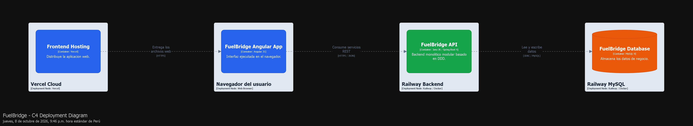

*Figura 3. C4 Deployment Diagram de FuelBridge, representando la infraestructura de producción en Vercel y Railway, así como la comunicación entre el frontend Angular, la API Spring Boot y MySQL.*

#### Validación de la Configuración de Despliegue

Para verificar la infraestructura de producción se consideran las siguientes comprobaciones:

| Componente | Evidencia de despliegue |
|---|---|
| Frontend Angular | Despliegue en Vercel con estado `Ready` |
| Backend Spring Boot | Servicio FuelBridge-Backend con estado `Online` en Railway |
| Base de datos MySQL | Servicio MySQL con estado `Online` y despliegue `ACTIVE` |
| Persistencia | Volumen `mysql-volume` asociado a MySQL |
| Comunicación | Frontend configurado para consumir la API REST de Railway |
| Infraestructura | Diagrama C4 que representa los nodos y sus conexiones |

Las evidencias permiten identificar la infraestructura utilizada y el estado de los servicios al momento de realizar las capturas. La validación funcional completa requiere comprobar adicionalmente las operaciones entre frontend, backend y base de datos.

En conjunto, la configuración de despliegue de FuelBridge proporciona una infraestructura centralizada para la lógica del negocio y la persistencia, manteniendo independiente la publicación del frontend y facilitando el mantenimiento de los componentes de la solución.

## 5.3 Microservices Implementation

### 5.3.1 Sprint 1

#### 5.3.1.1 Sprint Backlog 1

**Objetivo del Sprint 1:** cerrar las brechas entre lo diseñado en el Capítulo IV y lo realmente implementado en el backend: exponer el flujo de despacho de pedidos, conectar el patrón Observer para generar notificaciones al solicitante, cubrir el dominio con pruebas unitarias y dejar la primera versión funcional desplegada (frontend en Vercel y API en Railway).

**Drivers atendidos:** QA-1 (Availability & Traceability), QA-3 (Usability) y CON-1 (Spring Boot + MySQL).

| Sprint # | Sprint 1 |
| -------- | -------- |

| User Story / TS | Título | Task Id | Título de la tarea | Descripción | Estimado (horas) | Asignado a | Estado |
| --------------- | ------ | ------- | ------------------ | ----------- | ---------------- | ---------- | ------ |
| US-12 | Marcar pedido como despachado | T01.01 | Crear `DispatchFuelOrderCommand` | Definir el comando de dominio para despachar un pedido. | 2 | Milenko Rubén Cayanchi Avila | Done |
| US-12 | Marcar pedido como despachado | T01.02 | Manejar el comando en `FuelOrderCommandServiceImpl` | Invocar `dispatch()` del agregado y persistir el cambio. | 3 | Carlos Alberto Lopez Goitia | Done |
| US-12 / TS-17 | Marcar pedido como despachado | T01.03 | Exponer `POST /api/v1/fuel-orders/{orderId}/dispatch` | Endpoint en `FuelOrdersController` siguiendo el patrón de `confirm` y `cancel`. | 2 | Sebastian Andres Aiquipa Poma | Done |
| US-30 | Notificación de pedido despachado | T02.01 | Registrar eventos de dominio en `FuelOrder` | Emitir `FuelOrderConfirmedEvent`, `FuelOrderCancelledEvent` y `FuelOrderDispatchedEvent` al cambiar de estado. | 3 | Diego Fernando Herrera Enriquez | Done |
| US-30 | Notificación de pedido despachado | T02.02 | Publicar eventos en `FuelOrderRepositoryImpl.save()` | Usar `ApplicationEventPublisher` al guardar el agregado. | 3 | Schneider Carlos Alberto Delgado Carrasco | Done |
| US-29 / US-30 | Notificaciones de aprobación y despacho | T02.03 | Crear `FuelOrderNotificationEventHandler` | Listener en Notification BC que genera la notificación al usuario. | 4 | Milenko Rubén Cayanchi Avila | Done |
| TS-04 / TS-14 | Endpoints de pedidos | T03.01 | Pruebas unitarias de `FuelOrder` | 9 escenarios sobre estados y excepciones (JUnit 5 + AssertJ). | 4 | Sebastian Andres Aiquipa Poma | Done |
| TS-20 | Registrar y procesar pagos | T03.02 | Pruebas unitarias de `Payment` | 4 escenarios: creación, completar, reembolsar y fallar. | 2 | Carlos Alberto Lopez Goitia | Done |
| Técnica | Calidad del entorno de pruebas | T03.03 | Corregir `contextLoads()` con perfil de test | Perfil `application-test.properties` con H2 en memoria. | 2 | Diego Fernando Herrera Enriquez | Done |
| Técnica | Despliegue | T04.01 | Corregir configuración del perfil MySQL para Railway | Leer `MYSQLHOST`, `MYSQLPORT`, `MYSQLUSER`, `MYSQLPASSWORD` y `${PORT}`. | 2 | Schneider Carlos Alberto Delgado Carrasco | Done |
| Técnica | Despliegue | T04.02 | Desplegar backend en Railway | API publicada con Swagger UI disponible. | 3 | Milenko Rubén Cayanchi Avila | Done |
| Técnica | Despliegue | T04.03 | Desplegar frontend en Vercel | Rama `main` conectada a la API desplegada. | 2 | Sebastian Andres Aiquipa Poma | Done |
| Técnica | Documentación | T05.01 | Documentar el sprint en el informe | Evidencias de desarrollo, pruebas y despliegue. | 2 | Diego Fernando Herrera Enriquez | Done |

**Total estimado:** 34 horas.

---

##### 5.3.1.2 Development Evidence for Sprint Review
 
Durante este sprint se trabajó sobre el backend (`HaloFuel/FuelBrigde-Backend`), cerrando brechas entre lo documentado en el Capítulo IV y lo que estaba realmente implementado.
 
**Corrección de configuración para Railway:** el perfil `application-mysql.properties` tenía el host hardcodeado a `localhost` en vez de leer las variables que Railway inyecta automáticamente (`MYSQLHOST`, `MYSQLPORT`, `MYSQLUSER`, `MYSQLPASSWORD`). También faltaba leer el puerto dinámico con `${PORT}`.
 

  

 

**Endpoint faltante en Ordering BC:** el método `dispatch()` de `FuelOrder` no tenía ningún endpoint que lo expusiera, a diferencia de `confirm()` y `cancel()` que sí tenían el suyo. Se agregó `DispatchFuelOrderCommand`, su manejo en `FuelOrderCommandServiceImpl`, y el endpoint `POST /api/v1/fuel-orders/{orderId}/dispatch` en `FuelOrdersController`, siguiendo el mismo patrón existente.
 

  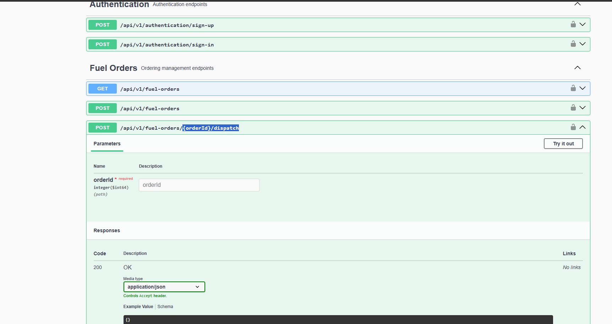

 

**Implementación real del patrón Observer (PAT-2 / ADR-03):** el Capítulo IV documentaba un Domain Event Dispatcher que no estaba conectado en el código. Se implementó de punta a punta: eventos de dominio en `FuelOrder`, publicación real en `FuelOrderRepositoryImpl.save()` vía `ApplicationEventPublisher`, y un listener nuevo en Notification BC (`FuelOrderNotificationEventHandler`) que genera una notificación real para el usuario de la empresa compradora. El detalle completo está en 5.1.2.
 

  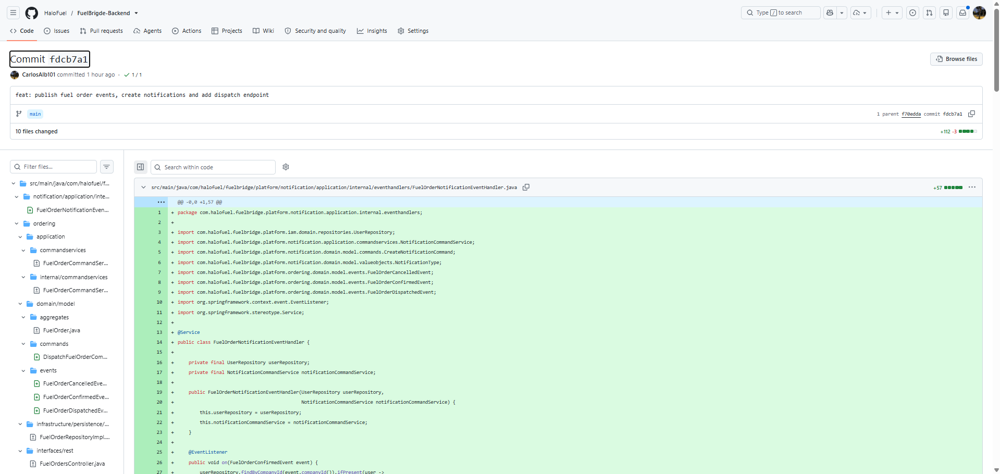

 

**Suite de tests del dominio:** se agregaron 13 pruebas unitarias sobre `FuelOrder` y `Payment`, y se corrigió el `contextLoads()` que fallaba por falta de base de datos local, configurando H2 en memoria para el perfil de test. El detalle está en 5.1.1.
 
 
**Repositorio y commits:** [github.com/HaloFuel/FuelBrigde-Backend](https://github.com/HaloFuel/FuelBrigde-Backend)
 

  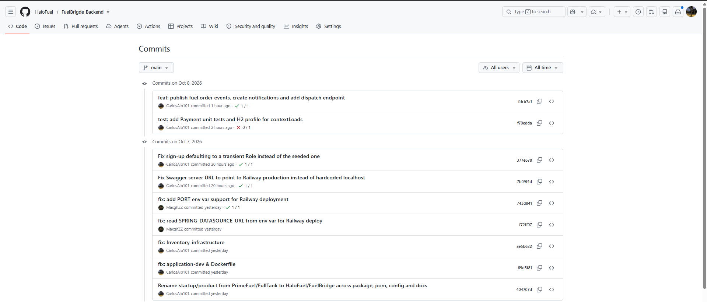

#### 5.3.1.3 Testing Suite Evidence for Sprint Review

#### 5.3.1.4 Execution Evidence for Sprint Review

Durante el Sprint 1, el equipo de HaloFuel implementó los Web Services del backend de FuelBridge, cubriendo los bounded contexts de IAM, Buyer Companies, Provider Companies, Fuel Products, Fuel Orders y Payments. A continuación se presentan las principales operaciones ejecutadas sobre los servicios, interactuando con la API REST mediante Postman.

**Registro de usuario (Sign Up)**

Se validó el endpoint de registro de usuarios con el rol `ROLE_BUYER`, obteniendo un response `201 Created` con los datos del usuario creado.

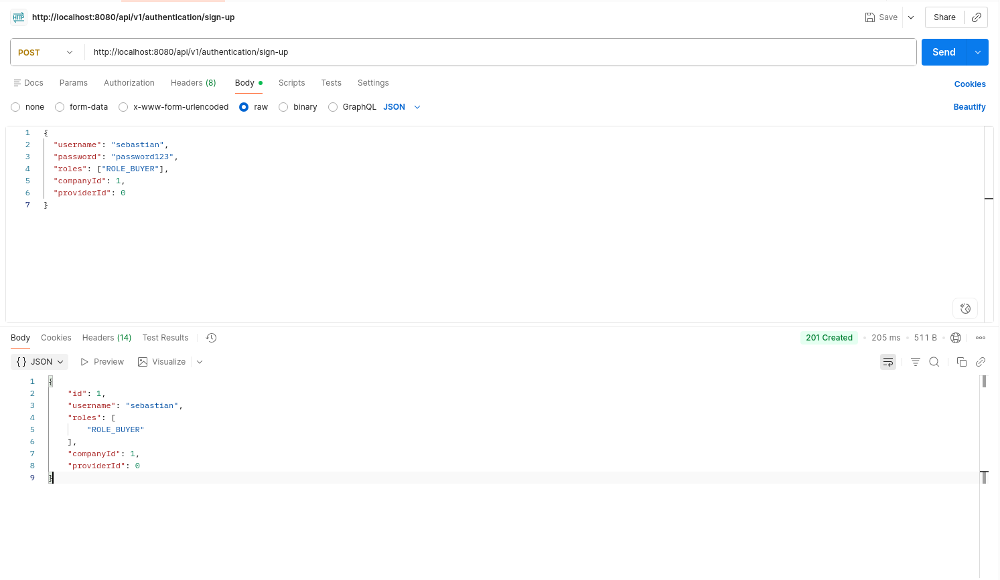

**Autenticación (Sign In)**

Se verificó el endpoint de autenticación, el cual retorna un token JWT requerido para acceder a los endpoints protegidos de la API.

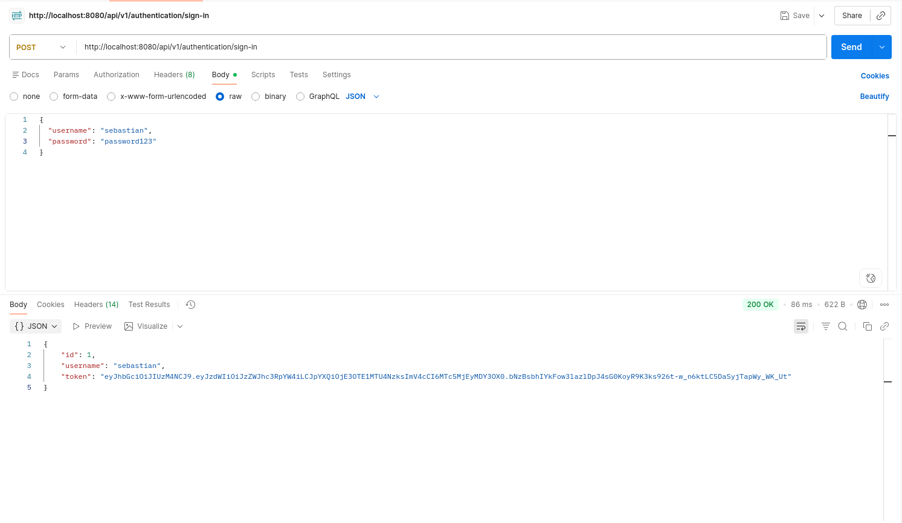

**Registro de empresa compradora**

Se registró la empresa compradora MineraCorp Perú SAC, obteniendo un response `201 Created`.

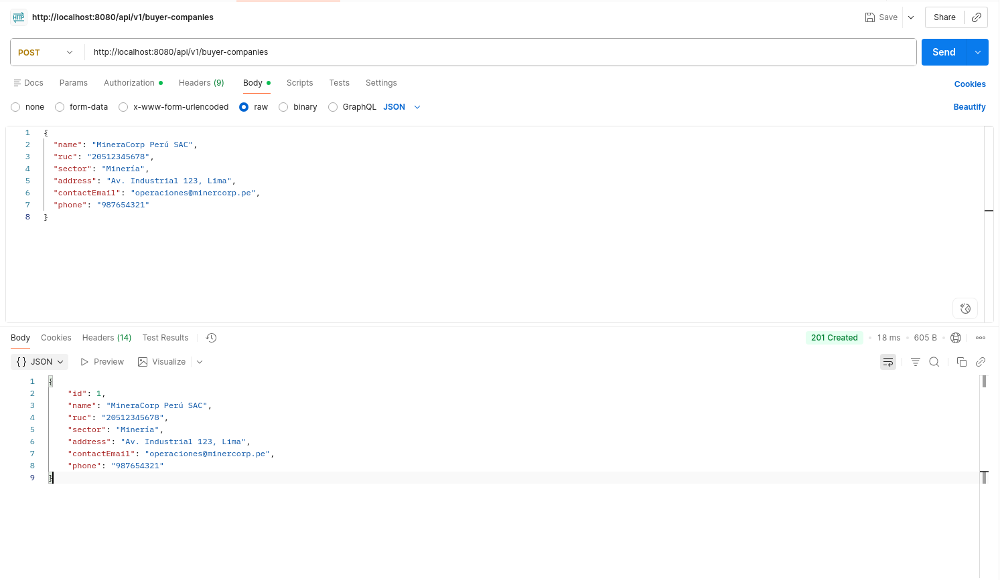

**Registro de empresa proveedora**

Se registró la empresa proveedora DistribFuel SAC con los tipos de combustible que ofrece, obteniendo un response `201 Created`.

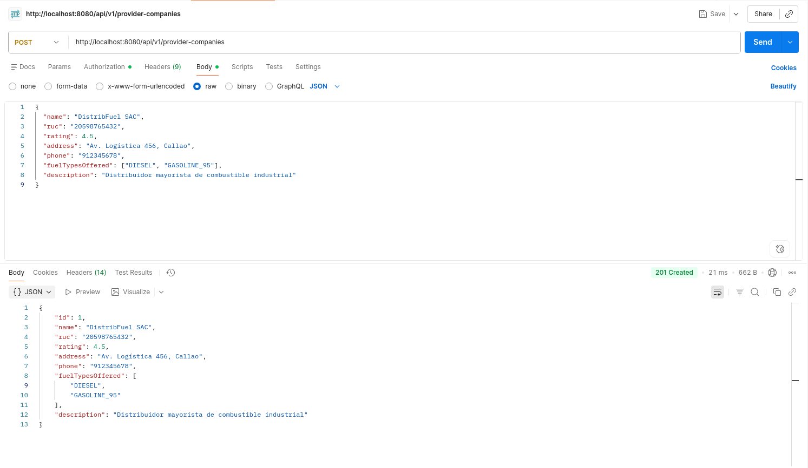

**Registro de producto de combustible**

Se creó el producto Diesel B5 Premium asociado al proveedor, con stock disponible y precio por unidad, obteniendo un response `201 Created`.

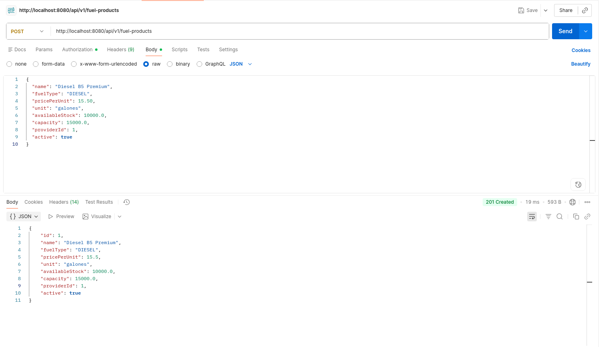

**Creación de pedido de combustible**

Se registró un pedido de 500 galones de Diesel B5 con dirección de entrega y fecha programada, obteniendo un response `201 Created` con el pedido en estado `PENDING`.

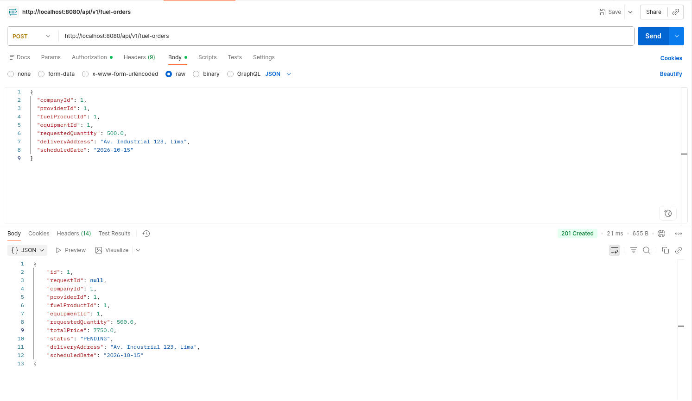

**Confirmación de pedido**

Se ejecutó la confirmación del pedido por parte del proveedor, actualizando el estado a `CONFIRMED` con un response `200 OK`.

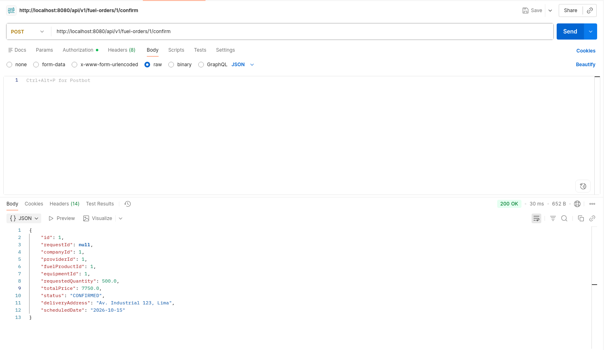

**Registro de pago**

Se registró el pago correspondiente al pedido mediante transferencia bancaria, obteniendo un response `201 Created` con el pago en estado `PENDING`.

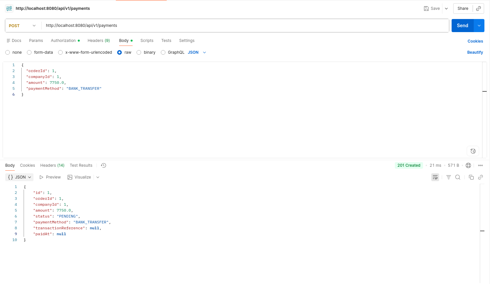

**Video de demostración Sprint 1:** [FuelBridge - Sprint 1 Execution Evidence](https://upcedupe-my.sharepoint.com/:v:/g/personal/u201916755_upc_edu_pe/IQAZur5nW4MhT5HGJjhtCbeaAZn0lYXzxUy-fxJNBNcOWbs?nav=eyJyZWZlcnJhbEluZm8iOnsicmVmZXJyYWxBcHAiOiJPbmVEcml2ZUZvckJ1c2luZXNzIiwicmVmZXJyYWxBcHBQbGF0Zm9ybSI6IldlYiIsInJlZmVycmFsTW9kZSI6InZpZXciLCJyZWZlcnJhbFZpZXciOiJNeUZpbGVzTGlua0NvcHkifX0&e=3qQurr)

---

#### 5.3.1.5 Microservices Documentation Evidence for Sprint Review

Durante el Sprint 1 se documentaron los Web Services de FuelBridge utilizando OpenAPI 3.0 a través de la dependencia `springdoc-openapi` (v3.0.3), generando automáticamente la especificación de la API y exponiéndola mediante Swagger UI. La documentación cubre un total de 9 grupos de endpoints con 73 rutas implementadas.

- **Swagger UI:** https://fuelbrigde-backend-production.up.railway.app/swagger-ui/index.html
- **OpenAPI JSON:** https://fuelbrigde-backend-production.up.railway.app/api-docs
- **Repositorio Backend:** https://github.com/HaloFuel/FuelBrigde-Backend

A continuación se presenta la vista general de la documentación generada:

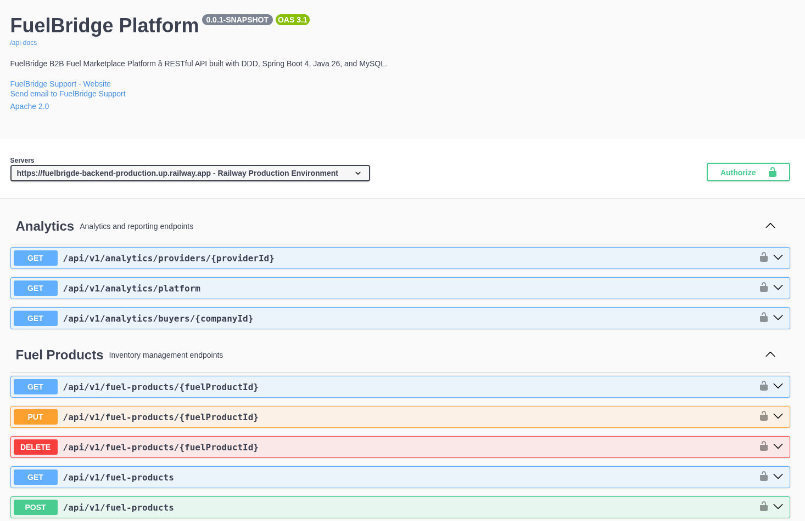

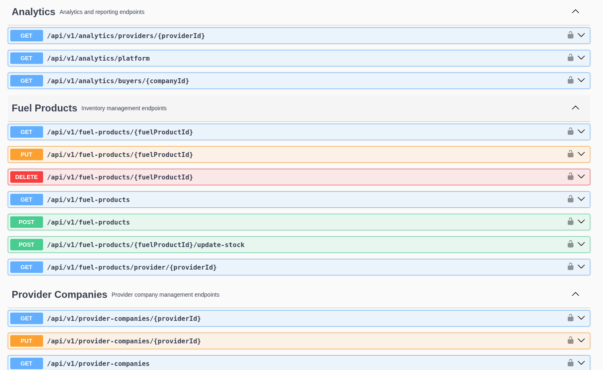

A continuación se presenta la tabla de endpoints documentados relacionados con el alcance del Sprint 1:

| Bounded Context | Endpoint | Verbo HTTP | Descripción | Response |
|---|---|---|---|---|
| IAM | `/api/v1/authentication/sign-up` | POST | Registro de nuevo usuario con rol y empresa asociada | `201 Created` — usuario con id y roles |
| IAM | `/api/v1/authentication/sign-in` | POST | Autenticación y obtención de token JWT | `200 OK` — id, username y Bearer token |
| Buyer Companies | `/api/v1/buyer-companies` | POST | Registro de empresa compradora | `201 Created` — empresa con id generado |
| Buyer Companies | `/api/v1/buyer-companies` | GET | Listado de empresas compradoras | `200 OK` — array de empresas |
| Buyer Companies | `/api/v1/buyer-companies/{companyId}` | GET | Consulta de empresa por ID | `200 OK` — datos de la empresa |
| Buyer Companies | `/api/v1/buyer-companies/{companyId}` | PUT | Actualización de empresa compradora | `200 OK` — empresa actualizada |
| Provider Companies | `/api/v1/provider-companies` | POST | Registro de empresa proveedora | `201 Created` — proveedor con id |
| Provider Companies | `/api/v1/provider-companies` | GET | Listado de empresas proveedoras | `200 OK` — array de proveedores |
| Provider Companies | `/api/v1/provider-companies/{providerId}` | GET | Consulta de proveedor por ID | `200 OK` — datos del proveedor |
| Provider Companies | `/api/v1/provider-companies/{providerId}` | PUT | Actualización de empresa proveedora | `200 OK` — proveedor actualizado |
| Fuel Products | `/api/v1/fuel-products` | POST | Registro de producto de combustible | `201 Created` — producto con id |
| Fuel Products | `/api/v1/fuel-products` | GET | Listado de productos de combustible | `200 OK` — array de productos |
| Fuel Products | `/api/v1/fuel-products/{fuelProductId}` | GET | Consulta de producto por ID | `200 OK` — datos del producto |
| Fuel Products | `/api/v1/fuel-products/{fuelProductId}` | PUT | Actualización de producto | `200 OK` — producto actualizado |
| Fuel Products | `/api/v1/fuel-products/{fuelProductId}` | DELETE | Eliminación de producto | `204 No Content` |
| Fuel Products | `/api/v1/fuel-products/{fuelProductId}/update-stock` | POST | Actualización de stock disponible | `200 OK` — producto con stock actualizado |
| Fuel Orders | `/api/v1/fuel-orders` | POST | Creación de pedido de combustible | `201 Created` — pedido en estado `PENDING` |
| Fuel Orders | `/api/v1/fuel-orders` | GET | Listado de todos los pedidos | `200 OK` — array de pedidos |
| Fuel Orders | `/api/v1/fuel-orders/{orderId}` | GET | Consulta de pedido por ID | `200 OK` — pedido con estado actual |
| Fuel Orders | `/api/v1/fuel-orders/company/{companyId}` | GET | Pedidos de una empresa compradora | `200 OK` — array de pedidos filtrados |
| Fuel Orders | `/api/v1/fuel-orders/provider/{providerId}` | GET | Pedidos asignados a un proveedor | `200 OK` — array de pedidos filtrados |
| Fuel Orders | `/api/v1/fuel-orders/{orderId}/confirm` | POST | Confirmación del pedido por el proveedor | `200 OK` — pedido en estado `CONFIRMED` |
| Fuel Orders | `/api/v1/fuel-orders/{orderId}/cancel` | POST | Cancelación del pedido | `200 OK` — pedido en estado `CANCELLED` |
| Payments | `/api/v1/payments` | POST | Registro de pago asociado a un pedido | `201 Created` — pago en estado `PENDING` |
| Payments | `/api/v1/payments/{paymentId}/complete` | POST | Confirmación de pago con referencia de transacción | `200 OK` — pago en estado `COMPLETED` |
| Payments | `/api/v1/payments/order/{orderId}` | GET | Consulta de pago por pedido | `200 OK` — datos del pago |

A continuación se muestra el schema del endpoint principal del bounded context Fuel Orders y la interacción con datos de muestra:

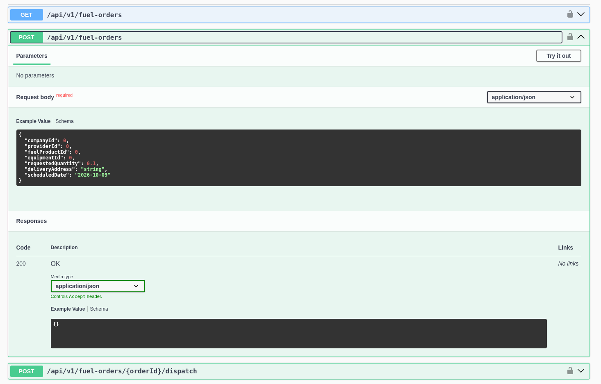

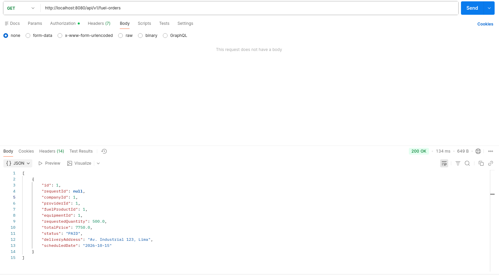

**Commits relacionados con documentación Sprint 1:**

| Repository | Branch | Commit Id | Commit Message | Committed on |
|---|---|---|---|---|
| HaloFuel/FuelBrigde-Backend | main | `7b09f4d` | fix: Swagger server URL to point to Railway production | 2026-10-08 |
| HaloFuel/FuelBrigde-Backend | main | `404707d` | Rename startup/product from PrimeFuel/FullTank to HaloFuel/FuelBridge across package, pom, config and docs | 2026-10-08 |

#### 5.3.1.6 Software Deployment Evidence for Sprint Review

La primera versión funcional de FuelBridge se despliega desde los repositorios de desarrollo del frontend y del backend, no desde la landing page. Durante esta etapa, la aplicación quedó disponible para validación con la interfaz web consumiendo la API desplegada del sistema.

| Elemento | Frontend | Backend |
| -------- | -------- | ------- |
| Producto | FuelBridge Web App / FuelBridge Frontend | FuelBridge API / FuelBridge Backend |
| Repositorio | FuelBridge-Frontend | FuelBridge-Backend |
| Plataforma de despliegue | Vercel | Plataforma de despliegue configurada para Spring Boot/API |
| Rama desplegada | main | main |
| Build / Run | Build del proyecto frontend para producción | Compilación y ejecución de la API Spring Boot |
| Variables de entorno | Configuradas para la conexión con la API y servicios del cliente | Configuradas para la conexión a base de datos y servicios internos |
| Estado | Frontend funcional y accesible desde la URL pública del proyecto | Backend funcional y consumido por la aplicación web |
|URL pública| https://fuel-brigde-frontend.vercel.app/home | https://fuelbrigde-backend-production.up.railway.app/swagger-ui/index.html |

La evidencia de despliegue corresponde a la versión de Sprint Review de la solución digital, donde el frontend y el backend operan de manera desacoplada pero integrados para la validación del flujo principal del producto.

**Landing Page desplegado:** 

#### 5.3.1.7 Team Collaboration Insights during Sprint

#### 5.3.1.8 Kanban Board

# Referencias bibliográficas

- Adzic, G. (s.f.). Impact Mapping. Recuperado de [https://www.impactmapping.org/](https://www.impactmapping.org/)

- Brandolini, A. (s.f.). Introducing EventStorming. Recuperado de [https://www.eventstorming.com/](https://www.eventstorming.com/)

- CareerFoundry. (s.f.). What are User Flows in User Experience (UX) Design?. Recuperado de [https://careerfoundry.com/en/blog/ux-design/what-are-user-flows/](https://careerfoundry.com/en/blog/ux-design/what-are-user-flows/)

- Cohn, M. (s.f.). User Stories. Mountain Goat Software. Recuperado de [https://www.mountaingoatsoftware.com/agile/user-stories](https://www.mountaingoatsoftware.com/agile/user-stories)

- Cone, M. (s.f.). The Markdown Guide. Recuperado de [https://www.markdownguide.org/](https://www.markdownguide.org/)

- Conventional Commits. (s.f.). Conventional Commits. Recuperado de [https://www.conventionalcommits.org/](https://www.conventionalcommits.org/)

- Cucumber. (s.f.). Gherkin Reference. Recuperado de [https://cucumber.io/docs/gherkin/reference/](https://cucumber.io/docs/gherkin/reference/)

- Driessen, V. (2010). A successful Git branching model. nvie.com. Recuperado de [https://nvie.com/posts/a-successful-git-branching-model/](https://nvie.com/posts/a-successful-git-branching-model/)

- DZone. (s.f.). Acceptance Criteria in Scrum: Explanation, Examples, and Template. Recuperado de [https://dzone.com/articles/acceptance-criteria-in-software-explanation-exampl](https://dzone.com/articles/acceptance-criteria-in-software-explanation-exampl)

- Evans, E. (2004). Domain-Driven Design: Tackling Complexity in the Heart of Software. Addison-Wesley Professional. Recuperado de [https://www.oreilly.com/library/view/domain-driven-design-tackling/0321125215/](https://www.oreilly.com/library/view/domain-driven-design-tackling/0321125215/)

- Fowler, M. (2006). Ubiquitous Language. Recuperado de [https://martinfowler.com/bliki/UbiquitousLanguage.html](https://martinfowler.com/bliki/UbiquitousLanguage.html)

- Google. (s.f.). Google HTML/CSS Style Guide. Recuperado de [https://google.github.io/styleguide/htmlcssguide.html](https://google.github.io/styleguide/htmlcssguide.html)

- Google. (s.f.). Google JavaScript Style Guide. Recuperado de [https://google.github.io/styleguide/jsguide.html](https://google.github.io/styleguide/jsguide.html)

- Gothelf, J., & Seiden, J. (2021). Lean UX: Designing Great Products with Agile Teams (3rd ed.). O'Reilly Media. Recuperado de [https://www.oreilly.com/library/view/lean-ux-2nd/9781491953594/](https://www.oreilly.com/library/view/lean-ux-2nd/9781491953594/)

- HubSpot. (s.f.). Full List of Meta Tags, Why They Matter for SEO & How to Write Them. Recuperado de [https://blog.hubspot.com/marketing/meta-tags](https://blog.hubspot.com/marketing/meta-tags)

- IBM Design. (s.f.). Empathy Map. Enterprise Design Thinking. Recuperado de [https://www.ibm.com/design/thinking/page/toolkit/activity/empathy-map](https://www.ibm.com/design/thinking/page/toolkit/activity/empathy-map)

- IBM Design. (s.f.). As-is Scenario Map. Enterprise Design Thinking. Recuperado de [https://www.ibm.com/design/thinking/page/toolkit/activity/as-is-scenario-map](https://www.ibm.com/design/thinking/page/toolkit/activity/as-is-scenario-map)

- Martin, R. C. (2017). Clean Architecture: A Craftsman's Guide to Software Structure and Design. Prentice Hall. Recuperado de [https://www.oreilly.com/library/view/clean-architecture-a/9780134494272/](https://www.oreilly.com/library/view/clean-architecture-a/9780134494272/)

- Mendel, J. (s.f.). Seriously, what's your (startup's) problem?. Medium. Recuperado de [4](https://medium.com/@jakemendel/seriously-whats-your-startup-s-problem-b3a884c54ab4)

- Nielsen Norman Group. (1994). 10 Usability Heuristics for User Interface Design. Recuperado de [https://www.nngroup.com/articles/ten-usability-heuristics/](https://www.nngroup.com/articles/ten-usability-heuristics/)

- Nielsen Norman Group. (2016). The Four Dimensions of Tone of Voice. Recuperado de [https://www.nngroup.com/articles/tone-of-voice-dimensions/](https://www.nngroup.com/articles/tone-of-voice-dimensions/)

- Preston-Werner, T. (s.f.). Semantic Versioning 2.0.0. Recuperado de [https://semver.org/](https://semver.org/)

- Progressa Lean. (s.f.). 5W+2H - Técnica de análisis de problemas. Recuperado de [https://www.progressalean.com/5w2h-tecnica-de-analisis-de-problemas/](https://www.progressalean.com/5w2h-tecnica-de-analisis-de-problemas/)

- Refactoring.Guru. (s.f.). Design Patterns. Recuperado de [https://refactoring.guru/es/design-patterns](https://refactoring.guru/es/design-patterns)

- UXPressia. (s.f.). User vs. Buyer Persona: Differences and free template. Recuperado de [https://uxpressia.com/blog/user-persona-vs-buyer-persona-difference](https://uxpressia.com/blog/user-persona-vs-buyer-persona-difference)

- Vernon, V. (2016). Domain-Driven Design Distilled. Addison-Wesley Professional. Recuperado de [https://www.oreilly.com/library/view/domain-driven-design-distilled/9780134434964/](https://www.oreilly.com/library/view/domain-driven-design-distilled/9780134434964/)

- Vernon, V. (s.f.). Domain-Driven Design Reference. Recuperado de [https://domainlanguage.com/ddd/reference/](https://domainlanguage.com/ddd/reference/)
