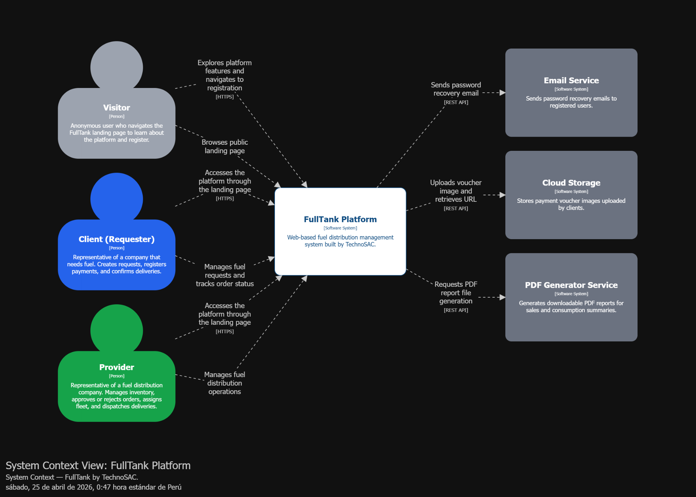
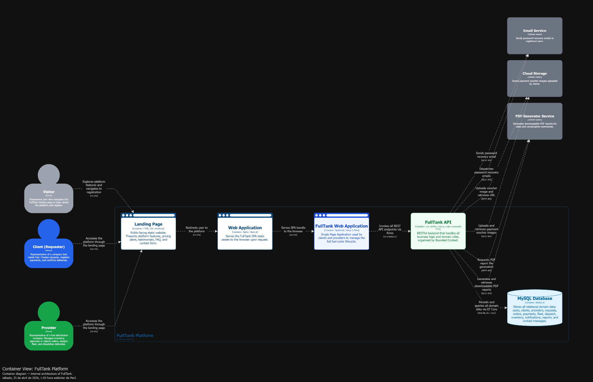
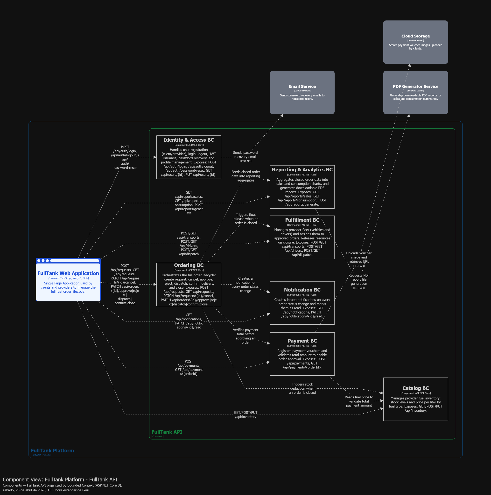
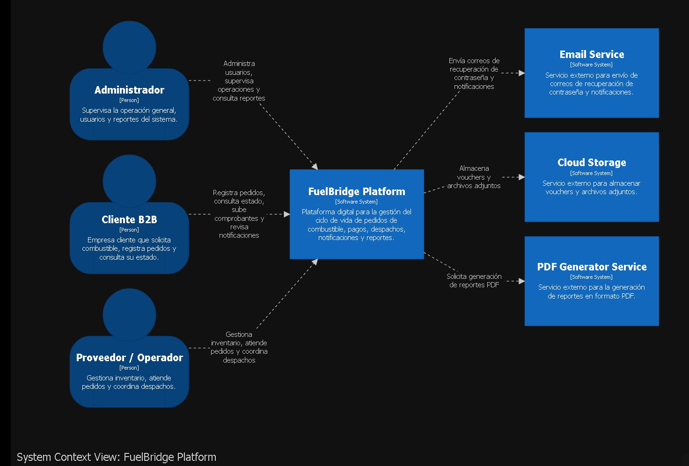
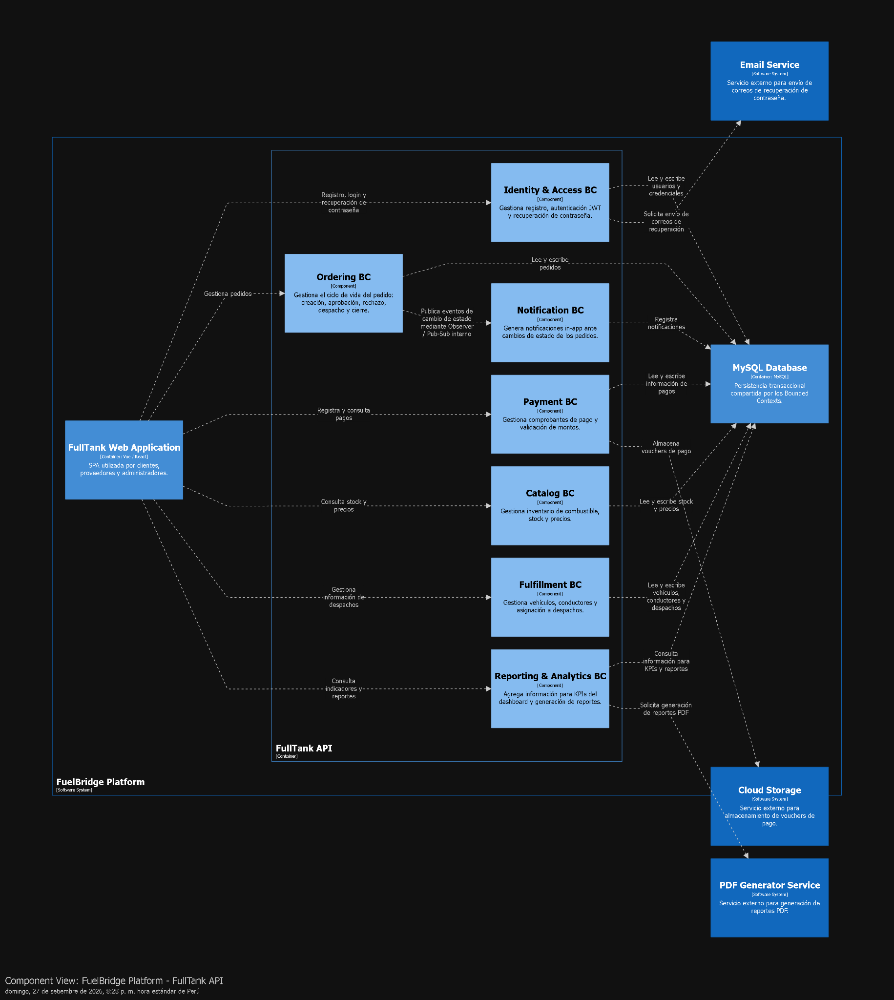
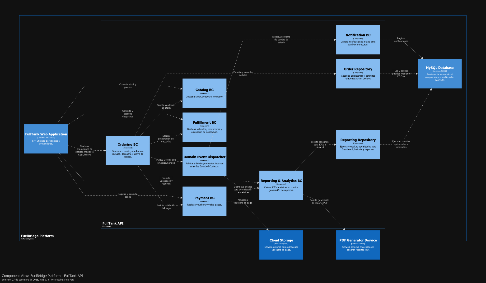

# Capítulo IV: Product Architecture Design

## 4.1 Design Concepts, ViewPoints & ER Diagrams

### 4.1.1 Principles Statements

El diseño arquitectónico de FuelBridge (desarrollado por PrimeFuel) se rige bajo principios fundamentales de ingeniería de software para garantizar escalabilidad, mantenibilidad y una experiencia de usuario óptima:

- Domain-Driven Design (DDD): El software está estrictamente alineado con los procesos de negocio de compra y distribución de combustible. El sistema se divide en Bounded Contexts claramente definidos (como Ordering, Payment, Fulfillment y Catalog) para aislar la complejidad del dominio.

- Separation of Concerns (SoC): El sistema se divide en distintas capas (Presentación, Lógica de Negocio mediante APIs y Acceso a Datos) asegurando que cada componente tenga una responsabilidad única.

- API-First Design: Todo el acceso a la lógica de negocio y a los datos se expone mediante una API REST centralizada, permitiendo que múltiples interfaces consuman los mismos servicios y facilitando integraciones futuras.

- Diseño centrado en el usuario: Priorización de interfaces limpias, fluidas y de respuesta rápida (Single Page Application) orientadas a resolver problemas prácticos del día a día logístico y asegurar la satisfacción del usuario final.

### 4.1.2 Approaches Statements Architectural Styles & Patterns

Para resolver la problemática de comunicación informal y trazabilidad en el sector energético, se adoptan los siguientes estilos:

- Arquitectura basada en Componentes / Microservicios lógicos: El backend se estructura internamente en módulos independientes por dominio, facilitando la escalabilidad y el mantenimiento concurrente.

- Single Page Application (SPA): El frontend utiliza un estilo de aplicación de página única para brindar una experiencia fluida sin recargas, crucial para paneles de control en tiempo real.

- Event-Driven (Parcial): Implementado para la orquestación asíncrona, como el disparo de notificaciones o la generación de reportes PDF cuando un pedido cambia de estado en el sistema.

### 4.1.3 Context Diagram

  

El Diagrama de Contexto de FuelBridge define los límites del sistema y sus interacciones principales con los usuarios y sistemas externos:

**Sistema Central**

FuelBridge Platform: Sistema web para la gestión de distribución de combustible.

**Actores (Personas)**

- Visitor: Usuario anónimo que navega por la Landing Page pública para conocer las características de la plataforma y registrarse.

- Client (Requester): Representante de una empresa que necesita combustible. Interactúa para crear pedidos, registrar pagos y hacer seguimiento del estado de entrega.

- Provider: Representante de la empresa distribuidora de combustible. Gestiona el inventario, aprueba/rechaza pedidos, asigna la flota logística y despacha las entregas.

**Sistemas Externos**

- Email Service: Sistema de software utilizado para enviar correos de recuperación de contraseñas a los usuarios registrados mediante REST API.

- Cloud Storage: Servicio en la nube encargado de almacenar las imágenes de los vouchers de pago subidos por los clientes.

- PDF Generator Service: Herramienta externa consumida vía REST API para generar reportes descargables en PDF sobre ventas y resúmenes de consumo.

### 4.1.4 Approach Driven ViewPoints Diagrams

  

El Diagrama de Contenedores detalla la arquitectura de alto nivel y las piezas de software desplegables:

- Landing Page: Sitio web estático que presenta las características de la plataforma, planes de precios, preguntas frecuentes y formulario de contacto, redirigiendo al usuario a la aplicación principal.

- FullTank Web Application: Una Single Page Application (SPA) ejecutada en el navegador del usuario, que sirve como la interfaz gráfica unificada para que clientes y proveedores gestionen el ciclo de vida del combustible.

- FullTank API: Desarrollada en ASP.NET Core 8, es la API RESTful central que contiene toda la lógica de negocio, procesa las peticiones del frontend y orquesta los diferentes Bounded Contents.

- MySQL Database: Base de datos relacional centralizada que almacena la información de dominio (usuarios, clientes, proveedores, pedidos, pagos, flota, despachos, etc.) utilizando Spring Data JPA.

  

A nivel de componentes, la FullTank API se descompone en los siguientes Bounded Contexts (BC) para mantener alta cohesión:

- Identity & Access BC: Gestiona registro, autenticación, JWT y recuperación de contraseñas.

- Ordering BC: Orquesta el ciclo de vida del pedido (creación, aprobación, rechazo, despacho y cierre).

- Catalog BC: Administra el inventario del proveedor, niveles de stock y precios.

- Payment BC: Registra comprobantes de pago y valida los montos.

- Fulfillment BC: Administra la flota (vehículos y conductores) y su asignación a pedidos.

- Notification BC: Crea notificaciones in-app ante cambios de estado de los pedidos.

- Reporting & Analytics BC: Agrega datos para generar gráficos y solicitar PDFs de ventas.

### 4.1.5 Relational/Non Relational Database Diagram

  

El modelo de datos relacional de la plataforma está normalizado para garantizar la integridad referencial y soportar las transacciones de los diferentes Bounded Contexts. El esquema se articula de la siguiente manera:

- Identidad y Perfiles: La tabla central USER almacena credenciales y roles. De esta se derivan lógicamente los perfiles especializados CLIENT (empresa solicitante) y PROVIDER (distribuidor), que incluyen datos comerciales específicos.

- Ciclo de Pedidos: La interacción comercial inicia en la tabla REQUEST y se detalla en REQUEST_DETAILS. Una vez aceptada, se consolida en la tabla transaccional ORDER, que centraliza estados y tiempos (aprobado, despachado, entregado).

- Finanzas e Inventario: Los pagos se registran en la tabla PAYMENT (asociada a una orden), además de considerar depósitos pre-aprobados en DEPOSIT. La tabla INVENTORY controla el stock de combustible de cada proveedor.

- Logística y Despacho: La tabla DISPATCH actúa como el núcleo operativo, vinculando un pedido aprobado (ORDER) con los recursos físicos de la tabla TRANSPORT (vehículos, placas, capacidad) y DRIVER (conductores y licencias).

- Notificaciones y Reportes: Tablas auxiliares como NOTIFICATION permiten el historial de alertas por usuario, y REPORT consolida la metadata de los archivos generados en el sistema.

### 4.1.6 Design Patterns

- Repository Pattern: Aplicado en el acceso a datos para abstraer las consultas a MySQL, permitiendo modificaciones en el motor de persistencia sin alterar los controladores de la API.

- Observer (Publish-Subscribe): Empleado internamente para que el Notification BC y Reporting & Analytics BC reaccionen asíncronamente a los eventos del Ordering BC (ej. cuando se aprueba o despacha una orden).

- MVC / MVVM: Patrones aplicados en el diseño de la SPA en el frontend para separar la lógica de presentación de la lógica de consumo de servicios REST.

### 4.1.7 Tactics

- Disponibilidad (Availability): Uso de redundancia en la persistencia de datos (Cloud Storage para archivos) y excepciones controladas en la comunicación con servicios de terceros (como el PDF Generator) para evitar fallos en cascada.

- Seguridad (Security): Autenticación estricta mediante JSON Web Tokens (JWT) gestionada por el Identity & Access BC, además de obligar al uso de HTTPS para todo el tráfico entre la SPA, la Landing Page y la API.

- Modificabilidad (Modifiability): La alta cohesión lograda al separar la API en 7 Bounded Contexts distintos permite modificar, por ejemplo, la lógica de inventario (Catalog BC) sin impactar la lógica de despachos (Fulfillment BC).

## 4.2 Architectural Drivers

### 4.2.1 Design Purpose

El propósito arquitectónico de FuelBridge es proporcionar una plataforma B2B centralizada y altamente confiable que digitalice el flujo completo de pedido, pago y despacho de combustible. Se busca reemplazar los canales informales (WhatsApp, llamadas, hojas de Excel) para reducir errores operativos, brindar trazabilidad en tiempo real y optimizar los tiempos de gestión logística para empresas de los sectores de minería y construcción.

### 4.2.2 Primary Functionality (Primary User Stories)

La arquitectura debe dar soporte prioritario a las historias de usuario y endpoints core identificados con mayor valor de negocio en el Product Backlog:

- US-05 / TS-04: Registrar un nuevo pedido de combustible (Solicitante) y su creación en la base de datos.

- US-11 / TS-14: Aprobar pedidos condicionados a la validación de los pagos correspondientes (Proveedor).

- US-46 / TS-17: Asignar recursos físicos (vehículo y conductor) al despacho en una sola operación.

- US-47: Despliegue de un Dashboard principal para el proveedor con KPIs y métricas en tiempo real.

### 4.2.3 Quality Attribute Scenarios

Basado en los requerimientos del sector B2B, los atributos de calidad críticos son:

Usabilidad (Usability): Dado que los usuarios transicionan desde herramientas manuales, el frontend (SPA) debe ser extremadamente intuitivo. Al registrar un pedido (US-05) o asignar flota (US-46), el sistema debe brindar feedback visual inmediato sin superar los tiempos cognitivos de espera.

Disponibilidad y Trazabilidad (Availability & Traceability): El seguimiento del pedido es el dolor principal de los clientes. Si el proveedor actualiza el estado de una orden a "Despachado", el Notification BC debe asegurar que la alerta llegue a la plataforma del cliente sin pérdida de eventos, garantizando visibilidad 24/7.

Desempeño (Performance): La carga de interfaces analíticas (como el Dashboard del proveedor y el historial del cliente) requiere procesar múltiples registros. El diseño de la base de datos MySQL debe soportar índices eficientes para evitar bloqueos durante consultas de rango de fechas.

### 4.2.4 Constraints

- Tecnológicas: El backend se restringe al uso del entorno ASP.NET Core 8 para la exposición de la REST API y MySQL para la persistencia transaccional.

- Integración de Terceros: El sistema tiene dependencias externas estrictas para el envío de correos, almacenamiento de vouchers (Cloud Storage) y generación de reportes (PDF Generator), por lo que las interfaces de red deben manejar latencias.

- Plazos (Time-to-market): El proyecto cuenta con un límite de tiempo estructurado en 4 Sprints, obligando a un desarrollo ágil y priorización del MVP.

### 4.2.5 Architectural Concerns

- Gestión Segura del Estado: Coordinar el flujo transaccional entre el pedido, el pago y la liberación de inventario (Ordering BC, Payment BC y Catalog BC) garantizando que un despacho no ocurra si el pago y el stock no están debidamente verificados.

- Desacoplamiento de Servicios Bloqueantes: Extraer tareas pesadas o de latencia variable (generación de PDFs o envío masivo de correos) fuera del hilo principal de ejecución HTTP para no afectar la experiencia del usuario.

- Mantenimiento del Código: Asegurar convenciones claras de nombrado, estructuración por dominios y un pipeline de CI/CD que soporte integraciones continuas conforme avance el equipo durante los Sprints establecidos.

## 4.3 ADD Iterations

### 4.3.1 Iteration 1: Estructura Global del Sistema

#### 4.3.1.1 Architectural Design Backlog 1

| **ID** | **Decisión de Diseño**                                                                   | **Driver Relacionado**                                       | **Prioridad** | **Estado**   |
|--------|------------------------------------------------------------------------------------------|--------------------------------------------------------------|---------------|--------------|
| ADD-01 | Definir los contenedores principales del sistema y sus responsabilidades                 | QA-1 (Availability & Traceability), QA-3 (Usability)         | Alta          | Por resolver |
| ADD-02 | Establecer el estilo arquitectónico base (SPA + API REST + BCs)                          | QA-2 (Performance), Constraint Tecnológica                   | Alta          | Por resolver |
| ADD-03 | Definir la estrategia de comunicación entre contenedores (sincrónica o. asincrónica)     | QA-1 (Availability & Traceability), Concern: Desacoplamiento | Alta          | Por resolver |
| ADD-04 | Establecer la separación en Bounded Contexts dentro de la API                            | QA-2 (Performance), Concern: Gestión Segura del Estado       | Media         | Por resolver |
| ADD-05 | Definir la Landing Page como contenedor estático separado de la FullTank Web Application | QA-3 (Usability), Concern: Separación de responsabilidades   | Media         | Por resolver |

#### 4.3.1.2 Establish Iteration Goal by Selecting Drivers

El objetivo de esta primera iteración es establecer la estructura global del sistema desde cero, definiendo los contenedores principales que lo componen y las relaciones entre ellos.

Drivers trabajados en Iteración 1: QA-1 Availability & Traceability, QA-3 Usability y Constraint Tecnológica ASP.NET Core 8 + MySQL. :

**QA-1 Availability & Traceability:** Es el driver de mayor impacto para el negocio. Los clientes del sector B2B (minería y construcción) dependen de la visibilidad del estado de sus pedidos en tiempo real. Una arquitectura que no garantice la entrega confiable de eventos de cambio de estado compromete el valor principal de la plataforma. Por ello, la estructura global debe contemplar desde el inicio un mecanismo asincrónico que desacople la notificación del flujo principal del pedido.

**QA-3 Usability:** Los usuarios de FuelBridge provienen de entornos manuales (Excel, WhatsApp). La arquitectura debe soportar una interfaz de usuario fluida y sin interrupciones, lo que justifica la elección de una SPA como contenedor de frontend separado de la API, permitiendo actualizaciones parciales de la vista sin recargas completas.

**Constraint Tecnológica:** El equipo está restringido al uso de ASP.NET Core 8 para el backend y MySQL para la persistencia. Esta restricción condiciona directamente las decisiones de contenedores y patrones de acceso a datos.

Los drivers QA-2 (Performance) y los Concerns de gestión del estado quedan registrados en el backlog pero se abordan en la Iteración 2, donde se profundizará en los componentes internos de la API.

#### 4.3.1.3 Choose One or More Elements of the System to Refine

El elemento refinado en esta iteración es el sistema FuelBridge en su totalidad, abordado como una unidad que se descompone por primera vez en sus contenedores desplegables. Se identifican como puntos de decisión:

- La separación entre el frontend y el backend como contenedores independientes.

- La estructura interna de la API y su división en Bounded Contexts.

- Las integraciones con sistemas externos (Email Service, Cloud Storage, PDF Generator Service) y el tipo de comunicación que cada una requiere.

#### 4.3.1.4 Choose One or More Design Concepts That Satisfy the Selected Drivers

| **Concepto evaluado**                           | **Decisión** | **Razón**                                                                                                                   |
|-------------------------------------------------|--------------|-----------------------------------------------------------------------------------------------------------------------------|
| Monolito MVC server-side                        | Rechazado    | Las recargas completas de página son incompatibles con la experiencia requerida en paneles de control en tiempo real (QA-3) |
| SPA + REST API desacoplada                      | Seleccionado | Permite actualizaciones parciales de la vista y desacopla el ciclo de despliegue del frontend del backend                   |
| Microservicios distribuidos                     | Rechazado    | Complejidad operativa incompatible con el plazo de 4 Sprints (Constraint: Time-to-market)                                   |
| Monolito Modular (API única con BCs internos)   | Seleccionado | Compatible con ASP.NET Core 8 y MySQL; permite cohesión por dominio sin overhead de infraestructura distribuida             |
| Observer/Pub-Sub interno para eventos entre BCs | Seleccionado | Desacopla el Notification BC del flujo transaccional del Ordering BC sin requerir un message broker externo en esta etapa   |

Decisión adoptada: arquitectura de Monolito Modular con SPA desacoplada. La API centralizada en ASP.NET Core 8 se divide internamente en 7 Bounded Contexts que comparten una base de datos MySQL. La comunicación entre BCs que requiere desacoplamiento se implementa mediante Observer/Pub-Sub interno.

#### 4.3.1.5 Instantiate Architectural Elements, Allocate Responsibilities, and Define Interfaces

**Contenedores del sistema:**

| **Elemento**             | **Tipo**                 | **Responsabilidad**                                                                                                 | **Interfaz**                                                                                  |
|--------------------------|--------------------------|---------------------------------------------------------------------------------------------------------------------|-----------------------------------------------------------------------------------------------|
| Landing Page             | Static Web               | Presentación pública de la plataforma y redirección al Web Application                                              | Ninguna, redirección via URL                                                                  |
| FullTank Web Application | SPA (Vue/React)          | Interfaz unificada para clientes y proveedores en la gestión del ciclo de vida del combustible                      | Consume: FullTank API (REST/HTTPS)                                                            |
| FullTank API             | ASP.NET Core 8           | Lógica de negocio completa dividida en 7 BCs; procesamiento de pedidos, pagos, despachos, notificaciones y reportes | Expone: REST API (HTTPS/JSON). Consume: MySQL DB, Email Service, Cloud Storage, PDF Generator |
| MySQL Database           | Base de datos relacional | Persistencia transaccional de todos los dominios del sistema                                                        | Consumida por FullTank API via Entity Framework Core                                          |
| Email Service            | Sistema externo          | Envío de correos de recuperación de contraseña                                                                      | Consumido por Identity & Access BC via REST API                                               |
| Cloud Storage            | Sistema externo          | Almacenamiento de vouchers de pago                                                                                  | Consumido por Payment BC via REST API                                                         |
| PDF Generator Service    | Sistema externo          | Generación de reportes en PDF                                                                                       | Consumido por Reporting & Analytics BC via REST API                                           |

**Bounded Contexts de la FullTank API:**

| **Bounded Context**      | **Responsabilidad**                                                        |
|--------------------------|----------------------------------------------------------------------------|
| Identity & Access BC     | Registro, autenticación JWT y recuperación de contraseña                   |
| Ordering BC              | Ciclo de vida del pedido: creación, aprobación, rechazo, despacho y cierre |
| Payment BC               | Registro de comprobantes de pago y validación de montos                    |
| Catalog BC               | Gestión de inventario de combustible: stock y precios                      |
| Fulfillment BC           | Gestión de flota (vehículos y conductores) y asignación a despachos        |
| Notification BC          | Generación de notificaciones in-app ante cambios de estado de pedidos      |
| Reporting & Analytics BC | Agregación de datos para KPIs del dashboard y generación de reportes PDF   |

#### 4.3.1.6 Sketch Views (C4 & UML) and Record Design Decisions

**C4 Context Diagram**

  

**Diagrama de Secuencia UML**

  

**Diagrama de Componentes - Estructura del Monolito**

**Component Diagram – FullTank API**

  

El diagrama de componentes representa la estructura interna del Monolito Modular implementado en FullTank API. La lógica de negocio se divide en siete Bounded Contexts con responsabilidades independientes: Identity & Access, Ordering, Payment, Catalog, Fulfillment, Notification y Reporting & Analytics. Todos los componentes se ejecutan dentro de una única API ASP.NET Core 8 y comparten una base de datos MySQL. Las integraciones externas se mantienen asociadas al contexto responsable: Identity & Access consume Email Service, Payment utiliza Cloud Storage y Reporting & Analytics utiliza PDF Generator Service. Asimismo, Ordering BC se comunica con Notification BC mediante Observer/Pub-Sub interno para reducir el acoplamiento del flujo de notificaciones.

**C4 Component Diagram – FullTank Web Application**

  

El diagrama de componentes de FullTank Web Application representa la organización interna de la SPA utilizada por clientes, proveedores y administradores. La interfaz se divide en componentes asociados a las principales funcionalidades del sistema, como autenticación, pedidos, catálogo, pagos, despachos, notificaciones y reportes. Todas las operaciones hacia el backend se centralizan mediante API Client, que consume FullTank API utilizando REST sobre HTTPS. Shared UI Components reúne elementos reutilizables de interfaz para evitar duplicación y mantener consistencia visual.

**C4 Component Diagram – Landing Page**

  

El diagrama de componentes de la Landing Page representa la estructura del sitio público de FuelBridge. Al tratarse de una aplicación web estática, sus componentes se limitan a responsabilidades de presentación y navegación. Navigation permite acceder a las distintas secciones, Hero Section comunica la propuesta principal, Platform Information presenta las características de la solución y Access CTA redirige hacia FullTank Web Application. Esta separación mantiene la Landing Page independiente de la lógica transaccional del sistema.

| **ID** | **Decisión**                                                  | **Alternativa descartada**        | **Justificación**                                                                        | **Consecuencia**                                                                |
|--------|---------------------------------------------------------------|-----------------------------------|------------------------------------------------------------------------------------------|---------------------------------------------------------------------------------|
| ADR-01 | SPA desacoplada del backend                                   | Monolito MVC server-side          | Soporte de actualizaciones parciales de vista sin recargas para paneles en tiempo real   | El frontend requiere pipeline de despliegue independiente                       |
| ADR-02 | Monolito Modular como estilo del backend                      | Microservicios distribuidos       | Viable dentro del plazo de 4 Sprints; modificabilidad por dominio sin overhead operativo | Riesgo de acoplamiento si los BCs no mantienen límites claros en el código      |
| ADR-03 | Observer/Pub-Sub interno para eventos Ordering → Notification | Message broker externo (RabbitMQ) | Satisface QA-1 sin infraestructura adicional en el MVP                                   | Si el volumen de eventos crece, se requerirá migrar a un message broker externo |
| ADR-04 | Base de datos MySQL compartida entre todos los BCs            | Base de datos por BC              | Compatible con la Constraint Tecnológica y el time-to-market                             | Cambios en tablas compartidas requieren coordinación entre BCs                  |

#### 4.3.1.7 Analysis of Current Design and Review Iteration Goal (Kanban Board)

Al cierre de esta iteración, los objetivos planteados en el backlog quedan en el siguiente estado:

| **Tarea**                                                   | **Estado** |
|-------------------------------------------------------------|------------|
| Definir contenedores principales del sistema                | Done       |
| Establecer estilo arquitectónico base                       | Done       |
| Definir estrategia de comunicación entre contenedores       | Done       |
| Separar API en Bounded Contexts y asignar responsabilidades | Done       |
| Elaborar C4 Level 1 Context Diagram                         | Done       |
| Elaborar C4 Level 2 Container Diagram                       | Done       |
| Elaborar C4 Level 3 Component Diagram (FullTank API)        | Done       |
| Registrar decisiones de diseño (ADR-01 al ADR-04)           | Done       |
| Abordar QA-2 (Performance) a nivel de componentes internos  | Pendiente  |

Los drivers QA-1 y QA-3 quedan satisfechos a nivel estructural. QA-2 se traslada a la Iteración 2 donde se abordará la estructura interna del Ordering BC y el Reporting & Analytics BC.

### 4.3.2 Iteration 2: Performance y Procesamiento Asíncrono de Pedidos, Notificaciones y Reportes

#### 4.3.2.1 Architectural Design Backlog 2

| **Decisión de diseño**                                                                  | **Driver relacionado**                                      | **ID** | **Prioridad** | **Estado**   |
|-----------------------------------------------------------------------------------------|-------------------------------------------------------------|--------|---------------|--------------|
| Optimizar consultas del Dashboard y reportes                                            | QA-2 Performance                                            | ADD-06 | Alta          | Por resolver |
| Definir procesamiento asíncrono para notificaciones y reportes PDF                      | QA-1 Availability & Traceability / Concern: Desacoplamiento | ADD-07 | Alta          | Por resolver |
| Refinar componentes internos de Ordering BC, Notification BC y Reporting & Analytics BC | QA-2 Performance / Modificabilidad                          | ADD-08 | Alta          | Por resolver |
| Definir interfaces internas entre BCs mediante eventos de dominio                       | Concern: Gestión Segura del Estado                          | ADD-09 | Media         | Por resolver |
| Establecer estrategia de índices y consultas para MySQL                                 | QA-2 Performance                                            | ADD-10 | Media         | Por resolver |

#### 4.3.2.2 Establish Iteration Goal by Selecting Drivers

El objetivo de esta segunda iteración es refinar los componentes internos de la FullTank/FuelBridge API, priorizando el desempeño del Dashboard, el procesamiento de reportes y el desacoplamiento de notificaciones generadas por cambios de estado de pedidos. Los drivers seleccionados son QA-2 Performance, porque el Dashboard y el historial requieren consultar múltiples registros sin bloquear la operación; QA-1 Availability & Traceability, porque cada cambio de estado del pedido debe generar notificaciones sin pérdida de eventos; y el concern de Desacoplamiento de Servicios Bloqueantes, porque la generación de PDFs y envío de correos no deben ejecutarse dentro del flujo principal HTTP. Estos drivers ya estaban identificados en la sección 4.2 y quedaron pendientes al cierre de la Iteración 1.

#### 4.3.2.3 Choose One or More Elements of the System to Refine

En esta iteración se refina el contenedor FullTank/FuelBridge API, específicamente los Bounded Contexts internos que soportan el flujo transaccional y analítico:

- Ordering BC: ciclo de vida del pedido.

- Notification BC: generación de notificaciones por cambios de estado.

- Reporting & Analytics BC: KPIs, dashboard y reportes PDF.

- Payment BC: validación de pagos antes de aprobación.

- Catalog BC: verificación de stock antes del despacho.

Estos elementos se seleccionan porque concentran los puntos de mayor riesgo: pedidos, pagos, stock, notificaciones y reportes.

#### 4.3.2.4 Choose One or More Design Concepts That Satisfy the Selected Drivers

| **Concepto evaluado**                      | **Decisión** | **Razón**                                                                                         |
|--------------------------------------------|--------------|---------------------------------------------------------------------------------------------------|
| Procesamiento síncrono completo            | Rechazado    | Puede bloquear la API al generar PDFs o enviar notificaciones.                                    |
| Observer/Pub-Sub interno                   | Seleccionado | Permite que Notification BC y Reporting BC reaccionen a eventos sin acoplarse al flujo principal. |
| Repository Pattern                         | Seleccionado | Abstrae acceso a MySQL y mejora mantenibilidad.                                                   |
| Índices en MySQL para consultas frecuentes | Seleccionado | Reduce tiempos de búsqueda en Dashboard e historial                                               |
| Message broker externo                     | Postergado   | Útil a futuro, pero aumenta complejidad para el MVP de 4 sprints.                                 |

Decisión adoptada: mantener el Monolito Modular con eventos internos mediante Observer/Pub-Sub, aplicar Repository Pattern para acceso a datos e incorporar optimización de consultas mediante índices en MySQL. Esta decisión mantiene bajo el costo operativo y mejora performance sin introducir infraestructura distribuida.

#### 4.3.2.5 Instantiate Architectural Elements, Allocate Responsibilities, and Define Interfaces

| **Elemento**             | **Tipo**               | **Responsabilidad**                                   | **Interfaz**                                      |
|--------------------------|------------------------|-------------------------------------------------------|---------------------------------------------------|
| Ordering BC              | Componente API         | Crear, aprobar, rechazar, despachar y cerrar pedidos  | Expone endpoints REST. Publica eventos internos.  |
| Payment BC               | Componente API         | Registrar vouchers y validar montos de pago.          | Consume Cloud Storage. Expone validación interna. |
| Catalog BC               | Componente API         | Gestionar stock, precios e inventario de combustible. | Consulta/actualiza MySQL mediante repositorios.   |
| Fulfillment BC           | Componente API         | Asignar vehículos y conductores al despacho.          | Consume pedidos aprobados desde Ordering BC.      |
| Notification BC          | Componente API         | Generar notificaciones in-app ante cambios de estado. | Consume eventos internos de Ordering BC           |
| Reporting & Analytics BC | Componente API         | Calcular KPIs, métricas y solicitar PDFs.             | Consulta MySQL y consume PDF Generator Service.   |
| Domain Event Dispatcher  | Componente interno     | Publicar eventos internos entre BCs.                  | Interfaz publish/subscribe interna.               |
| Domain Event Dispatcher  | Componente de datos    | Consultar pedidos por usuario, estado y fechas.       | Entity Framework Core hacia MySQL.                |
| Order Repository         | Componente de consulta | Optimizar consultas para Dashboard y reportes.        | SQL/EF Core con índices.                          |

#### 4.3.2.6 Sketch Views (C4 & UML) and Record Design Decisions

**C4 Component Diagram – FullTank/FuelBridge API  
**El diagrama de componentes de esta iteración debe mostrar la estructura interna de la API, refinando los Bounded Contexts más críticos: Ordering, Payment, Catalog, Fulfillment, Notification y Reporting & Analytics. Ordering BC actúa como núcleo del ciclo de pedido y publica eventos internos cuando un pedido cambia de estado. Notification BC consume esos eventos para generar alertas in-app, mientras Reporting & Analytics BC consulta MySQL para mostrar KPIs y solicitar reportes PDF al servicio externo. Esta vista permite evidenciar el uso de bajo acoplamiento, alta cohesión y procesamiento asíncrono interno.

| **ID** | **Decisión**                                         | **Alternativa descartada**                | **Justificación**                                  | **Consecuencia**                                         |
|--------|------------------------------------------------------|-------------------------------------------|----------------------------------------------------|----------------------------------------------------------|
| ADR-05 | Usar Observer/Pub-Sub interno para eventos de pedido | Llamadas directas entre BCs               | Reduce acoplamiento entre Ordering y Notification. | Si crece el volumen, podría requerirse broker externo.   |
| ADR-06 | Aplicar Repository Pattern con EF Core               | Consultas SQL directas en controladores   | Centraliza acceso a datos y mejora mantenibilidad. | Requiere disciplina para no duplicar lógica de consulta. |
| ADR-07 | Optimizar Dashboard con consultas indexadas          | Consultas sin estrategia de índices       | Mejora performance en reportes e historial.        | Se deben mantener índices según evolución del modelo.    |
| ADR-08 | Mantener generación de PDF fuera del flujo principal | Generar PDF dentro del endpoint principal | Evita bloqueo de la API ante latencia externa.     | Requiere manejo de estados o errores de generación.      |

#### 4.3.2.7 Analysis of Current Design and Review Iteration Goal (Kanban Board)

| **Tarea**                                                        | **Estado** |
|------------------------------------------------------------------|------------|
| Refinar componentes internos de FullTank/FuelBridge API          | Done       |
| Definir comunicación interna entre Ordering BC y Notification BC | Done       |
| Definir estrategia de consultas para Dashboard y reportes        | Done       |
| Registrar ADR-05 a ADR-08                                        | Done       |
| Aplicar Repository Pattern con Entity Framework Core             | Done       |
| Evaluar futura migración a broker externo                        | Pendiente  |
| Validar performance real con pruebas de carga                    | Pendiente  |

Al cierre de esta iteración, los objetivos principales quedan cubiertos: se refinó la estructura interna de la API, se definió comunicación asíncrona interna mediante eventos de dominio y se estableció una estrategia inicial para mejorar el desempeño de Dashboard y reportes. Quedan pendientes pruebas de carga y evaluación futura de un broker externo si el volumen de eventos supera lo esperado.

#### 4.3.2.8 C4 Y DIAGRAMA UML

**C4 Component Diagram – FullTank API refinado**

  

El diagrama muestra el refinamiento interno de la FullTank API durante la segunda iteración. Se representan los Bounded Contexts principales relacionados con pedidos, pagos, stock, despachos, notificaciones y reportes, además del Domain Event Dispatcher y los repositorios. La estructura busca reducir el acoplamiento entre componentes y mejorar el acceso a datos y el rendimiento de las consultas.

**UML Sequence Diagram – Aprobación y despacho de pedido**

  

El diagrama de secuencia representa el flujo de aprobación de un pedido, incluyendo la validación del pago y stock, la asignación del despacho y la actualización del estado. Luego, el sistema publica eventos internos para generar notificaciones y actualizar la información de reportes, mostrando la interacción entre los principales componentes de la API.
